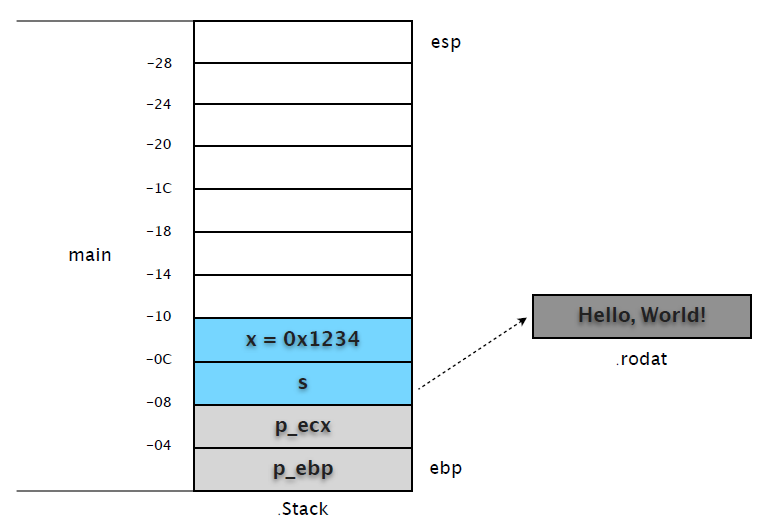
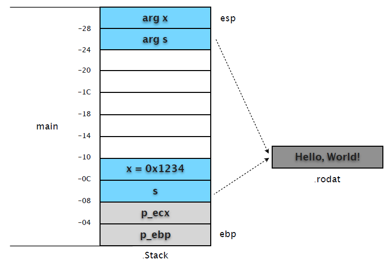
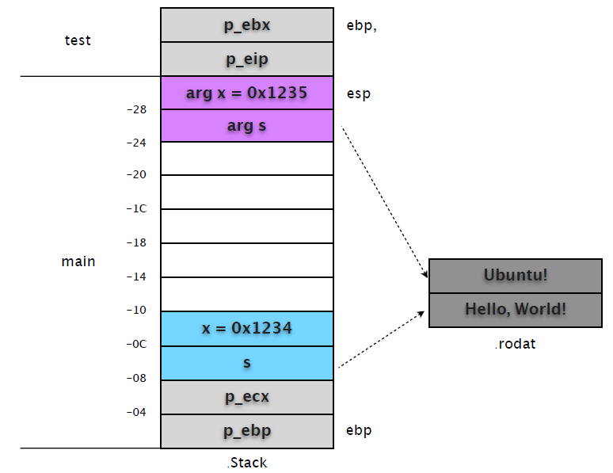
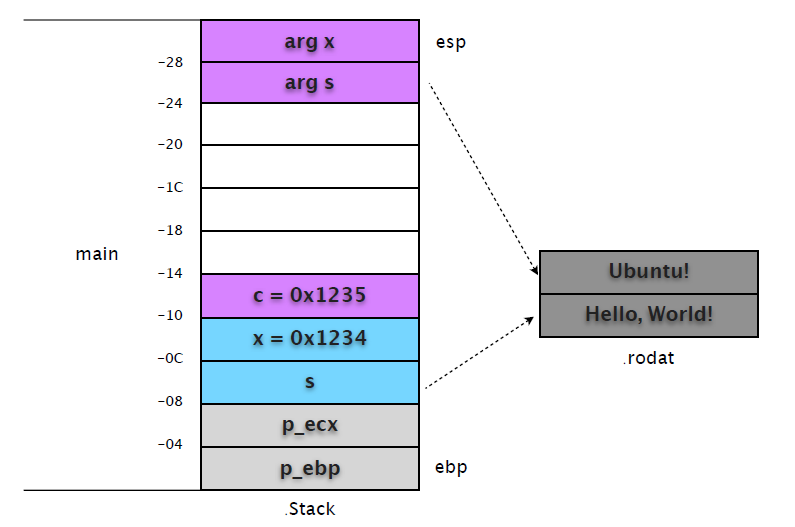

# 第二部分: 高级

# 1. 指针概要

简单罗列一下 C 的指针用法，便于复习。

##1.1 指针常量

指针常量意指 "类型为指针的常量"，初始化后不能被修改，固定指向某个内存地址。我们无法修改指针自身的值，但可以修改指针所指目标的内容。

```
int x[] = { 1, 2, 3, 4 };
int* const p = x;

for (int i = 0; i < 4; i++)
{
	int v = *(p + i);
	*(p + i) = ++v;

	printf("%d\n", v);

	//p++; // Compile Error!
}
```

上例中的指针 p 始终指向数组 x 的第一个元素，和数组名 x 作用相同。由于指针本身是常量，自然无法执行 p++、++p 之类的操作，否则会导致编译错误。

## 1.2 常量指针

常量指针是说 "指向常量数据的指针"，指针目标被当做常量处理 (尽管原目标不一定是常量)，不能用通过指针做赋值处理。指针自身并非常量，可以指向其他位置，但依然不能做赋值操作。

```
int x = 1, y = 2;

int const* p = &x;
//*p = 100; ! ! // Compile Error!

p = &y;
printf("%d\n", *p);

//*p = 100; ! ! // Compile Error!
```

建议常量指针将 const 写在前面更易识别。

```
const int* p = &x;
```

看几种特殊情况：
(1) 下面的代码据说在 VC 下无法编译，但 GCC 是可以的。

```
const int x = 1;
int* p = &x;

printf("%d\n", *p);

*p = 1234;
printf("%d\n", *p);
```

(2) const int* p 指向 const int 自然没有问题，但肯定也不能通过指针做出修改。

```
const int x = 1;
const int* p = &x;

printf("%d\n", *p);

*p = 1234; ! ! ! // Compile Error!
```

(3) 声明指向常量的指针常量，这很罕见，但也好理解。

```
int x = 10;
const int* const p = &i;

p++; ! ! ! ! // Compile Error!
*p = 20; ! ! ! // Compile Error!
```

区别指针常量和常量指针方法很简单：看 const 修饰的是谁，也就是` * `在 const 的左边还是右边。
- int* const p: const 修饰指针变量 p，指针是常量。
- int const *p: const 修饰指针所指向的内容 `*p`，是常量的指针。或写成 const int *p。
- const int`*` const p: 指向常量的指针常量。右 const 修饰 p 常量，左 const 表明 *p 为常量。

## 1.3 指针的指针

指针本身也是内存区的一个数据变量，自然也可以用其他的指针来指向它。

```
int x = 10;
int* p = &x;
int** p2 = &p;

printf("p = %p, *p = %d\n", p, *p);
printf("p2 = %p, *p2 = %x\n", p2, *p2);
printf("x = %d, %d\n",*p, **p2);
```

输出:

```
p = 0xbfba3e5c, *p = 10
p2 = 0xbfba3e58, *p2 = bfba3e5c
x = 10, 10
```

我们可以发现 p2 存储的是指针 p 的地址。因此才有了指针的指针一说。

## 1.4 数组指针

默认情况下，数组名为指向该数组第一个元素的指针常量。

```
int x[] = { 1, 2, 3, 4 };
int* p = x;

for (int i = 0; i < 4; i++)
{
	printf("%d, %d, %d\n", x[i], *(x + i), , *p++);
}
```

尽管我们可以用 *(x + 1) 访问数组元素，但不能执行 x++ / ++x 操作。但 "数组的指针" 和数组名并不是一个类型，数组指针将整个数组当做一个对象，而不是其中的成员(元素)。

```
int x[] = { 1, 2, 3, 4 };

int* p = x;
int (*p2)[] = &x; ! ! // 数组指针

for(int i = 0; i < 4; i++)
{
	printf("%d, %d\n", *p++, (*p2)[i]);
}
```

更多详情参考《数组指针》。

## 1.5 指针数组

元素类型为指针的数组称之为指针数组。

```
int x[] = { 1, 2, 3, 4 };
int* ps[] = { x, x + 1, x + 2, x + 3 };

for(int i = 0; i < 4; i++)
{
	printf("%d\n", *(ps[i]));
}
```

x 默认就是指向第⼀一个元素的指针，那么 x + n 自然获取后续元素的指针。

指针数组通常⽤用来处理交错数组 (Jagged Array，又称数组的数组，不是二维数组)，最常见的就是字符串数组了。

```
void test(const char** x, int len)
{
	for (int i = 0; i < len; i++)
	{
		printf("test: %d = %s\n", i, *(x + i));
	}
}

int main(int argc, char* argv[])
{
	char* a = "aaa";
	char* b = "bbb";
	char* ss[] = { a, b };

	for (int i = 0; i < 2; i++)
	{
		printf("%d = %s\n", i, ss[i]);
	}

	test(ss, 2);

	return EXIT_SUCCESS;
}
```

更多详情参考《指针数组》。

## 1.6 函数指针

默认情况下，函数名就是指向该函数的指针常量。

```
void inc(int* x)
{
	*x += 1;
}

int main(void)
{
	void (*f)(int*) = inc;

	int i = 100;
	f(&i);
	printf("%d\n", i);

	return 0;
}
```

如果嫌函数指针的声明不好看，可以像 C# 委托那样定义一个函数指针类型。

```
typedef void (*inc_t)(int*);

int main(void)
{
	inc_t f = inc;
	... ...
}
```

很显然，有了 typedef，下面的代码更易阅读和理解。

```
inc_t getFunc()
{
	return inc;
}

int main(void)
{
	inc_t inc = getFunc();
	... ...
}
```

注意:
- 定义函数指针类型: typedef void (*inc_t)(int*)
- 定义函数类型: typedef void (inc_t)(int*)

```
void test()
{
	printf("test");
}

typedef void(func_t)();
typedef void(*func_ptr_t)();

int main(int argc, char* argv[])
{
	func_t* f = test;
	func_ptr_t p = test;

	f();
	p();

	return EXIT_SUCCESS;
}
```

# 2. 数组指针

注意下面代码中指针的区别。

```
int x[] = {1,2,3,4,5,6};

int *p1 = x; ! // 指向整数的指针
int (*p2)[] = &x; ! // 指向数组的指针
```

p1 的类型是 int*，也就是说它指向一个整数类型。数组名默认指向数组中的第一个元素，因此 x 默认也是 int* 类型。

p2 的含义是指向一个 "数组类型" 的指针，注意是 "数组类型" 而不是 "数组元素类型"，这有本质上的区别。

数组指针把数组当做一个整体，因为从类型角度来说，数组类型和数组元素类型是两个概念。因此"p2 = &x" 当中 x 代表的是数组本身而不是数组的第一个元素地址，&x 取的是数组指针，而不是"第一个元素指针的指针"。

接下来，我们看看如何用数组指针操作一维数组。

```
void array1()
{
	int x[] = {1,2,3,4,5,6};
	int (*p)[] = &x; // 指针 p 指向数组

	for(int i = 0; i < 6; i++)
	{
		printf("%d\n", (*p)[i]); // *p 返回该数组, (*p)[i] 相当于 x[i]
	}
}
```

有了上面的说明，这个例子就很好理解了。

"p = &x" 使得指针 p 存储了该数组的指针，*p 自然就是获取该数组。那么 (*p)[i] 也就等于 x[i]。
注意: p 的目标类型是数组，因此 p++ 指向的不是数组下一个元素，而是 "整个数组之后" 位置 (EA + SizeOf(x))，这已经超出数组范围了。

数组指针对二维数组的操作。

```
void array2()
{
	int x[][4] = {{1, 2, 3, 4}, {11, 22, 33, 44}};
	int (*p)[4] = x; !! ! ! ! // 相当于 p = &x[0]

	for(int i = 0; i < 2; i++)
	{
		for (int c = 0; c < 4; c++)
		{
		printf("[%d, %d] = %d\n", i, c, (*p)[c]);
		}
		
		p++;
	}
}
```

x 是一个二维数组，x 默认指向该数组的第一个元素，也就是 {1,2,3,4}。不过要注意，这第一个元素不是 int，而是一个 int[]，x 实际上是 int(*)[] 指针。因此 "p = x" 而不是 "p = &x"，否则 p 就指向 int (*)[][] 了。

既然 p 指向第一个元素，那么 *p 自然也就是第一行数组了，也就是 {1,2,3,4}，(*p)[2] 的含义就是第一行的第三个元素。p++ 的结果自然也就是指向下一行。我们还可以直接用 *(p + 1) 来访问
x[1]。

```
void array2()
{
	int x[][4] = {{1, 2, 3, 4}, {11, 22, 33, 44}};
	int (*p)[4] = x;

	printf("[1, 3] = %d\n", (*(p + 1))[3]);
}
```

我们继续看看 int (*)[][] 的例子。

```
void array3()
{
	int x[][4] = {{1, 2, 3, 4}, {11, 22, 33, 44}};
	int (*p)[][4] = &x;

	for(int i = 0; i < 2; i++)
	{
		for (int c = 0; c < 4; c++)
		{
			printf("[%d, %d] = %d\n", i, c, (*p)[i][c]);
		}
	}
}
```

这回 "p = &x"，也就是说把整个二维数组当成一个整体，因此 *p 返回的是整个二维数组，因此 p++ 也就用不得了。
 
附: 在附有初始化的数组声明语句中，只有第一维度可以省略。

将数组指针当做函数参数传递。

```
void test1(p,len)
	int(*p)[];
	int len;
{
	for(int i = 0; i < len; i++)
	{
		printf("%d\n", (*p)[i]);
	}
}

void test2(void* p, int len)
{
	int(*pa)[] = p;

	for(int i = 0; i < len; i++)
	{
		printf("%d\n", (*pa)[i]);
	}
}

int main (int args, char* argv[])
{
	int x[] = {1,2,3};

	test1(&x, 3);
	test2(&x, 3);

	return 0;
}
```

由于数组指针类型中有括号，因此 test1 的参数定义看着有些古怪，不过习惯就好了。

# 3. 指针数组

指针数组是指元素为指针类型的数组，通常用来处理 "交错数组"，又称之为数组的数组。和二维数组不同，指针数组的元素只是一个指针，因此在初始化的时候，每个元素只占用4字节内存空间，比二维数组节省。同时，每个元素数组的长度可以不同，这也是交错数组的说法。(在C# 中，二维数组用 [,] 表示，交错数组用 [][])

```
int main(int argc, char* argv[])
{
	int x[] = {1,2,3};
	int y[] = {4,5};
	int z[] = {6,7,8,9};

	int* ints[] = { NULL, NULL, NULL };
	ints[0] = x;
	ints[1] = y;
	ints[2] = z;

	printf("%d\n", ints[2][2]);

	for(int i = 0; i < 4; i++)
	{
		printf("[2,%d] = %d\n", i, ints[2][i]);
	}

	return 0;
}
```

输出:

```
8
[2,0] = 6
[2,1] = 7
[2,2] = 8
[2,3] = 9
```

我们查看一下指针数组 ints 的内存数据。

```
(gdb) x/3w ints
0xbf880fd0: 0xbf880fdc 0xbf880fe8 0xbf880fc0

(gdb) x/3w x
0xbf880fdc: 0x00000001 0x00000002 0x00000003

(gdb) x/2w y
0xbf880fe8: 0x00000004 0x00000005

(gdb) x/4w z
0xbf880fc0: 0x00000006 0x00000007 0x00000008 0x00000009
```

可以看出，指针数组存储的都是目标元素的指针。

那么默认情况下 ints 是哪种类型的指针呢？按规则来说，数组名默认是指向第一个元素的指针，那么第一个元素是什么呢？数组？当然不是，而是一个 int* 的指针而已。注意 "ints[0] = x;" 这条语
句，实际上 x 返回的是 &x[0] 的指针 (int*)，而非 &a 这样的数组指针(int (*)[])。继续，*ints 取出第一个元素内容 (0xbf880fdc)，这个内容又是一个指针，因此 ints 隐式成为一个指针的指针(int**)，就交错数组而言，它默认指向 ints[0][0]。

```
int main(int argc, char* argv[])
{
	int x[] = {1,2,3};
	int y[] = {4,5};
	int z[] = {6,7,8,9};

	int* ints[] = { NULL, NULL, NULL };
	ints[0] = x;
	ints[1] = y;
	ints[2] = z;

	printf("%d\n", **ints);
	printf("%d\n", *(*ints + 1));
	printf("%d\n", **(ints + 1));

	return 0;
}
```

输出:

```
1
2
4
```

第一个 printf 语句验证了我们上面的说法。我们继续分析后面两个看上去有些复杂的 printf 语句。

(1) *(*ints + 1)
首先 *ints 取出了第一个元素，也就是 ints[0][0] 的指针。那么 "*ints + 1" 实际上就是向后移动一
次指针，因此指向 ints[0][1] 的指针。"*(*ints + 1)" 的结果也就是取出 ints[0][1] 的值了。
(2) **(ints + 1)
ints 指向第一个元素 (0xbf880fdc)，"ints + 1" 指向第二个元素(0xbf880fe8)。"*(ints + 1)" 取
出 ints[1] 的内容，这个内容是另外一只指针，因此 "**(ints + 1)" 就是取出 ints[1][0] 的内容。

下面这种写法，看上去更容易理解一些。

```
int main(int argc, char* argv[])
{
	int x[] = {1,2,3};
	int y[] = {4,5};
	int z[] = {6,7,8,9};

	int* ints[] = { NULL, NULL, NULL };
	ints[0] = x;
	ints[1] = y;
	ints[2] = z;

	int** p = ints;

	// -----------------------------------------------

	// *p 取出 ints[0] 存储的指针(&ints[0][0])
	// **p 取出 ints[0][0] 值
	printf("%d\n", **p);

	// -----------------------------------------------

	// p 指向 ints[1]
	p++;

	// *p 取出 ints[1] 存储的指针(&ints[1][0])
	// **p 取出 ints[1][0] 的值(= 4)
	printf("%d\n", **p);

	// -----------------------------------------------

	// p 指向 ints[2]
	p++;

	// *p 取出 ints[2] 存储的指针(&ints[2][0])
	// *p + 1 返回所取出指针的后一个位置
	// *(*p + 1) 取出 ints[2][0 + 1] 的值(= 7)
	printf("%d\n", *(*p + 1));

	return 0;
}
```

指针数组经常出现在操作字符串数组的场合。

```
int main (int args, char* argv[])
{
	char* strings[] = { "Ubuntu", "C", "C#", "NASM" };

	for (int i = 0; i < 4; i++)
	{
		printf("%s\n", strings[i]);
	}

	printf("------------------\n");

	printf("[2,1] = '%c'\n", strings[2][1]);

	strings[2] = "CSharp";
	printf("%s\n", strings[2]);
	printf("------------------\n");

	char** p = strings;
	printf("%s\n", *(p + 2));

	return 0;
}
```

输出:

```
Ubuntu
C
C#
NASM
------------------
[2,1] = '#'
CSharp
------------------
CSharp
```

main 参数的两种写法。

```
int main(int argc, char* argv[])
{
	for (int i = 0; i < argc; i++)
	{
		printf("%s\n", argv[i]);
	}

	return 0;
}

int main(int argc, char** argv)
{
	for (int i = 0; i < argc; i++)
	{
		printf("%s\n", *(argv + i));
	}

	return 0;
}
```

当然，指针数组不仅仅用来处理数组。

```
int main (int args, char* argv[])
{
	int* ints[] = { NULL, NULL, NULL, NULL };

	int a = 1;
	int b = 2;

	ints[2] = &a;
	ints[3] = &b;
	for(int i = 0; i < 4; i++)
	{
		int* p = ints[i];
		printf("%d = %d\n", i, p == NULL ? 0 : *p);
	}

	return 0;
}
```

# 4. 函数调用

先准备一个简单的例子。

源代码

```
#include <stdio.h>

int test(int x, char* s)
{
	s = "Ubuntu!";
	return ++x;
}

int main(int args, char* argv[])
{
	char* s = "Hello, World!";
	int x = 0x1234;

	int c = test(x, s);
	printf(s);

	return 0;
}
```

编译 (注意没有使用优化参数)：

```
$ gcc -Wall -g -o hello hello.c
```

调试之初，我们先反编译代码，并做简单标注。

```
$ gdb hello

(gdb) set disassembly-flavor intel ; 设置反汇编指令格式
(gdb) disass main ; 反汇编 main

Dump of assembler code for function main:
0x080483d7 <main+0>: lea ecx,[esp+0x4]
0x080483db <main+4>: and esp,0xfffffff0
0x080483de <main+7>: push DWORD PTR [ecx-0x4]

0x080483e1 <main+10>: push ebp ; main 堆栈帧开始
0x080483e2 <main+11>: mov ebp,esp ; 修正 ebp 基址
0x080483e4 <main+13>: push ecx ; 保护寄存器现场
0x080483e5 <main+14>: sub esp,0x24 ; 预留堆栈帧空间

0x080483e8 <main+17>: mov DWORD PTR [ebp-0x8],0x80484f8 ; 设置变量 s，为字符串地址。
0x080483ef <main+24>: mov DWORD PTR [ebp-0xc],0x1234 ; 变量 x，内容为内联整数值。

0x080483f6 <main+31>: mov eax,DWORD PTR [ebp-0x8] ; 复制变量 s
0x080483f9 <main+34>: mov DWORD PTR [esp+0x4],eax ; 将复制结果写入新堆栈位置
0x080483fd <main+38>: mov eax,DWORD PTR [ebp-0xc] ; 复制变量 x
0x08048400 <main+41>: mov DWORD PTR [esp],eax ; 将复制结果写入新堆栈位置
0x08048403 <main+44>: call 0x80483c4 <test> ; 调用 test
0x08048408 <main+49>: mov DWORD PTR [ebp-0x10],eax ; 保存 test 返回值

0x0804840b <main+52>: mov eax,DWORD PTR [ebp-0x8] ; 复制变量 s 内容
0x0804840e <main+55>: mov DWORD PTR [esp],eax ; 保存复制结果到新位置
0x08048411 <main+58>: call 0x80482f8 <printf@plt> ; 调用 printf
0x08048416 <main+63>: mov eax,0x0 ; 丢弃 printf 返回值

0x0804841b <main+68>: add esp,0x24 ; 恢复 esp 到堆栈空间预留前位置
0x0804841e <main+71>: pop ecx ; 恢复 ecx 保护现场
0x0804841f <main+72>: pop ebp ; 修正前一个堆栈帧基址
0x08048420 <main+73>: lea esp,[ecx-0x4] ; 修正 esp 指针
0x08048423 <main+76>: ret
End of assembler dump.

(gdb) disass test ! ! ! ! ! ! ; 反汇编 test

Dump of assembler code for function test:
0x080483c4 <test+0>: push ebp ; 保存前一个堆栈帧的基址
0x080483c5 <test+1>: mov ebp,esp ; 修正 ebp 基址
0x080483c7 <test+3>: mov DWORD PTR [ebp+0xc],0x80484f0 ; 修改参数 s, 是前一堆栈帧地址
0x080483ce <test+10>: add DWORD PTR [ebp+0x8],0x1 ; 累加参数 x
0x080483d2 <test+14>: mov eax,DWORD PTR [ebp+0x8] ; 将返回值存入 eax

0x080483d5 <test+17>: pop ebp ; 恢复 ebp
0x080483d6 <test+18>: ret
End of assembler dump.
```

我们一步步分析，并用示意图说明堆栈状态。

(1) 在 0x080483f6 处设置断点，这时候 main 完成了基本的初始化和内部变量赋值。

```
(gdb) b *0x080483f6
Breakpoint 1 at 0x80483f6: file hello.c, line 14.

(gdb) r
Starting program: /home/yuhen/Projects/Learn.C/hello
Breakpoint 1, main () at hello.c:14
14 int c = test(x, s);
```

我们先记下 ebp 和 esp 的地址。

```
(gdb) p $ebp
$8 = (void *) 0xbfcb3c78

(gdb) p $esp
$9 = (void *) 0xbfcb3c50! # $ebp - $esp = 0x28，不是 0x24？在预留空间前还 "push ecx" 了。

(gdb) p x ! ! ! # 整数值直接保存在堆栈
$10 = 4660
(gdb) p &x ! ! ! # 变量 x 地址 = ebp (0xbfcb3c78) - 0xc = 0xbfcb3c6c
$11 = (int *) 0xbfcb3c6c

(gdb) p s ! ! ! # 变量 s 在堆栈保存了字符串在 .rodata 段的地址
$12 = 0x80484f8 "Hello, World!"

(gdb) p &s ! ! ! # 变量 s 地址 = ebp (0xbfcb3c78) - 0x8 = 0xbfcb3c70
$13 = (char **) 0xbfcb3c70
```

这时候的堆栈示意图如下：



(2) 接下来，我们将断点设在 call test 之前，看看调用前堆栈的准备情况。

```
(gdb) b *0x08048403
Breakpoint 2 at 0x8048403: file hello.c, line 14

(gdb) c
Continuing.
Breakpoint 2, 0x08048403 in main () at hello.c:14
14 int c = test(x, s);
```

0x08048403 之前的 4 条指令通过 eax 做中转，分别在 [esp+0x4] 和 [esp] 处复制了变量 s、x的内容。

```
(gdb) x/12w $esp
0xbfcb3c50: 0x00001234 0x080484f8 0xbfcb3c68 0x080482c4
0xbfcb3c60: 0xb8081ff4 0x08049ff4 0xbfcb3c88 0x00001234
0xbfcb3c70: 0x080484f8 0xbfcb3c90 0xbfcb3ce8 0xb7f39775
```

第 1 行: 复制的变量 x，复制的变量 s，未使用，未使用
第 2 行: 未使用，未使用，未使用，变量 x
第 3 行: 变量 s，ecx 保护值，ebp 保护值，eip 保护值。



可以和 frame 信息对照着看。

```
(gdb) info frame

Stack level 0, frame at 0xbfcb3c80:
	eip = 0x8048403 in main (hello.c:14); saved eip 0xb7f39775
	source language c.
	Arglist at 0xbfcb3c78, args:
	Locals at 0xbfcb3c78, Previous frame's sp at 0xbfcb3c74
	Saved registers:
	ebp at 0xbfcb3c78, eip at 0xbfcb3c7c
```

说明: 严格来说堆栈帧(frame)从函数被调用的 call 指令将 eip 入栈开始，而不是我们通常所指修正后的 ebp 位置。以 ebp 为基准纯粹是为了阅读代码方便，本文也以此做示意图。也就是说在 call
test 之前，内存当中已经有了两份 s 和 x 。从中我们也看到了 C 函数参数是按照从右到左的方式入栈。

附：这种由调用方负责参数入栈和清理的方式是 C 默认的调用约定 cdecl，调用者除了参数入栈，还负责堆栈清理。相比 stdcall 的好处就是：cdecl 允许方法参数数量不固定。

(3) 在 test 中设置断点，我们看看 test 中的代码对堆栈的影响。

```
(gdb) b test
Breakpoint 3 at 0x80483c7: file hello.c, line 5.

(gdb) c
Continuing.
Breakpoint 3, test (x=4660, s=0x80484f8 "Hello, World!") at hello.c:5
5 s = "Ubuntu!";
```


main 中的 call 指令会先将 eip 的值入栈，以便函数完成时可以恢复调用位置。然后才是跳转到 test 函数地址入口。因此我们在 test 中设置的断点(0x080483c7)中断时，test 堆栈帧中就有了
p_eip 和 p_ebp 两个数据。

```
(gdb) x/2w $esp
0xbfcb3c48: 0xbfcb3c78 0x08048408
```

分别保存了 main ebp 和 main call 后一条指令的 eip 地址。其后的指令直接修改 [ebp+0xc] 内容，使其指向新的字符串 "Ubuntu"。然后累加 [ebp+0x8] 的值，并用 eax 寄存器返回函数结果。

```
0x080483c7 <test+3>: mov DWORD PTR [ebp+0xc],0x80484f0
0x080483ce <test+10>: add DWORD PTR [ebp+0x8],0x1
0x080483d2 <test+14>: mov eax,DWORD PTR [ebp+0x8]
```

注意都是直接对 main 栈帧中的复制变量进⾏行操作，并没有在 test 栈帧中开辟存储区域。

```
(gdb) x/s 0x80484f0
0x80484f0: "Ubuntu!"
```


执行到函数结束，然后再次输出 main 堆栈帧的内容看看。

```
(gdb) finish ! ! ! # test 执⾏行结束，回到 main frame。
Run till exit from #0 test (x=4660, s=0x80484f8 "Hello, World!") at hello.c:5
0x08048408 in main () at hello.c:14
14 int c = test(x, s);
Value returned is $21 = 4661

(gdb) p $eip ! ! ! # eip 重新指向 main 中的指令
$22 = (void (*)()) 0x8048408 <main+49>

(gdb) x/12xw $esp ! ! # 查看 main 堆栈帧内存
0xbfcb3c50: 0x00001235 0x080484f0 0xbfcb3c68 0x080482c4
0xbfcb3c60: 0xb8081ff4 0x08049ff4 0xbfcb3c88 0x00001234
0xbfcb3c70: 0x080484f8 0xbfcb3c90 0xbfcb3ce8 0xb7f39775
```

重新查看 main 堆栈帧信息，我们会发现栈顶两个复制变量的值被改变。

(3) 继续执行，查看修改后的变量对后续代码的影响。

当 call test 发生后，其返回值 eax 被保存到 [ebp-0x10] 处，也就是变量 c 的内容。



继续 "printf(s)"，我们会发现和 call test 一样，再次复制了变量 s 到 [esp]。

```
0x0804840b <main+52>: mov eax,DWORD PTR [ebp-0x8]
0x0804840e <main+55>: mov DWORD PTR [esp],eax
0x08048411 <main+58>: call 0x80482f8 <printf@plt>
```

很显然，这会覆盖 test 修改的值。我们在 0x08048411 设置断点，查看堆栈帧的变化。

```
(gdb) b *0x08048411
Breakpoint 4 at 0x8048411: file hello.c, line 15.

(gdb) c
Continuing.
Breakpoint 4, 0x08048411 in main () at hello.c:15
15 printf(s);

(gdb) x/12w $esp
0xbfcb3c50: 0x080484f8 0x080484f0 0xbfcb3c68 0x080482c4
0xbfcb3c60: 0xb8081ff4 0x08049ff4 0x00001235 0x00001234
0xbfcb3c70: 0x080484f8 0xbfcb3c90 0xbfcb3ce8 0xb7f39775
```

从输出的栈内存可以看出，[esp] 和 [ebp-0x8] 值相同，都是指向 "Hello, World!" 的地址。


由此可见，test 的修改并没有对后续调用造成影响。这也是所谓 "指针本身也是按值传送" 的规则。剩余的工作就是恢复现场等等，在此就不多说废话了。