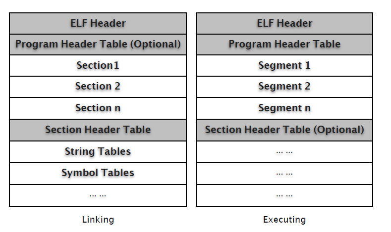
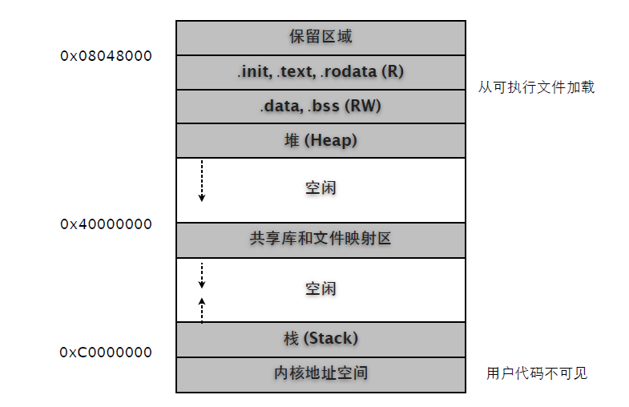

# 第三部分: 系统

# 1. ELF File Format

Executable and Linking Format，缩写 ELF。是 Linux 系统目标文件 (Object File) 格式。

主要有如下三种类型：

(1) 可重定位文件 (relocatable file)，可与其它目标文件一起创建可执行文件或共享目标文件。

```
$ gcc -g -c hello.c

$ file hello.o
hello.o: ELF 32-bit LSB relocatable, Intel 80386, version 1 (SYSV), not stripped
```

(2) 可执行文件 (executable file)。

```
$ gcc -g hello.c -o hello

$ file hello
hello: ELF 32-bit LSB executable, Intel 80386, version 1 (SYSV), dynamically linked (uses shared
libs), for GNU/Linux 2.6.15, not stripped
```

(3) 共享目标文件 (shared object file)，通常是 "函数库"，可静态链接到其他 ELF 文件中，或动态链接共同创建进程映像 (类似 DLL)。

```
$ gcc -shared -fpic stack.c -o hello.so

$ file hello.so
hello.so: ELF 32-bit LSB shared object, Intel 80386, version 1 (SYSV), dynamically linked, not
stripped
```

## 1.1 基本结构

我们可以从文件 (Linking) 和执行 (Execution) 两个角度审视 ELF 结构 (/usr/include/elf.h)。

和 Windows COFF 格式类似，ELF 也有一个特定的文件头，包括一个特定的标志串 (Magic)。

文件头中描述了 ELF 文件版本 (Version)，目标机器型号 (Machine)，程序入口地址 (Entry point Address) 等信息。紧接其后的是可选的程序头表 (Program Header Table) 和多个段(Section)，其中有我们所熟悉的存储了执行代码的 .text 段。

ELF 使用段表 (Section Header Table) 存储各段的相关信息，包括名称、起始位置、长度、权限属性等等。除了段表，ELF 中还有符号表 (Symbol Table)、字符串表 (String Table，段、函数等名称) 等。

Section 和 Segment 中文翻译虽然都是 "段"，但它们并不是一个意思。Section 主要是面向目标文件连接器，而 Segment 则是面向执行加载器，后者描述的是内存布局结构。本文主要分析 ELF 静态文件格式，也就是说主要跟 Section 打交道，而有关 ELF 进程及内存布局模型将另文详述。



相关分析将使用下面这个例子，如非说明，所有生成文件都是32位。

```
$ cat hello.c

#include <stdio.h>

int main(int argc, char* argv[])
{
	printf("Hello, World!\n");
	return 0;
}

$ gcc -g -c hello.c

$ gcc -g hello.c -o hello

$ ls
hello.c hello.o hello

$ file hello
hello: ELF 32-bit LSB executable, Intel 80386, version 1 (SYSV), dynamically linked (uses shared
libs), for GNU/Linux 2.6.15, not stripped
```

附: ELF文件标准历史

20世纪90年代，一些厂商联合成立了一个委员会，起草并发布了一个 ELF 文件格式标准供公开使用，并且希望所有人能够遵循这项标准并且从中获益。1993年，委员会发布了 ELF 文件标准。当时参与该委员会的有来自于编译器的厂商，如 Watcom 和 Borland；来自 CPU 的厂商如 IBM 和 Intel；来自操作系统的厂商如 IBM 和 Microsoft。1995年，委员会发布了 ELF1.2 标准，自此委员会完成了自己的使命，不久就解散了。所以 ELF 最新版本为1.2。

## 1.2 ELF Header

我们先看看 elf.h 中的相关定义。

```
typedef uint16_t Elf32_Half;
typedef uint32_t Elf32_Word;
typedef uint32_t Elf32_Addr;
typedef uint32_t Elf32_Off;

#define EI_NIDENT (16)

typedef struct
{
	unsigned char e_ident[EI_NIDENT]; /* Magic number and other info */
	Elf32_Half e_type; /* Object file type */
	Elf32_Half e_machine; /* Architecture */
	Elf32_Word e_version; /* Object file version */
	Elf32_Addr e_entry; /* Entry point virtual address */
	Elf32_Off e_phoff; /* Program header table file offset */
	Elf32_Off e_shoff; /* Section header table file offset */
	Elf32_Word e_flags; /* Processor-specific flags */
	Elf32_Half e_ehsize; /* ELF header size in bytes */
	Elf32_Half e_phentsize; /* Program header table entry size */
	Elf32_Half e_phnum; /* Program header table entry count */
	Elf32_Half e_shentsize; /* Section header table entry size */
	Elf32_Half e_shnum; /* Section header table entry count */
	Elf32_Half e_shstrndx; /* Section header string table index */
} Elf32_Ehdr;
```

总长度是 52 (0x34) 字节。

```
$ xxd -g 1 -l 0x34 hello

0000000: 7f 45 4c 46 01 01 01 00 00 00 00 00 00 00 00 00 .ELF............
0000010: 02 00 03 00 01 00 00 00 30 83 04 08 34 00 00 00 ........0...4...
0000020: 80 16 00 00 00 00 00 00 34 00 20 00 08 00 28 00 ........4. ...(.
0000030: 26 00 23 00 &.#.
```

我们可以借助 readelf 这个工具来查看详细信息。

```
$ readelf -h hello
ELF Header:
	Magic: 7f 45 4c 46 01 01 01 00 00 00 00 00 00 00 00 00
	Class: ELF32
	Data: 2's complement, little endian
	Version: 1 (current)
	OS/ABI: UNIX - System V
	ABI Version: 0
	Type: EXEC (Executable file)
	Machine: Intel 80386
	Version: 0x1
	Entry point address: 0x8048330
	Start of program headers: 52 (bytes into file)
	Start of section headers: 5760 (bytes into file)
	Flags: 0x0
	Size of this header: 52 (bytes)
	Size of program headers: 32 (bytes)
	Number of program headers: 8
	Size of section headers: 40 (bytes)
	Number of section headers: 38
	Section header string table index: 35
```

头信息中，我们通常关注的是 Entry point address、Start of section headers。

```
$ objdump -dS hello | less

08048330 <_start>:
	8048330: 31 ed xor %ebp,%ebp
	8048332: 5e pop %esi
	8048333: 89 e1 mov %esp,%ecx
	8048335: 83 e4 f0 and $0xfffffff0,%esp
	8048338: 50 push %eax
```

注意 Entry point address 指向 <_start> 而非 mian()，我们再看看段表信息。

```
$ readelf -S hello

There are 38 section headers, starting at offset 0x1680:

Section Headers:
	[Nr] Name Type Addr Off Size ES Flg Lk Inf Al
	[ 0] NULL 00000000 000000 000000 00 0 0 0
	[ 1] .interp PROGBITS 08048134 000134 000013 00 A 0 0 1
	[ 2] .note.ABI-tag NOTE 08048148 000148 000020 00 A 0 0 4
	[ 3] .note.gnu.build-i NOTE 08048168 000168 000024 00 A 0 0 4
	[ 4] .hash HASH 0804818c 00018c 000028 04 A 6 0 4
	[ 5] .gnu.hash GNU_HASH 080481b4 0001b4 000020 04 A 6 0 4
	[ 6] .dynsym DYNSYM 080481d4 0001d4 000050 10 A 7 1 4
	[ 7] .dynstr STRTAB 08048224 000224 00004a 00 A 0 0 1
	[ 8] .gnu.version VERSYM 0804826e 00026e 00000a 02 A 6 0 2
	[ 9] .gnu.version_r VERNEED 08048278 000278 000020 00 A 7 1 4
	[10] .rel.dyn REL 08048298 000298 000008 08 A 6 0 4
	[11] .rel.plt REL 080482a0 0002a0 000018 08 A 6 13 4
	[12] .init PROGBITS 080482b8 0002b8 000030 00 AX 0 0 4
	[13] .plt PROGBITS 080482e8 0002e8 000040 04 AX 0 0 4
	[14] .text PROGBITS 08048330 000330 00016c 00 AX 0 0 16
	[15] .fini PROGBITS 0804849c 00049c 00001c 00 AX 0 0 4
	[16] .rodata PROGBITS 080484b8 0004b8 000016 00 A 0 0 4
	[17] .eh_frame PROGBITS 080484d0 0004d0 000004 00 A 0 0 4
	[18] .ctors PROGBITS 08049f0c 000f0c 000008 00 WA 0 0 4
	[19] .dtors PROGBITS 08049f14 000f14 000008 00 WA 0 0 4
	[20] .jcr PROGBITS 08049f1c 000f1c 000004 00 WA 0 0 4
	[21] .dynamic DYNAMIC 08049f20 000f20 0000d0 08 WA 7 0 4
	[22] .got PROGBITS 08049ff0 000ff0 000004 04 WA 0 0 4
	[23] .got.plt PROGBITS 08049ff4 000ff4 000018 04 WA 0 0 4
	[24] .data PROGBITS 0804a00c 00100c 000008 00 WA 0 0 4
	[25] .bss NOBITS 0804a014 001014 000008 00 WA 0 0 4
	[26] .comment PROGBITS 00000000 001014 000046 01 MS 0 0 1
	[27] .debug_aranges PROGBITS 00000000 001060 000040 00 0 0 8
	[28] .debug_pubnames PROGBITS 00000000 0010a0 000040 00 0 0 1
	[29] .debug_info PROGBITS 00000000 0010e0 0001ae 00 0 0 1
	[30] .debug_abbrev PROGBITS 00000000 00128e 0000c3 00 0 0 1
	[31] .debug_line PROGBITS 00000000 001351 0000ba 00 0 0 1
	[32] .debug_frame PROGBITS 00000000 00140c 00002c 00 0 0 4
	[33] .debug_str PROGBITS 00000000 001438 0000c6 01 MS 0 0 1
	[34] .debug_loc PROGBITS 00000000 0014fe 00002c 00 0 0 1
	[35] .shstrtab STRTAB 00000000 00152a 000156 00 0 0 1
	[36] .symtab SYMTAB 00000000 001c70 0004a0 10 37 54 4
	[37] .strtab STRTAB 00000000 002110 000202 00 0 0 1

Key to Flags:
	W (write), A (alloc), X (execute), M (merge), S (strings)
	I (info), L (link order), G (group), x (unknown)
	O (extra OS processing required) o (OS specific), p (processor specific)
```

"starting at offset 0x1680" 转换成十进制就是5760。

## 1.3 Program Header

程序头表告诉系统如何建立一个进程映象。

操作系统依据该表对进程地址空间进行分段 (Segment)，并依据该表数据对进程 "内存段" 进行属性和权限管理。

```
typedef struct
{
	Elf32_Word p_type; /* Segment type */
	Elf32_Off p_offset; /* Segment file offset */
	Elf32_Addr p_vaddr; /* Segment virtual address */
	Elf32_Addr p_paddr; /* Segment physical address */
	Elf32_Word p_filesz; /* Segment size in file */
	Elf32_Word p_memsz; /* Segment size in memory */
	Elf32_Word p_flags; /* Segment flags */
	Elf32_Word p_align; /* Segment alignment */
} Elf32_Phdr;
```

ELF 头信息中已经给出了 Program 的相关数据，起始位置 52(0x34)，数量8，每个头信息长度32(0x20) 字节，总长度 256(0x100) 字节。

```
$ readelf -h hello

ELF Header:
	... ...
	Start of program headers: 52 (bytes into file)
	Size of program headers: 32 (bytes)
	Number of program headers: 8
	... ...
$ xxd -g 1 -s 0x34 -l 0x100 hello

0000034: 06 00 00 00 34 00 00 00 34 80 04 08 34 80 04 08 ....4...4...4...
0000044: 00 01 00 00 00 01 00 00 05 00 00 00 04 00 00 00 ................
0000054: 03 00 00 00 34 01 00 00 34 81 04 08 34 81 04 08 ....4...4...4...
0000064: 13 00 00 00 13 00 00 00 04 00 00 00 01 00 00 00 ................
0000074: 01 00 00 00 00 00 00 00 00 80 04 08 00 80 04 08 ................
0000084: d4 04 00 00 d4 04 00 00 05 00 00 00 00 10 00 00 ................
0000094: 01 00 00 00 0c 0f 00 00 0c 9f 04 08 0c 9f 04 08 ................
00000a4: 08 01 00 00 10 01 00 00 06 00 00 00 00 10 00 00 ................
00000b4: 02 00 00 00 20 0f 00 00 20 9f 04 08 20 9f 04 08 .... ... ... ...
00000c4: d0 00 00 00 d0 00 00 00 06 00 00 00 04 00 00 00 ................
00000d4: 04 00 00 00 48 01 00 00 48 81 04 08 48 81 04 08 ....H...H...H...
00000e4: 44 00 00 00 44 00 00 00 04 00 00 00 04 00 00 00 D...D...........
00000f4: 51 e5 74 64 00 00 00 00 00 00 00 00 00 00 00 00 Q.td............
0000104: 00 00 00 00 00 00 00 00 06 00 00 00 04 00 00 00 ................
0000114: 52 e5 74 64 0c 0f 00 00 0c 9f 04 08 0c 9f 04 08 R.td............
0000124: f4 00 00 00 f4 00 00 00 04 00 00 00 01 00 00 00 ................
```

从程序表数据中，我们可以从执行角度来看操作系统如何映射 ELF 文件数据 (Section to Segment mapping)，如何确定各段 (Segment) 加载偏移量、内存虚拟地址以及内存属性 (Flag)、对齐方式等信息。

```
$ readelf -l hello

Elf file type is EXEC (Executable file)
Entry point 0x8048330
There are 8 program headers, starting at offset 52

Program Headers:
	Type Offset VirtAddr PhysAddr FileSiz MemSiz Flg Align
	PHDR 0x000034 0x08048034 0x08048034 0x00100 0x00100 R E 0x4
	INTERP 0x000134 0x08048134 0x08048134 0x00013 0x00013 R 0x1
		[Requesting program interpreter: /lib/ld-linux.so.2]
	LOAD 0x000000 0x08048000 0x08048000 0x004d4 0x004d4 R E 0x1000
	LOAD 0x000f0c 0x08049f0c 0x08049f0c 0x00108 0x00110 RW 0x1000
	DYNAMIC 0x000f20 0x08049f20 0x08049f20 0x000d0 0x000d0 RW 0x4
	NOTE 0x000148 0x08048148 0x08048148 0x00044 0x00044 R 0x4
	GNU_STACK 0x000000 0x00000000 0x00000000 0x00000 0x00000 RW 0x4
	GNU_RELRO 0x000f0c 0x08049f0c 0x08049f0c 0x000f4 0x000f4 R 0x1
Section to Segment mapping:
	Segment Sections...
	00
	01 .interp
	02 .interp .note.ABI-tag .note.gnu.build-id .hash .gnu.hash .dynsym ...
	03 .ctors .dtors .jcr .dynamic .got .got.plt .data .bss
	04 .dynamic
	05 .note.ABI-tag .note.gnu.build-id
	06
	07 .ctors .dtors .jcr .dynamic .got
```

## 1.4 Section Header Table

分析 Section 之前，我们需要先了解 Section Header Table，因为我们需要通过它定位 Section，并获知相关的属性信息。

从 ELF Header 中我们可以获知起始位置、单条记录长度、总记录数以及存储段名称字符串表的索引号信息。

```
$ readelf -h hello

ELF Header:
	Start of section headers: 5760 (bytes into file)
	Size of section headers: 40 (bytes)
	Number of section headers: 38
	Section header string table index: 35
```

elf.h 中对 Section Header 的数据结构定义：

```
typedef struct
{
	Elf32_Word sh_name; /* Section name (string tbl index) */
	Elf32_Word sh_type; /* Section type */
	Elf32_Word sh_flags; /* Section flags */
	Elf32_Addr sh_addr; /* Section virtual addr at execution */
	Elf32_Off sh_offset; /* Section file offset */
	Elf32_Word sh_size; /* Section size in bytes */
	Elf32_Word sh_link; /* Link to another section */
	Elf32_Word sh_info; /* Additional section information */
	Elf32_Word sh_addralign; /* Section alignment */
	Elf32_Word sh_entsize; /* Entry size if section holds table */
} Elf32_Shdr;
```

每条 Header 记录是 40(0x28) 字节。我们对照着分析看看。

```
$ readelf -S hello

There are 38 section headers, starting at offset 0x1680:

Section Headers:
	[Nr] Name Type Addr Off Size ES Flg Lk Inf Al
	[ 0] NULL 00000000 000000 000000 00 0 0 0
	[ 1] .interp PROGBITS 08048134 000134 000013 00 A 0 0 1
	[ 2] .note.ABI-tag NOTE 08048148 000148 000020 00 A 0 0 4
	... ...
	[35] .shstrtab STRTAB 00000000 00152a 000156 00 0 0 1
	[36] .symtab SYMTAB 00000000 001c70 0004a0 10 37 54 4
	[37] .strtab STRTAB 00000000 002110 000202 00 0 0 1
Key to Flags:
	W (write), A (alloc), X (execute), M (merge), S (strings)
	I (info), L (link order), G (group), x (unknown)
	O (extra OS processing required) o (OS specific), p (processor specific)

$ xxd -g 1 -s 0x1680 -l 0x78 hello

0001680: 00 00 00 00 00 00 00 00 00 00 00 00 00 00 00 00 ................
0001690: 00 00 00 00 00 00 00 00 00 00 00 00 00 00 00 00 ................
00016a0: 00 00 00 00 00 00 00 00 1b 00 00 00 01 00 00 00 ................
00016b0: 02 00 00 00 34 81 04 08 34 01 00 00 13 00 00 00 ....4...4.......
00016c0: 00 00 00 00 00 00 00 00 01 00 00 00 00 00 00 00 ................
00016d0: 23 00 00 00 07 00 00 00 02 00 00 00 48 81 04 08 #...........H...
00016e0: 48 01 00 00 20 00 00 00 00 00 00 00 00 00 00 00 H... ...........
00016f0: 04 00 00 00 00 00 00 00 ........
```

Sections[0] 为空，我们就从 [1] .interp 开始分析，跳过40个字节，从 0x1680 + 0x28 = 0x16a8 开始抓取数据。

```
$ xxd -g 1 -s 0x16a8 -l 0x28 hello

00016a8: 1b 00 00 00 01 00 00 00 02 00 00 00 34 81 04 08 ............4...
00016b8: 34 01 00 00 13 00 00 00 00 00 00 00 00 00 00 00 4...............
00016c8: 01 00 00 00 00 00 00 00 ........
```

从 elf.h 结构定义中得知，前4个字节存储了该段名称在字符串表中序号。

```
$ readelf -p .shstrtab hello ; 也可以使用索引号 "readelf -p 35 hello"

String dump of section '.shstrtab':
	[ 1] .symtab
	[ 9] .strtab
	[ 11] .shstrtab
	[ 1b] .interp
	[ 23] .note.ABI-tag
	[ 31] .note.gnu.build-id
	.. ...
```

很好，名称是 "[ 1b] .interp"。

```
sh_type(Section type) = 0x00000001 = SHT_PROGBITS。
#define SHT_PROGBITS 1 /* Program data */

sh_flags(Section flags) = 0x00000002 = SHF_ALLOC
#define SHF_ALLOC (1 << 1) /* Occupies memory during execution */
sh_addr(virtual addr) = 0x08048134
sh_offset(Section file offset) = 0x00000134
sh_size(Section size) = 0x00000013
... ...
```

嗯相关信息和 readelf 输出的都对上号了。

## 1.5 String Table

字符串表是以 "堆(Heap)" 的方式存储的，也就是说 "序号" 实际上是字符串在该段的偏移位置。

```
$ readelf -x .shstrtab hello ; 或使用索引号 "readelf -x 35 hello"

Hex dump of section '.shstrtab':
	0x00000000 002e7379 6d746162 002e7374 72746162 ..symtab..strtab
	0x00000010 002e7368 73747274 6162002e 696e7465 ..shstrtab..inte
	0x00000020 7270002e 6e6f7465 2e414249 2d746167 rp..note.ABI-tag
	0x00000030 002e6e6f 74652e67 6e752e62 75696c64 ..note.gnu.build
	... ...
```

我们数一下：

```
.symtab 序号是 1
.strtab 序号是 9
...
```

字符串以 "\0" 结尾，并以此来分割表中的多个字符串。

```
$ readelf -p .shstrtab hello

String dump of section '.shstrtab':
	[ 1] .symtab
	[ 9] .strtab
	[ 11] .shstrtab
	[ 1b] .interp
	... ...
```

## 1.6 Symbol Table

符号表记录了程序中符号的定义信息和引用信息，它是一个结构表，每条记录对应一个符号。

记录中存储了符号的名称、类型、尺寸等信息，这些记录可能对应源代码文件、结构类型、某个函数或者某个常变量。

当我们调试程序时，这些信息有助于我们快速定位问题所在，我们可以使用符号信息设置断点，看到更易阅读的反汇编代码。

```
typedef uint16_t Elf32_Section;
typedef struct
{
	Elf32_Word st_name; /* Symbol name (string tbl index) */
	Elf32_Addr st_value; /* Symbol value */
	Elf32_Word st_size; /* Symbol size */
	unsigned char st_info; /* Symbol type and binding */
	unsigned char st_other; /* Symbol visibility */
	Elf32_Section st_shndx; /* Section index */
} Elf32_Sym;
```

每条记录的长度是 16 (0xF) 字节。我们可以用 "readelf -s" 查看符号表详细信息。

```
$ readelf -s hello

Symbol table '.dynsym' contains 5 entries:
	Num: Value Size Type Bind Vis Ndx Name
	0: 00000000 0 NOTYPE LOCAL DEFAULT UND
	1: 00000000 0 NOTYPE WEAK DEFAULT UND __gmon_start__
	2: 00000000 0 FUNC GLOBAL DEFAULT UND __libc_start_main@GLIBC_2.0 (2)
	3: 00000000 0 FUNC GLOBAL DEFAULT UND puts@GLIBC_2.0 (2)
	4: 080484bc 4 OBJECT GLOBAL DEFAULT 16 _IO_stdin_used

Symbol table '.symtab' contains 74 entries:
	Num: Value Size Type Bind Vis Ndx Name
	0: 00000000 0 NOTYPE LOCAL DEFAULT UND
	1: 08048134 0 SECTION LOCAL DEFAULT 1
	... ...
	35: 00000000 0 FILE LOCAL DEFAULT ABS init.c
	36: 00000000 0 FILE LOCAL DEFAULT ABS crtstuff.c
	37: 08049f0c 0 OBJECT LOCAL DEFAULT 18 __CTOR_LIST__
	... ...
	49: 00000000 0 FILE LOCAL DEFAULT ABS hello.c
	50: 08049ff4 0 OBJECT LOCAL HIDDEN 23 _GLOBAL_OFFSET_TABLE_
	... ...
	72: 080483e4 28 FUNC GLOBAL DEFAULT 14 main
	73: 080482b8 0 FUNC GLOBAL DEFAULT 12 _init
```

我们看看 "symtab" 段具体的数据信息。符号表所需的字符串数据存储在 .strtab 字符串表。

```
$ readelf -S hello

There are 38 section headers, starting at offset 0x1680:

Section Headers:
	[Nr] Name Type Addr Off Size ES Flg Lk Inf Al
	... ...
	[14] .text PROGBITS 08048330 000330 00016c 00 AX 0 0 16
	... ...
	[36] .symtab SYMTAB 00000000 001c70 0004a0 10 37 54 4
	[37] .strtab STRTAB 00000000 002110 000202 00 0 0 1
```

我们用 "72: 080483e4 28 FUNC GLOBAL DEFAULT 14 main" 这条记录来比对数据。

```
$ readelf -x .symtab hello

Hex dump of section '.symtab':
	0x00000000 00000000 00000000 00000000 00000000 ................
	0x00000010 00000000 34810408 00000000 03000100 ....4...........
	0x00000020 00000000 48810408 00000000 03000200 ....H...........
	0x00000030 00000000 68810408 00000000 03000300 ....h...........
	0x00000040 00000000 8c810408 00000000 03000400 ................
	0x00000050 00000000 b4810408 00000000 03000500 ................
	... ...
	0x00000410 9b010000 189f0408 00000000 11021300 ................
	0x00000420 a8010000 10840408 5a000000 12000e00 ........Z.......
	0x00000430 b8010000 14a00408 00000000 1000f1ff ................
	0x00000440 c4010000 1ca00408 00000000 1000f1ff ................
	0x00000450 c9010000 00000000 00000000 12000000 ................
	0x00000460 d9010000 14a00408 00000000 1000f1ff ................
	0x00000470 e0010000 6a840408 00000000 12020e00 ....j...........
	0x00000480 f7010000 e4830408 1c000000 12000e00 ................
	0x00000490 fc010000 b8820408 00000000 12000c00 ................
```

记录长度是16，整好一行，我们直接挑出所需的记录 (72 * 16 = 0x480)。

```
0x00000480 f7010000 e4830408 1c000000 12000e00 ................

st_name(Symbol name) = 0x000001f7
st_value(Symbol value) = 0x080483e4
st_size(Symbol size) = 0x0000001c
st_info(Symbol type and binding) = 0x12
st_other(Symbol visibility) = 0x00
st_shndx(Section index) = 0x000e
```

首先从字符串表找出 Name。

```
$ readelf -p .strtab hello

String dump of section '.strtab':
	[ 1] init.c
	... ...
	[ 1f7] main
	[ 1fc] _init
```

elf.h 中的相关定义：

```
#define STT_FUNC 2 /* Symbol is a code object */
#define STB_GLOBAL 1 /* Global symbol */
#define STV_DEFAULT 0 /* Default symbol visibility rules */
```

整理一下：

```
st_name(Symbol name) = 0x000001f7 -> "main"
st_value(Symbol value) = 0x080483e4
st_size(Symbol size) = 0x0000001c -> 28
st_info(Symbol type and binding) = 0x12 -> 参考 elf 中的转换公式
st_other(Symbol visibility) = 0x00 -> STV_DEFAULT
st_shndx(Section index) = 0x000e -> "[14] .text"
```

嘿嘿，对上号了。

我们还可以用 strip 命令删除符号表 .symtab，这可以缩减文件尺寸。

```
$ ls -l hello
-rwxr-xr-x 1 yuhen yuhen 8978 2009-12-04 00:24 hello

$ strip hello

$ ls -l hello
-rwxr-xr-x 1 yuhen yuhen 5528 2009-12-04 20:27 hello

$ readelf -s hello ; .symtab 不见了

Symbol table '.dynsym' contains 5 entries:
	Num: Value Size Type Bind Vis Ndx Name
	0: 00000000 0 NOTYPE LOCAL DEFAULT UND
	1: 00000000 0 NOTYPE WEAK DEFAULT UND __gmon_start__
	2: 00000000 0 FUNC GLOBAL DEFAULT UND __libc_start_main@GLIBC_2.0 (2)
	3: 00000000 0 FUNC GLOBAL DEFAULT UND puts@GLIBC_2.0 (2)
	4: 080484bc 4 OBJECT GLOBAL DEFAULT 16 _IO_stdin_used

$ readelf -S hello ; Section 也少了很多

There are 28 section headers, starting at offset 0x1138:

Section Headers:
	[Nr] Name Type Addr Off Size ES Flg Lk Inf Al
	[ 0] NULL 00000000 000000 000000 00 0 0 0
	[ 1] .interp PROGBITS 08048134 000134 000013 00 A 0 0 1
	[ 2] .note.ABI-tag NOTE 08048148 000148 000020 00 A 0 0 4
	[ 3] .note.gnu.build-i NOTE 08048168 000168 000024 00 A 0 0 4
	[ 4] .hash HASH 0804818c 00018c 000028 04 A 6 0 4
	[ 5] .gnu.hash GNU_HASH 080481b4 0001b4 000020 04 A 6 0 4
	[ 6] .dynsym DYNSYM 080481d4 0001d4 000050 10 A 7 1 4
	[ 7] .dynstr STRTAB 08048224 000224 00004a 00 A 0 0 1
	[ 8] .gnu.version VERSYM 0804826e 00026e 00000a 02 A 6 0 2
	[ 9] .gnu.version_r VERNEED 08048278 000278 000020 00 A 7 1 4
	[10] .rel.dyn REL 08048298 000298 000008 08 A 6 0 4
	[11] .rel.plt REL 080482a0 0002a0 000018 08 A 6 13 4
	[12] .init PROGBITS 080482b8 0002b8 000030 00 AX 0 0 4
	[13] .plt PROGBITS 080482e8 0002e8 000040 04 AX 0 0 4
	[14] .text PROGBITS 08048330 000330 00016c 00 AX 0 0 16
	[15] .fini PROGBITS 0804849c 00049c 00001c 00 AX 0 0 4
	[16] .rodata PROGBITS 080484b8 0004b8 000016 00 A 0 0 4
	[17] .eh_frame PROGBITS 080484d0 0004d0 000004 00 A 0 0 4
	[18] .ctors PROGBITS 08049f0c 000f0c 000008 00 WA 0 0 4
	[19] .dtors PROGBITS 08049f14 000f14 000008 00 WA 0 0 4
	[20] .jcr PROGBITS 08049f1c 000f1c 000004 00 WA 0 0 4
	[21] .dynamic DYNAMIC 08049f20 000f20 0000d0 08 WA 7 0 4
	[22] .got PROGBITS 08049ff0 000ff0 000004 04 WA 0 0 4
	[23] .got.plt PROGBITS 08049ff4 000ff4 000018 04 WA 0 0 4
	[24] .data PROGBITS 0804a00c 00100c 000008 00 WA 0 0 4
	[25] .bss NOBITS 0804a014 001014 000008 00 WA 0 0 4
	[26] .comment PROGBITS 00000000 001014 000046 01 MS 0 0 1
	[27] .shstrtab STRTAB 00000000 00105a 0000de 00 0 0 1
```

## 1.7 Section .text

.text 段中保存了所有函数的执行代码，我们看看 main 的反汇编代和 .text 数据对比。

```
$ objdump -d hello | less

080483e4 <main>:
	80483e4: 55
	80483e5: 89 e5
	80483e7: 83 e4 f0
	80483ea: 83 ec 10
	80483ed: c7 04 24 c0 84 04 08
	80483f4: e8 1f ff ff ff
	80483f9: b8 00 00 00 00
	80483fe: c9
	80483ff: c3

08048400 <__libc_csu_fini>:
	8048400: 55
	8048401: 89 e5
	8048403: 5d
	8048404: c3
	8048405: 8d 74 26 00
	8048409: 8d bc 27 00 00 00 00

$ readelf -x .text hello

Hex dump of section '.text':
	... ...
	0x080483e0 ******** 5589e583 e4f083ec 10c70424
	0x080483f0 c0840408 e81fffff ffb80000 0000c9c3
	0x08048400 5589e55d c38d7426 008dbc27 00000000
	... ...
```

通过对比数据，我们会发现 .text 段中只保存了所有函数机器码，并没有其他的信息，包括函数名称、起始位置等等。那么反编译时如何确定某个函数的名称以及具体位置和长度呢？这其实就是我们前面提到的符号表的作用了。

```
$ readelf -s hello

... ...
Symbol table '.symtab' contains 74 entries:
	Num: Value Size Type Bind Vis Ndx Name
	... ...
	72: 080483e4 28 FUNC GLOBAL DEFAULT 14 main
	... ...
```

Type = FUNC 表明该记录是个函数，起始位置就是 Value:080483e4，代码长度 28(0x1c) 字节，存储在索引号为14的段中。怎么样？这回对上了吧。不过有个问题，很显然反编译和符号表中给出的都是虚拟地址，我们如何确定代码在文件中的实际位置呢？

公式：VA - Section Address + Offset = 实际文件中的位置

```
$ readelf -S hello

There are 38 section headers, starting at offset 0x1680:

Section Headers:
	[Nr] Name Type Addr Off Size ES Flg Lk Inf Al
	... ...
	[14] .text PROGBITS 08048330 000330 00016c 00 AX 0 0 16
	... ...

0x080483e4 - 0x08048330 + 0x000330 = 0x3E4
```

验证一下。

```
$ xxd -g 1 -s 0x3e4 -l 0x1c hello

00003e4: 55 89 e5 83 e4 f0 83 ec 10 c7 04 24 c0 84 04 08
00003f4: e8 1f ff ff ff b8 00 00 00 00 c9 c3
```

如果用 strip 命令删除了符号表，反汇编效果就比较悲惨了，都挤到 .text 段，正经的入门级汇编编码风格啊。

```
$ strip hello

$ objdump -d hello | less

Disassembly of section .text:

... ...

08048330 <.text>:
	8048330: 31 ed
	8048332: 5e
	8048333: 89 e1
	... ...
	80483e4: 55 ! ! ; 可怜的 <main> 就是从这嘎达开始的
	80483e5: 89 e5
	80483e7: 83 e4 f0
	80483ea: 83 ec 10
	80483ed: c7 04 24 c0 84 04 08
	80483f4: e8 1f ff ff ff
	80483f9: b8 00 00 00 00
	80483fe: c9
	80483ff: c3
	8048400: 55 ! ! ; 这家伙是 <__libc_csu_fini>
	8048401: 89 e5
	8048403: 5d
	8048404: c3
	8048405: 8d 74 26 00
	8048409: 8d bc 27 00 00 00 00
	... ...
```

## 1.8 Section .rodata .data

.data 段包含了诸如全局变量、常量、静态局部变量之类的需要初始化的数据，而 .rodata 段则包含代码中的常量字符串(注意不是函数名这些符号名)等只读数据。

.data 段是可写的，实际内容是指针或常量值，而 .rodata 则是个只读段。

为了查看实际效果，需要修改一下演示程序。

```
#include <stdio.h>

const char* format = "Hello, %s !\n";
char* name = "Q.yuhen";

int main(int argc, char* argv[])
{
	printf(format, name);
	return 0;
}
```

我们开始分析编译后的程序文件。

```
$ objdump -dS -M intel hello | less

... ...

080483e4 <main>:

const char* format = "Hello, %s !\n";
char* name = "Q.yuhen";

int main(int argc, char* argv[])
{
	80483e4: push ebp
	80483e5: mov ebp,esp
	80483e7: and esp,0xfffffff0
	80483ea: sub esp,0x10
		printf(format, name);
	80483ed: mov edx,DWORD PTR ds:0x804a018 ! ! ; 变量 name
	80483f3: mov eax,ds:0x804a014 ! ! ! ; 常量 format
	80483f8: mov DWORD PTR [esp+0x4],edx
	80483fc: mov DWORD PTR [esp],eax
	80483ff: call 804831c <printf@plt>
		return 0;
	8048404: mov eax,0x0
}
	8048409: leave
	804840a: ret
	804840b: nop
	804840c: nop
	804840d: nop
	804840e: nop
... ...
```

我们可以从符号表中找出相关的定义信息。通过对比，就可以知道汇编代码中的虚拟地址的实际含义。

```
$ readelf -s hello

... ...

Symbol table '.symtab' contains 76 entries:
	Num: Value Size Type Bind Vis Ndx Name
	... ...
	57: 0804a014 4 OBJECT GLOBAL DEFAULT 24 format
	70: 0804a018 4 OBJECT GLOBAL DEFAULT 24 name
	74: 080483e4 39 FUNC GLOBAL DEFAULT 14 main
	... ...

$ readelf -S hello

There are 38 section headers, starting at offset 0x16f0:

Section Headers:
	... ...
	[Nr] Name Type Addr Off Size ES Flg Lk Inf Al
	[16] .rodata PROGBITS 080484c8 0004c8 00001d 00 A 0 0 4
	[24] .data PROGBITS 0804a00c 00100c 000010 00 WA 0 0 4
	... ...
Key to Flags:
	W (write), A (alloc), X (execute), M (merge), S (strings)
	I (info), L (link order), G (group), x (unknown)
	O (extra OS processing required) o (OS specific), p (processor specific)
```

format 和 name 都存储在 .data 段中，且该段是可写的，这表明该变量是多个栈共享。我们继续看看 .data 段中具体内容。

```
$ readelf -x .data hello

Hex dump of section '.data':
	0x0804a00c 00000000 00000000 d0840408 dd840408 ................
```

从符号表的 Value 值我们可以看到：

```
[format] = 0x080484d0
[name] = 0x080484dd
```

.data 中存储的指针显然指向 .rodata 段 (0x080484c8 ~ 0x080484e5)。

```
$ readelf -x .rodata hello

Hex dump of section '.rodata':
	0x080484c8 03000000 01000200 48656c6c 6f2c2025 ........Hello, %
	0x080484d8 7320210a 00512e79 7568656e 00 s !..Q.yuhen.
```

.rodata 段果然也就是这些变量所指向的字符串。

## 1.9 Section .bss

.bss 段实际是执行后才会启用，并不占用文件空间 (下面 .bss 和 .comment Offset 相同)，相关细节可参考 Linux/ELF 内存布局分析之类文章。

```
$ readelf -S hello

Section Headers:
	[Nr] Name Type Addr Off Size ES Flg Lk Inf Al
	... ...
	[25] .bss NOBITS 0804a01c 00101c 000008 00 WA 0 0 4
	[26] .comment PROGBITS 00000000 00101c 000046 01 MS 0 0 1
	... ...
Key to Flags:
	W (write), A (alloc), X (execute), M (merge), S (strings)
	I (info), L (link order), G (group), x (unknown)
	O (extra OS processing required) o (OS specific), p (processor specific)

$ readelf -x .bss hello

	Section '.bss' has no data to dump.
```

ELF 中我们常打交道的几个段：
- .bss : 存储未初始化的全局和静态局部变量等。程序运行时初始为零，不占文件空间。
- .data : 包含占据内存映像的初始化数据 (包括已初始化的全局变量、静态局部变量等)。
- .rodata : 包含程序映像中的只读数据，通常是代码中的常量字符串 (非符号名)。
- .shstrtab : 字符串表，包含 Section 名称。
- .strtab : 字符串表，包含符号表记录 (Symbol Table Entry) 名称。
- .symtab : 符号表，包含定位或重定位程序符号定义和引用时所需要的信息。
- .text : 包含程序的可执行指令。

# 2. Linux Process Model

下图是一个简易的内存模型示意图。其中某些段 (Segment) 是从可执行文件加载的，有关 ELFSection 和 Segment 的映射关系，我们可以从 ELF Program Headers 中获取相关信息。



```
$ readelf -l hello

Elf file type is EXEC (Executable file)
Entry point 0x8048410
There are 8 program headers, starting at offset 52

Program Headers:
	Type Offset VirtAddr PhysAddr FileSiz MemSiz Flg Align
	PHDR 0x000034 0x08048034 0x08048034 0x00100 0x00100 R E 0x4
	INTERP 0x000134 0x08048134 0x08048134 0x00013 0x00013 R 0x1
	LOAD 0x000000 0x08048000 0x08048000 0x0064c 0x0064c R E 0x1000
	LOAD 0x000f0c 0x08049f0c 0x08049f0c 0x0011c 0x00128 RW 0x1000
	DYNAMIC 0x000f20 0x08049f20 0x08049f20 0x000d0 0x000d0 RW 0x4
	NOTE 0x000148 0x08048148 0x08048148 0x00044 0x00044 R 0x4
	GNU_STACK 0x000000 0x00000000 0x00000000 0x00000 0x00000 RW 0x4
	GNU_RELRO 0x000f0c 0x08049f0c 0x08049f0c 0x000f4 0x000f4 R 0x1

Section to Segment mapping:
	Segment Sections...
	00
	01 .interp
	02 ... .init .plt .text .fini .rodata
	03 ... .data .bss
	04 .dynamic
	05 .note.ABI-tag .note.gnu.build-id
	06
	07 .ctors .dtors .jcr .dynamic .got
```

对照示意图，我们可以看到 .text, .rodata, .data, .bss 被加载到 0x08048000 之后，也就是序号02, 03两个 LOAD Segemtn 段中。ELF Section 信息中的 Virtual Address 也是一个参考。

```
$ readelf -S hello

There are 38 section headers, starting at offset 0x1a10:

Section Headers:
	[Nr] Name Type Addr Off Size ES Flg Lk Inf Al
	... ...
	[14] .text PROGBITS 08048410 000410 0001ec 00 AX 0 0 16
	[16] .rodata PROGBITS 08048618 000618 000030 00 A 0 0 4
	[24] .data PROGBITS 0804a018 001018 000010 00 WA 0 0 4
	[25] .bss NOBITS 0804a028 001028 00000c 00 WA 0 0 4
	[35] .shstrtab STRTAB 00000000 0018b8 000156 00 0 0 1
	[36] .symtab SYMTAB 00000000 002000 000540 10 37 56 4
	[37] .strtab STRTAB 00000000 002540 000263 00 0 0 1
Key to Flags:
	W (write), A (alloc), X (execute), M (merge), S (strings)
	I (info), L (link order), G (group), x (unknown)
	O (extra OS processing required) o (OS specific), p (processor specific)
```

注意不是所有的 Section 都会被加载到进程内存空间。

查看进程运行时内存信息：

(1) pmap

```
$ ps aux | grep hello | grep -v grep

yuhen 6649 0.0 1.6 39692 8404 pts/0 Sl+ Dec10 0:13 vim hello.c
yuhen 12787 0.0 0.0 1664 396 pts/1 S+ 08:24 0:00 ./hello

$ pmap -x 12787

12787: ./hello
Address Kbytes RSS Anon Locked Mode Mapping
00110000 1272 - - - r-x-- libc-2.10.1.so
0024e000 8 - - - r---- libc-2.10.1.so
00250000 4 - - - rw--- libc-2.10.1.so
00251000 12 - - - rw--- [ anon ]
002b2000 108 - - - r-x-- ld-2.10.1.so
002cd000 4 - - - r---- ld-2.10.1.so
002ce000 4 - - - rw--- ld-2.10.1.so
00c4d000 4 - - - r-x-- [ anon ]
08048000 4 - - - r-x-- hello
08049000 4 - - - r---- hello
94
0804a000 4 - - - rw--- hello
09f89000 132 - - - rw--- [ anon ]
b7848000 4 - - - rw--- [ anon ]
b7855000 16 - - - rw--- [ anon ]
bfc40000 84 - - - rw--- [ stack ]
-------- ------- ------- ------- -------
total kB 1664 - - -
```

(2) maps

```
$ cat /proc/12787/maps

00110000-0024e000 r-xp 00000000 08:01 5231 /lib/tls/i686/cmov/libc-2.10.1.so
0024e000-00250000 r--p 0013e000 08:01 5231 /lib/tls/i686/cmov/libc-2.10.1.so
00250000-00251000 rw-p 00140000 08:01 5231 /lib/tls/i686/cmov/libc-2.10.1.so
00251000-00254000 rw-p 00000000 00:00 0
002b2000-002cd000 r-xp 00000000 08:01 1809 /lib/ld-2.10.1.so
002cd000-002ce000 r--p 0001a000 08:01 1809 /lib/ld-2.10.1.so
002ce000-002cf000 rw-p 0001b000 08:01 1809 /lib/ld-2.10.1.so
00c4d000-00c4e000 r-xp 00000000 00:00 0 [vdso]
08048000-08049000 r-xp 00000000 08:01 135411 /home/yuhen/Projects/Learn.C/hello
08049000-0804a000 r--p 00000000 08:01 135411 /home/yuhen/Projects/Learn.C/hello
0804a000-0804b000 rw-p 00001000 08:01 135411 /home/yuhen/Projects/Learn.C/hello
09f89000-09faa000 rw-p 00000000 00:00 0 [heap]
b7848000-b7849000 rw-p 00000000 00:00 0
b7855000-b7859000 rw-p 00000000 00:00 0
bfc40000-bfc55000 rw-p 00000000 00:00 0 [stack]
```

(3) gdb

```
$ gdb --pid=12787

(gdb) info proc mappings

process 12619
cmdline = '/home/yuhen/Projects/Learn.C/hello'
cwd = '/home/yuhen/Projects/Learn.C'
exe = '/home/yuhen/Projects/Learn.C/hello'
Mapped address spaces:
	Start Addr End Addr Size Offset objfile
	... ...
	0x8048000 0x8049000 0x1000 0 /home/yuhen/Projects/Learn.C/hello
	0x8049000 0x804a000 0x1000 0 /home/yuhen/Projects/Learn.C/hello
	0x804a000 0x804b000 0x1000 0x1000 /home/yuhen/Projects/Learn.C/hello
	0x9f89000 0x9faa000 0x21000 0 [heap]
	0xb7848000 0xb7849000 0x1000 0
	0xb7855000 0xb7859000 0x4000 0
	0xbfc40000 0xbfc55000 0x15000 0 [stack]
```

接下来我们分析不同生存周期变量在进程空间的位置。

```
#include <stdio.h>
#include <stdlib.h>
#include <stdbool.h>
#include <string.h>

int x = 0x1234;
char *s;

int test()
{
	static int a = 0x4567;
	static int b;

	return ++a;
}

int main(int argc, char* argv[])
{
	int i = test() + x;
	s = "Hello, World!";

	char* p = malloc(10);

	return EXIT_SUCCESS;
}
```

在分析 ELF 文件结构时我们就已经知道全局变量和静态局部变量在编译期就决定了其内存地址。

```
$ readelf -s hello

Symbol table '.symtab' contains 79 entries:
	Num: Value Size Type Bind Vis Ndx Name
	... ...
	50: 0804a018 4 OBJECT LOCAL DEFAULT 24 a.2344
	51: 0804a024 4 OBJECT LOCAL DEFAULT 25 b.2345
	57: 0804a028 4 OBJECT GLOBAL DEFAULT 25 s
	65: 0804a014 4 OBJECT GLOBAL DEFAULT 24 x
... ...

$ readelf -S hello

There are 38 section headers, starting at offset 0x1a10:

Section Headers:
	[Nr] Name Type Addr Off Size ES Flg Lk Inf Al
	... ...
	[16] .rodata PROGBITS 080484f8 0004f8 000016 00 A 0 0 4
	[24] .data PROGBITS 0804a00c 00100c 000010 00 WA 0 0 4
	[25] .bss NOBITS 0804a01c 00101c 000010 00 WA 0 0 4
Key to Flags:
	W (write), A (alloc), X (execute), M (merge), S (strings)
	I (info), L (link order), G (group), x (unknown)
	O (extra OS processing required) o (OS specific), p (processor specific)
```

通过对比相关段，我们可确定已初始化的全局和静态变量被分配在 .data 中，而未初始化全局和静态变量则分配在 .bss。

```
.data 0804a00c ~ 0804a01b : x(0804a014), a(0804a018),
.bss 0804a01c ~ 0804a02b : b(0804a024), s(0804a028)
```

而代码中的字符串 "Hello, World!" 被分配在 .rodata 中。

```
$ readelf -p .rodata hello

String dump of section '.rodata':
	[ 8] Hello, World!
$ readelf -x .rodata hello

Hex dump of section '.rodata':
	0x080484f8 03000000 01000200 48656c6c 6f2c2057 ........Hello, W
	0x08048508 6f726c64 2100 orld!.
```

可以用反汇编代码验证一下。

```
$ objdump -dS -M intel hello | less

int x = 0x1234;
char *s;

int test()
{
	80483e4: push ebp
	80483e5: mov ebp,esp
		static int a = 0x4567;
		static int b;
		return ++a;
	80483e7: mov eax,ds:0x804a018 ! ! ; 静态变量 a
	80483ec: add eax,0x1 ! ! ; 计算 (eax) = (eax) + 1
	80483ef: mov ds:0x804a018,eax ! ! ; 将结果存回 a
	80483f4: mov eax,ds:0x804a018
}

int main(int argc, char* argv[])
{
	int i = test() + x;
	8048404: call 80483e4 <test> ! ; test() 返回值被存入 eax
	8048409: mov edx,DWORD PTR ds:0x804a014 ! ; 将全局变量 x 值放入 edx
	804840f: add eax,edx ! ; 计算 (eax) = test() + x
	8048411: mov DWORD PTR [esp+0x1c],eax ! ; 局部变量 i = (eax), 显然 i 在栈分配

	s = "Hello, World!";
	8048415: mov DWORD PTR ds:0x804a028,0x8048500 ; 将 "Hello..." 地址复制给 s
	... ...
	char* p = malloc(10);
	804841f: mov DWORD PTR [esp],0xa
	8048426: call 804831c <malloc@plt>
	804842b: mov DWORD PTR [esp+0x18],eax

	return EXIT_SUCCESS;
	804842f: mov eax,0x0
}
```

也可以用 gdb 查看运行期分配状态。

```
(gdb) p &i ! ! ! ; main() 局部变量 i 地址
$1 = (int *) 0xbffff74c

(gdb) p p ! ! ! ; malloc 返回空间指针 p
$2 = 0x804b008 ""

(gdb) info proc mappings

Mapped address spaces:
	Start Addr End Addr Size Offset objfile
	0x804b000 0x806c000 0x21000 0 [heap]
	0xbffeb000 0xc0000000 0x15000 0 [stack]
```

很显然，局部变量 i 分配在 Stack，而 malloc p 则是在 Heap 上分配。

# 3. Core Dump

程序总免不了要崩溃的…… 这是常态，要淡定！

利用 setrlimit 函数我们可以将 "core file size" 设置成一个非0值，这样就可以在崩溃时自动生成 core 文件了。(可参考 bshell ulimit 命令)

```
#include <sys/resource.h>

void test()
{
	char* s = "abc";
	*s = 'x';
}

int main(int argc, char** argv)
{
	struct rlimit res = { .rlim_cur = RLIM_INFINITY, .rlim_max = RLIM_INFINITY };
	setrlimit(RLIMIT_CORE, &res);

	test();

	return (EXIT_SUCCESS);
}
```

很显然，我们在 test 函数中特意制造了一个 "Segmentation fault"，执行一下看看效果。

```
$ ./test
Segmentation fault (core dumped)

$ ls -l
total 104
-rw------- 1 yuhen yuhen 172032 2010-01-14 20:59 core
-rwxr-xr-x 1 yuhen yuhen 9918 2010-01-14 20:53 test
```

# 4. Thread

## 4.1 Memory Leak

线程对于 Linux 内核来说就是一种特殊的 "轻量级进程"。如同 fork 处理子进程一样，当线程结束时，它会维持一个最小现场，其中保存有退出状态等资源，以便主线程或其他线程调用 thread_join 获取这些信息。如果我们不处理这个现场，那么就会发生内存泄露。

```
void* test(void* arg)
{
	printf("%s\n", (char*)arg);
	return (void*)0;
}

int main(int argc, char** argv)
{
	pthread_t tid;
	pthread_create(&tid, NULL, test, "a");

	sleep(3);
	return (EXIT_SUCCESS);
}
```

编译后，我们用 Valgrind 检测一下。

```
$ valgrind --leak-check=full ./test

==11224== Memcheck, a memory error detector
==11224== Copyright (C) 2002-2009, and GNU GPL'd, by Julian Seward et al.
==11224== Using Valgrind-3.5.0-Debian and LibVEX; rerun with -h for copyright info
==11224== Command: ./test
==11224==
a
==11224==
==11224== HEAP SUMMARY:
==11224== in use at exit: 136 bytes in 1 blocks
==11224== total heap usage: 1 allocs, 0 frees, 136 bytes allocated
==11224==
==11224== 136 bytes in 1 blocks are possibly lost in loss record 1 of 1
==11224== at 0x4023F5B: calloc (vg_replace_malloc.c:418)
==11224== by 0x40109AB: _dl_allocate_tls (dl-tls.c:300)
==11224== by 0x403F102: pthread_create@@GLIBC_2.1 (allocatestack.c:561)
==11224== by 0x80484F8: main (main.c:51)
==11224==
==11224== LEAK SUMMARY:
==11224== definitely lost: 0 bytes in 0 blocks
==11224== indirectly lost: 0 bytes in 0 blocks
==11224== possibly lost: 136 bytes in 1 blocks
==11224== still reachable: 0 bytes in 0 blocks
==11224== suppressed: 0 bytes in 0 blocks
==11224==
==11224== For counts of detected and suppressed errors, rerun with: -v
==11224== ERROR SUMMARY: 1 errors from 1 contexts (suppressed: 15 from 8)
```

结果报告显示 pthread_create 发生内存泄露。

我们试着调用 pthread_join 获取线程状态，看看内核是否会回收这个被泄露的线程遗留内存。

```
void* test(void* arg)
{
	printf("%s\n", (char*)arg);
	return (void*)123;
}

int main(int argc, char** argv)
{
	pthread_t tid;
	pthread_create(&tid, NULL, test, "a");

	void* state;
	pthread_join(tid, &state);
	printf("%d\n", (int)state);

	return (EXIT_SUCCESS);
}
```

```
$ valgrind --leak-check=full ./test

==11802== Memcheck, a memory error detector
==11802== Copyright (C) 2002-2009, and GNU GPL'd, by Julian Seward et al.
==11802== Using Valgrind-3.5.0-Debian and LibVEX; rerun with -h for copyright info
==11802== Command: ./test
==11802==
a
123
==11802==
==11802== HEAP SUMMARY:
==11802== in use at exit: 0 bytes in 0 blocks
==11802== total heap usage: 1 allocs, 1 frees, 136 bytes allocated
==11802==
==11802== All heap blocks were freed -- no leaks are possible
==11802==
==11802== For counts of detected and suppressed errors, rerun with: -v
==11802== ERROR SUMMARY: 0 errors from 0 contexts (suppressed: 15 from 8)
```

这次检测结果表明，内存不再泄露。可见 pthread_join 和 waitpid 之类的函数作用类似，就是获取状态，并通知内核完全回收相关内存区域。

在实际开发中，我们并不是总要关心线程的退出状态。例如异步调用，主线程只需建立线程，然后继续自己的任务。这种状况下，我们可以为用 "分离线程 (detach)" 来通知内核无需维持状态线程，直接回收全部内存。

可以调用 pthread_detach 函数分离线程。

```
int main(int argc, char** argv)
{
	pthread_t tid;
	pthread_create(&tid, NULL, test, "a");
	pthread_detach(tid);

	sleep(3);
	return (EXIT_SUCCESS);
}
```

当然，也可以在 thread function 中调用。

```
void* test(void* arg)
{
	printf("%s\n", (char*)arg);

	pthread_detach(pthread_self());
	return NULL;
}
```

或者使用线程属性。

```
int main(int argc, char** argv)
{
	pthread_attr_t attr;
	pthread_attr_init(&attr);
	pthread_attr_setdetachstate(&attr, PTHREAD_CREATE_DETACHED);

	pthread_t tid;
	pthread_create(&tid, &attr, test, "a");

	sleep(3);
	
	pthread_attr_destroy(&attr);

	return (EXIT_SUCCESS);
}
```

根据编码需要，任选其一即可。

## 4.2 Cancel

pthread_cancel 是个危险的东东，天知道会在哪旮旯停掉线程。

```
void* test(void* arg)
{
	for (int i = 0; i < 10; i++)
	{
		printf("start: %d; ", i);
		sleep(1);
		printf("end: %d\n", i);
	}

	return (void*)0;
}

int main(int argc, char* argv[])
{
	// 创建线程
	pthread_t tid;
	pthread_create(&tid, NULL, test, NULL);

	// 3秒后取消线程
	sleep(3);
	pthread_cancel(tid);

	// 释放资源
	void* ret;
	pthread_join(tid, &ret);
	if ((int)ret != 0) fprintf(stderr, "cancel!\n");

	return EXIT_SUCCESS;
}
```

假设以下三行构成一个完整的事务逻辑。

```
printf("start: %d; ", i);
sleep(1);
printf("end: %d\n", i);
```

那么执行的结果可能是这样。

```
$ ./test

start: 0; end: 0
start: 1; end: 1
start: 2;
cancel!
```

"end: 2" 不见了，如果是真实的业务逻辑可能会惹出大麻烦。原因是因为本例中的 "sleep(1)" 是一个 "取消点"，类似的函数含有很多，天知道会有什么道理可讲。

当对某个线程调用 thread_cancel 时，会将线程设置成 "未决状态"，当执行到 "取消点" 时就会终止线程。可以考虑用 pthread_setcancelstate 将线程从默认的 PTHREAD_CANCEL_ENABLED 改成PTHREAD_CANCEL_DISABLE，等我们的逻辑执行完成后再改回。

```
void* test(void* arg)
{
	for (int i = 0; i < 10; i++)
	{
		pthread_setcancelstate(PTHREAD_CANCEL_DISABLE, NULL);
		printf("start: %d; ", i);
		sleep(1);
		printf("end: %d\n", i);

		pthread_setcancelstate(PTHREAD_CANCEL_ENABLE, NULL);
		pthread_testcancel();
	}

	return (void*)0;
}
```

这回搞定了，下面是输出效果。注意当我们改回 PTHREAD_CANCEL_ENABLE 后，仅表示该线程可以被中断了，还需要调用 pthread_testcancel 来完成这次中断。

```
$ ./test

start: 0; end: 0
start: 1; end: 1
start: 2; end: 2
cancel!
```

就算我们在完成一次完整逻辑后不立即改回 PTHREAD_CANCEL_ENABLE，就算后续循环再次调用PTHREAD_CANCEL_DISABLE 设置，其 "未决状态" 依然会保留的。因此我们写成下面这样。

```
void* test(void* arg)
{
	for (int i = 0; i < 10; i++)
	{
		pthread_setcancelstate(PTHREAD_CANCEL_DISABLE, NULL);

		printf("start: %d; ", i);
		sleep(1);
		printf("end: %d\n", i);

		if (i > 7)
		{
			pthread_setcancelstate(PTHREAD_CANCEL_ENABLE, NULL);
			pthread_testcancel();
		}
	}

	return (void*)0;
}
```

输出:

```
$ ./test

start: 0; end: 0
start: 1; end: 1
start: 2; end: 2
start: 3; end: 3
start: 4; end: 4
start: 5; end: 5
start: 6; end: 6
start: 7; end: 7
start: 8; end: 8
cancel!
```

## 4.3 Synchronization

建议开发中总是设置 PTHREAD_MUTEX_RECURSIVE 属性，避免死锁。

```
pthread_mutex_t mutex;
pthread_cond_t cond;

void* test(void* arg)
{
	pthread_mutex_lock(&mutex);

	for (int i = 0; i < 10; i++)
	{
		printf("T1: %d\n", i);
		sleep(1);

		// 释放锁，等待信号后再次加锁继续执行。
		if (i == 5) pthread_cond_wait(&cond, &mutex);
	}

	pthread_mutex_unlock(&mutex);
	return (void*)0;
}

void* test2(void* arg)
{
	// 多次加锁
	pthread_mutex_lock(&mutex);
	pthread_mutex_lock(&mutex);

	for (int i = 0; i < 10; i++)
	{
		printf("T2: %d\n", i);
		sleep(1);
	}

	// 发送信号
	pthread_cond_signal(&cond);

	pthread_mutex_unlock(&mutex);
	pthread_mutex_unlock(&mutex);
	return (void*)0;
}

int main(int argc, char* argv[])
{
	// 线程属性: 分离
	pthread_attr_t p_attr;
	pthread_attr_init(&p_attr);
	pthread_attr_setdetachstate(&p_attr, PTHREAD_CREATE_DETACHED);

	// 互斥量属性: 同一线程可多次加锁
	pthread_mutexattr_t m_attr;
	pthread_mutexattr_init(&m_attr);
	pthread_mutexattr_settype(&m_attr, PTHREAD_MUTEX_RECURSIVE);

	// 初始化
	pthread_mutex_init(&mutex, &m_attr);
	pthread_cond_init(&cond, NULL);

	// 创建线程
	pthread_t tid1, tid2;
	pthread_create(&tid1, &p_attr, test, NULL);
	sleep(1);
	pthread_create(&tid2, &p_attr, test2, NULL);

	// 释放
	pthread_attr_destroy(&p_attr);
	pthread_mutexattr_destroy(&m_attr);

	sleep(30);
	return EXIT_SUCCESS;
}
```

输出:

```
$ ./test
T1: 0
T1: 1
T1: 2
T1: 3
T1: 4
T1: 5 ----> 释放锁，开始等待信号。
T2: 0 ----> 2 号线程获得锁开始执行。
T2: 1
T2: 2
T2: 3
T2: 4
T2: 5
T2: 6
T2: 7
T2: 8
T2: 9 ----> 发送信号后，释放锁。
T1: 6 ----> 1 号线程开始执行。
T1: 7
T1: 8
T1: 9
```

# 5. Signal

## 5.1 Payload

利用信号在进程间传送数据，可以是 int 类型的标志，或者某个共享内存的地址。为了便于阅读，下面代码中对函数返回值的判断被删除了……

```
#include <stdio.h>
#include <stdlib.h>
#include <stdbool.h>
#include <string.h>
#include <sys/types.h>
#include <sys/wait.h>
#include <unistd.h>
#include <signal.h>

void sig_test(int signo, siginfo_t* si, void* p)
{
	// 终于等到子进程送盒饭过来了，除了整数外，还可以是共享内存的地址。
	printf("signo:%d pid:%d value:%d\n", signo, si->si_pid, si->si_int);
}

void parent()
{
	// 让子进程退出后自动回收，避免成为僵尸或者需要父进程 wait。
	struct sigaction sat_cld = { .sa_handler = SIG_IGN, .sa_flags = SA_NOCLDWAIT };
	sigaction(SIGCHLD, &sat_cld, NULL);

	// 注册信号处理程序
	struct sigaction sat_usr = { .sa_flags = SA_SIGINFO, .sa_sigaction = sig_test };
	sigaction(SIGUSR1, &sat_usr, NULL);

	// 父进程该干嘛干嘛，作为示例只好无聊地坐看风起云灭。
	while(true) pause();
}

void child()
{
	if (fork() == 0)
	{
		// 休息一下，等父进程完成信号处理程序注册。
		sleep(1);

		for (int i = 0; i < 10; i++)
		{
			// 发送附加数据的信号，也可以发送某个共享内存的地址。
			sigqueue(getppid(), SIGUSR1, (union sigval){ .sival_int = i });

			// 间隔一下，连续发送会导致失败。
			usleep(1);
		}

		// 子进程退出
		exit(EXIT_SUCCESS);
	}
}

int main(int argc, char* argv[])
{
	child();
	parent();
	return EXIT_SUCCESS;
}
```

## 5.2 Blocking

内核可能在任何时候暂停正在执行的函数，然后执行信号服务程序。基于安全等原因，我们可能需要阻塞这种行为，确保我们的关键逻辑被完整执行。

先看一个非阻塞版本。

```
void sig_handler(int signo)
{
	printf("signal: %d\n", signo);
}

void test()
{
	for (int i = 0; i < 10; i++)
	{
		printf("%s: %d\n", __func__, i);
		sleep(1);
	}
}

void child()
{
	if (fork() == 0)
	{
		sleep(1);

		for (int i = 0; i < 10; i++)
		{
			if (kill(getppid(), SIGUSR1) == -1) perror("kill");
			sleep(1);
		}

		exit(EXIT_SUCCESS);
	}
}

int main(int argc, char* argv[])
{
	signal(SIGUSR1, sig_handler);
	
	child();
	test();

	return EXIT_SUCCESS;
}
```

编译执行，很显然 test 函数多次被信号中断。

```
$ ./test

test: 0
signal: 10
test: 1
signal: 10
test: 2
signal: 10
test: 3
signal: 10
test: 4
signal: 10
test: 5
signal: 10
test: 6
signal: 10
test: 7
signal: 10
test: 8
signal: 10
test: 9
signal: 10
```

通过 sigprocmask 函数我们可以实现自己的不可重入函数。

```
void test()
{
	sigset_t set,;
	sigemptyset(&set);
	sigaddset(&set, SIGUSR1);
	sigprocmask(SIG_BLOCK, &set, NULL);

	for (int i = 0; i < 10; i++)
	{
		printf("%s: %d\n", __func__, i);
		sleep(1);
	}

	sigprocmask(SIG_UNBLOCK, &set, NULL);
}
```

编译执行，信号被阻塞。同时要注意这期间相同的信号只有一个在排队 (Linux)。

```
$ ./test

test: 0
test: 1
test: 2
test: 3
test: 4
test: 5
test: 6
test: 7
test: 8
test: 9
signal: 10
```

我们还以用 sigfillset 来阻挡除 SIGKILL 和 SIGSTOP 之外的所有信号。

```
void test()
{
	sigset_t set, oldset;
	sigemptyset(&set);
	sigfillset(&set);

	sigprocmask(SIG_SETMASK, &set, &oldset);

	for (int i = 0; i < 10; i++)
	{
		printf("%s: %d\n", __func__, i);
		sleep(1);
	}

	sigprocmask(SIG_SETMASK, &oldset, NULL);
}
```

你可以试试在运行期间按 <CTRL> + C 试试。

# 6. Zombie Process

在写多进程服务程序的时候，免不了要处理僵尸进程。为了让服务程序长时间正常运转，我们需要有些过硬的功夫对付这些赖着不走的死鬼们。哦，对了，先看看僵尸啥样。

```
int main(int argc, char* argv[])
{
	for (int i = 0; i < 10; i++)
	{
		pid_t child = fork();

		if (child == 0)
		{
			printf("child: %d, parent: %d\n", getpid(), getppid());
			exit(EXIT_SUCCESS);
		}
		else if (child == -1)
		{
			perror("fork");
		}
	}
	while(true) pause();
	return EXIT_SUCCESS;
}
```

编译执行。

```
$ ./test

child: 2038, parent: 2035
child: 2039, parent: 2035
child: 2040, parent: 2035
child: 2041, parent: 2035
child: 2042, parent: 2035
child: 2043, parent: 2035
child: 2037, parent: 2035
child: 2036, parent: 2035
child: 2044, parent: 2035
child: 2045, parent: 2035
^Z
[2]+ Stopped ./test

$ ps aux | grep test

yuhen 2035 0.0 0.0 1632 376 pts/0 T 17:32 0:00 ./test
yuhen 2036 0.0 0.0 0 0 pts/0 Z 17:32 0:00 [test] <defunct>
yuhen 2037 0.0 0.0 0 0 pts/0 Z 17:32 0:00 [test] <defunct>
yuhen 2038 0.0 0.0 0 0 pts/0 Z 17:32 0:00 [test] <defunct>
yuhen 2039 0.0 0.0 0 0 pts/0 Z 17:32 0:00 [test] <defunct>
yuhen 2040 0.0 0.0 0 0 pts/0 Z 17:32 0:00 [test] <defunct>
yuhen 2041 0.0 0.0 0 0 pts/0 Z 17:32 0:00 [test] <defunct>
yuhen 2042 0.0 0.0 0 0 pts/0 Z 17:32 0:00 [test] <defunct>
yuhen 2043 0.0 0.0 0 0 pts/0 Z 17:32 0:00 [test] <defunct>
yuhen 2044 0.0 0.0 0 0 pts/0 Z 17:32 0:00 [test] <defunct>
yuhen 2045 0.0 0.0 0 0 pts/0 Z 17:32 0:00 [test] <defunct>
```

好多僵尸啊。子进程退出时会保留一个最小现场，其中有退出状态码等东东，等待父进程查询。默认情况下，我们需要在父进程用 wait / waitpid 之类的函数进行处理后，僵尸才会消失。但在实际开发中，我们并不总是需要获知子进程的结束状态。

从下面的兵器中选一把，准备杀僵尸吧。

## 6.1 fork + fork

也就是所谓两次 fork 调用，主进程并不直接创建目标子进程，而是通过创建一个 Son，然后再由Son 创建实际的目标子进程 Grandson。Son 在创建 Grandson 后立即返回，并由主进程 waitpid回收掉。而真正的目标 Grandson 则因为 "生父" Son 死掉而被 init 收养，然后直接被人道毁灭。

```
void create_child()
{
	pid_t son = fork();

	if (son == 0)
	{
		pid_t grandson = fork();

		if (grandson == 0)
		{
			printf("child: %d, parent: %d\n", getpid(), getppid());
			exit(EXIT_SUCCESS);
		}

		exit(EXIT_SUCCESS);
	}
	else if (son > 0)
	{
		waitpid(son, NULL, 0);
	}
	else
	{
		perror("fork");
	}
}

int main(int argc, char* argv[])
{
	for (int i = 0; i < 10; i++)
	{
		create_child();
	}

	while(true) pause();
	return EXIT_SUCCESS;
}
```

## 6.2 signal

父进程注册 SIGCHLD 信号处理程序来完成异步 wait 回收操作。

```
void create_child()
{
	pid_t son = fork();

	if (son == 0)
	{
		printf("child: %d, parent: %d\n", getpid(), getppid());
		exit(EXIT_SUCCESS);
	}
	else if (son == -1)
	{
		perror("fork");
	}
}

void sig_child(int signo)
{
	if (signo != SIGCHLD) return;

	int status;
	pid_t pid = wait(&status);
	printf("child %d exited!\n", pid);
}

int main(int argc, char* argv[])
{
	signal(SIGCHLD, sig_child);

	for (int i = 0; i < 10; i++)
	{
		create_child();
	}

	while(true) pause();
	return EXIT_SUCCESS;
}
```

## 6.3 sigaction

同样是信号，但区别在于提前告知内核：别等我了，直接杀了吧。

```
void create_child()
{
	pid_t son = fork();

	if (son == 0)
	{
		printf("child: %d, parent: %d\n", getpid(), getppid());
		exit(EXIT_SUCCESS);
	}
	else if (son == -1)
	{
	perror("fork");
	}
}

int main(int argc, char* argv[])
{
	struct sigaction act_nowait = { .sa_handler = SIG_IGN, .sa_flags = SA_NOCLDWAIT};
	sigaction(SIGCHLD, &act_nowait, NULL);

	for (int i = 0; i < 10; i++)
	{
		create_child();
	}

	while(true) pause();
	return EXIT_SUCCESS;
}
```

#7. Dynamic Linking Loader

在运行时动态载入库 (.so)，并调用其中的函数。

## 7.1 动态库

我们调用的目标函数就是 testfunc。

mylib.c

```
#include <stdio.h>
#include <stdlib.h>
#include <string.h>

void testfunc(const char* s, int x)
{
	printf("testfunc call.\n");
	printf("%s, %d\n", s, x);
}
```

编译成动态库。

```
$ gcc -fPIC -shared -o libmy.so mylib.c

$ nm libmy.so

... ...
000004ac T testfunc
```

符号表中包含了目标函数名称。

## 7.2 调用

我们需要的函数在 "dlfcn.h" 中可以找到。相关函数信息可以通过 "man 3 dlopen" 查询。

main.c

```
#include <stdio.h>
#include <stdlib.h>
#include <stdbool.h>
#include <string.h>
#include <dlfcn.h>

int main(int argc, char* argv[])
{
	// 载入并返回动态库句柄
	void* handle = dlopen("./libmy.so", RTLD_LAZY);

	// 如果句柄为 NULL，打印出错信息
	if (!handle)
	{
		fprintf(stderr, "error1: %s\n", dlerror());
		return EXIT_FAILURE;
	}

	// 声明函数指针
	void (*func)(const char*, int);

	// 通过符号名称返回函数指针
	func = dlsym(handle, "testfunc");

	// 如果 dlerror() 结果不为 NULL 表示出错
	char* error = dlerror();
	if (error)
	{
		fprintf(stderr, "error2: %s\n", error);
		return EXIT_FAILURE;
	}

	// 调用函数
	func("Hello, Dynamic Library!", 1234);

	// 关闭动态库
	dlclose(handle);

	return EXIT_SUCCESS;
}
```

编译并测试。

```
$ gcc -g -o test -ldl main.c

$ ./test
testfunc call.
Hello, Dynamic Library!, 1234
```

注意添加 "-ldl" 编译参数。

# 8. Unit Testing
不要嫌单元测试麻烦，从长期看，这个投资是非常值得的。CUnit 和其孪生兄弟们的使用方法并没有多大差异，写起来很简单。
- Test Registry: 测试单元，通常与要测试的目标模块对应。可包含多个 "Test Suite"。
- Test Suite: 将多个测试函数组成一个有执行顺序的测试逻辑组。
- Test Function: 这个简单，就是一个签名为 "void test_func(void)" 的函数。
使用步骤:
(1) 编写测试函数。
(2) 如果需要的话可以为 "Test Suite" 创建 init/cleanup 函数。
(3) 初始化 "Test Registry"。
(4) 添加一个或多个 "Test Suite" 到 "Test Registry"。
(5) 添加 "Test Function" 到 "Test Suite"。
(6) 运行单元测试函数，例如 CU_basic_run_tests()。
(7) 清理 "Test Registry"。
试着写个简单的演示吧 (在实际项目中，我们会为单元测试专门创建一个子目录和独立的源代码文件)。

```
#define _GNU_SOURCE

#include <stdio.h>
#include <stdlib.h>
#include <stdbool.h>
#include <string.h>
#include <errno.h>
#include <CUnit/Basic.h>

/*---待测试函数-----------------------------------------------*/
int max(int a, int b)
{
	return a > b  a : b;
}

/*---单元测试--------------------------------------------------*/
static int init()
{
	return 0;
}

static int cleanup()
{
	return 0;
}

static void test_max()
{
	CU_ASSERT_EQUAL(3, max(1, 3));
	CU_ASSERT_NOT_EQUAL(1, max(1, 3));
}

void utest()
{
	CU_initialize_registry();

	CU_pSuite suite1 = CU_add_suite("my suite1", init, cleanup);
	CU_add_test(suite1, "max", test_max);

	CU_basic_set_mode(CU_BRM_VERBOSE);
	CU_basic_run_tests();

	CU_cleanup_registry();
}

/*-------------------------------------------------------------*/
int main(int argc, char* argv[])
{
	utest();
	return EXIT_SUCCESS;
}
```

输出:

```
Suite: my suite1
	Test: max ... passed
--Run Summary: Type Total Ran Passed Failed
				suites 1 1 n/a 0
				tests 1 1 1 0
				asserts 2 2 2 0
```

CUnit 提供了大量的 CU_ASSERT_ 测试宏方便我们对测试结果做出判断。每个 Suite 可以指定 init/cleanup 函数，其实就是我们熟悉的 NUnit setup/teardown，函数返回0表示执行成功。

```
typedef void (*CU_TestFunc)(void)
typedef int (*CU_InitializeFunc)(void)
typedef int (*CU_CleanupFunc)(void)
```

除了使用默认 CU_initialize_registry 函数，我们还可以使用 CU_create_new_registry 创建多个Test Registry 进行测试。相关细节参考官方文档。

# 9. libmm: Memory Pool

本文的 libmm 除了 Share Memory，也可做 Memory Pool 用，就是用 mmap 预先划出一大块内存，以后的分配操作都可以在这块内存内部进行，包括 malloc、calloc、free 等等。

Memory Pool 的好处是不在堆和栈上分配，可以重复使用，避免多次向内核请求分配和释放内存，一定程度上提高了性能。另外只需释放整个 Pool 即可完成所有的内存释放，避免内存泄露的发生。

安装 libmm 库:

```
$ sudo apt-get libmm14 libmm-dev libmm-dbg
```

头文件: /usr/include/mm.h

```
/* Standard Malloc-Style API */
MM *mm_create(size_t, const char *);
int mm_permission(MM *, mode_t, uid_t, gid_t);
void mm_reset(MM *);
void mm_destroy(MM *);
int mm_lock(MM *, mm_lock_mode);
int mm_unlock(MM *);
void *mm_malloc(MM *, size_t);
void *mm_realloc(MM *, void *, size_t);
void mm_free(MM *, void *);
void *mm_calloc(MM *, size_t, size_t);
char *mm_strdup(MM *, const char *);
size_t mm_sizeof(MM *, const void *);
size_t mm_maxsize(void);
size_t mm_available(MM *);
char *mm_error(void);
void mm_display_info(MM *);
```

和标准库内存分配函数差不多，很好理解。

```
#include <stdio.h>
#include <stdlib.h>
#include <stdbool.h>
#include <string.h>
#include <mm.h>

int main(int argc, char* argv[])
{
	// 创建 10KB 内存池 (最小 8192)，"abc" 是创建锁定标识文件名。
	MM* pool = mm_create(1024 * 10, "abc");

	// 锁定池，在当前目录下创建 abc.sem 文件。
	mm_lock(pool, MM_LOCK_RW);

	// 在池内分配内存块。
	int* x = mm_malloc(pool, sizeof(int));
	*x = 1234;

	// 获取池内分配的某个块大小。
	printf("%p = %d\n", x, mm_sizeof(pool, x));

	// 显式整个池状态信息。
	mm_display_info(pool);
	printf("max:%d, avail:%d\n", mm_maxsize(), mm_available(pool));

	getchar();
	
	// 删除 abc.sem，解除锁定。
	mm_unlock(pool);

	// 释放整个池。
	mm_destroy(pool);

	return EXIT_SUCCESS;
}
```

输出:

```
$ gcc -g -o test -lmm main.c

$ ldd ./test
	linux-gate.so.1 => (0xb7729000)
	libmm.so.14 => /usr/lib/libmm.so.14 (0xb771c000)
	libc.so.6 => /lib/tls/i686/cmov/libc.so.6 (0xb75d7000)
	/lib/ld-linux.so.2 (0xb772a000)

$ ./test
0xb7850034 = 4
Information for MM
	memory area = 0xb7850014 - 0xb78a0314
	memory size = 10264
	memory offset = 40
	bytes spare = 10224
	bytes free = 0 (0 chunks)
	bytes allocated = 16
	List of free chunks:
		<empty-list>
max:33546216, avail:10224
```

对照输出的地址信息，我们可以看 ./test 进程的内存映射数据。

```
$ ps aux | grep test
yuhen 2406 0.0 0.0 1576 440 pts/1 S+ 19:37 0:00 ./test

$ cat /proc/2406/maps

08048000-08049000 r-xp 00000000 fc:00 30456 /home/yuhen/projects/c/test
08049000-0804a000 r--p 00000000 fc:00 30456 /home/yuhen/projects/c/test
0804a000-0804b000 rw-p 00001000 fc:00 30456 /home/yuhen/projects/c/test
b7701000-b7703000 rw-p 00000000 00:00 0
b7703000-b7841000 r-xp 00000000 fc:00 690 /lib/tls/i686/cmov/libc-2.10.1.so
b7841000-b7842000 ---p 0013e000 fc:00 690 /lib/tls/i686/cmov/libc-2.10.1.so
b7842000-b7844000 r--p 0013e000 fc:00 690 /lib/tls/i686/cmov/libc-2.10.1.so
b7844000-b7845000 rw-p 00140000 fc:00 690 /lib/tls/i686/cmov/libc-2.10.1.so
120
b7845000-b7848000 rw-p 00000000 00:00 0
b7848000-b784b000 r-xp 00000000 fc:00 50664 /usr/lib/libmm.so.14.0.22
b784b000-b784d000 rw-p 00003000 fc:00 50664 /usr/lib/libmm.so.14.0.22
b784d000-b784f000 rw-p 00000000 00:00 0
b784f000-b7853000 rw-s 00000000 00:09 491521 /SYSV00000000 (deleted)
b7853000-b7855000 rw-p 00000000 00:00 0
b7855000-b7856000 r-xp 00000000 00:00 0 [vdso]
b7856000-b7871000 r-xp 00000000 fc:00 599 /lib/ld-2.10.1.so
b7871000-b7872000 r--p 0001a000 fc:00 599 /lib/ld-2.10.1.so
b7872000-b7873000 rw-p 0001b000 fc:00 599 /lib/ld-2.10.1.so
bfd3c000-bfd51000 rw-p 00000000 00:00 0 [stack]
```

再试试其他的函数。

```
#include <stdio.h>
#include <stdlib.h>
#include <stdbool.h>
#include <string.h>
#include <mm.h>

int main(int argc, char* argv[])
{
	MM* pool = mm_create(1024 * 10, "abc");

	/* --------- DUP ------------------ */
	char* s1 = mm_malloc(pool, 10);
	strcpy(s1, "abcd");

	char* s2 = mm_strdup(pool, s1);
	printf("s1=%p,%s, s2=%p,%s\n", s1, s1, s2, s2);

	printf("[Befor Reset] available: %d\n", mm_available(pool));

	/* --------- RESET ----------------- */
	mm_reset(pool);
	printf("[After Reset] available: %d\n", mm_available(pool));

	int* x = mm_malloc(pool, sizeof(int));
	*x = 0x1234;
	printf("x=%p,0x%x\n", x, *x);

	/* --------- ERROR ----------------- */
	char* s = mm_malloc(pool, 1024 * 20);
	if (!s) printf("%s\n", mm_error());

	/* --------- INFO ------------------ */
	mm_display_info(pool);

	mm_destroy(pool);

	return EXIT_SUCCESS;
}
```

输出:

```
$ ./test

s1=0xb78d8034,abcd, s2=0xb78d804c,abcd

[Befor Reset] available: 10200

[After Reset] available: 10240
x=0xb78d8034,0x1234

mm:alloc: out of memory

Information for MM
	memory area = 0xb78d8014 - 0xb7928314
	memory size = 10264
	memory offset = 40
	bytes spare = 10224
	bytes free = 0 (0 chunks)
	bytes allocated = 16
	List of free chunks:
		<empty-list>
```

调用 mm_reset 后内存池重新 "从头" 分配，当超出最大尺寸时返回 NULL。这些操作不会导致内存泄露。尽管池创建时都被初始化为 0，但随着分配和释放，池和堆一样会遗留大量垃圾数据，因此注意使用 mm_malloc 和 mm_calloc。

```
$ valgrind --leak-check=full ./test

==2654== Memcheck, a memory error detector
==2654== Copyright (C) 2002-2009, and GNU GPL'd, by Julian Seward et al.
==2654== Using Valgrind-3.5.0-Debian and LibVEX; rerun with -h for copyright info
==2654== Command: ./test
==2654==
==2654==
==2654== HEAP SUMMARY:
==2654== in use at exit: 0 bytes in 0 blocks
==2654== total heap usage: 0 allocs, 0 frees, 0 bytes allocated
==2654==
==2654== All heap blocks were freed -- no leaks are possible
==2654==
==2654== For counts of detected and suppressed errors, rerun with: -v
==2654== ERROR SUMMARY: 0 errors from 0 contexts (suppressed: 15 from 8)
```

mm.h 还有一组以大写字母 MM 开头的函数，不过是用了一个全局变量存储池指针，然后内部调用mm_xxx 而已。

```
000016c0 <MM_reset>:
	16c0: 55 push ebp
	16c1: 89 e5 mov ebp,esp
	16c3: 53 push ebx
	16c4: e8 4e fd ff ff call 1417 <mm_lib_error_set@plt+0xcb>
	16c9: 81 c3 2b 29 00 00 add ebx,0x292b
	16cf: 83 ec 04 sub esp,0x4
	16d2: 8b 83 34 01 00 00 mov eax,DWORD PTR [ebx+0x134]
	16d8: 85 c0 test eax,eax
	16da: 74 08 je 16e4 <MM_reset+0x24>
	16dc: 89 04 24 mov DWORD PTR [esp],eax
	16df: e8 d8 fa ff ff call 11bc <mm_reset@plt>
	16e4: 83 c4 04 add esp,0x4
	16e7: 5b pop ebx
	16e8: 5d pop ebp
	16e9: c3 ret
	16ea: 8d b6 00 00 00 00 lea esi,[esi+0x0]
```

# 10. libgc: Garbage Collector

习惯了 .NET 和 Java 平台的程序员，可能会对 C 编码的内存泄露存在某种未知的恐惧。其实 C 一样有好用、成熟而高效的垃圾回收库 —— libgc。

官方网站已经发布了 7.2 Alpha4，包括 Mozilla、Mono 等项目都是其用户。

我们先准备一个内存泄露的例子，当然通常所说的内存泄露只发生在堆 (Heap) 上。

```
#include <stdio.h>
#include <stdlib.h>
#include <unistd.h>

void test()
{
	char *s = malloc(102400);
	*s = 0x10;
}

int main(void)
{
	for (int i = 0; i < 10000; i++)
	{
		printf("%d\n", i);
		test();
		sleep(1);
	}
}
```

```
$ gcc -o test -g test.c

$ ./test
0
1
2
3
4
... ...
```

新开一个终端，我们监视内存变化。

```
$ ps aux | grep test

yuhen 3474 0.0 0.0 2360 416 pts/1 S+ 20:44 0:00 ./test

$ top -p 3474

Mem: 509336k total, 499840k used, 9496k free, 55052k buffers
Swap: 409616k total, 116k used, 409500k free, 307464k cached
	
	PID USER PR NI VIRT RES SHR S %CPU %MEM TIME+ COMMAND
	3474 yuhen 20 0 4160 492 324 S 0.0 0.1 0:00.00 test
```

内存占用 (VIRT) 不断上升，显然内存泄露正在发生。

接下来我们正式引入 libgc，首先得安装相关的库。

```
$ sudo apt-get install libgc-dev
```

我们先看看 libgc 检测内存泄露的本事。

```
#include <stdio.h>
#include <stdlib.h>
#include <unistd.h>
#include <gc/leak_detector.h>

void test()
{
	char *s = malloc(102400);
	*s = 0x10;
}

int main(void)
{
	GC_find_leak = 1;

	for (int i = 0; i < 10000; i++)
	{
		printf("%d\n", i);
		test();
	}

	CHECK_LEAKS();

	getchar();
	return 0;
}
```

GC_find_leak 和 CHECK_LEAKS 的信息可参考 /usr/include/gc/gc.h、leak_detector.h。

```
$ gcc -o test -g test.c -lgc

$ ./test
0
1
2
3
4
5
Leaked composite object at 0x8c94010 (test.c:13, sz=102400, NORMAL)
Leaked composite object at 0x8c7a010 (test.c:13, sz=102400, NORMAL)
Leaked composite object at 0x8c60010 (test.c:13, sz=102400, NORMAL)
... ...
```

我们可以看到每隔一定的周期就会输出内存泄露提示，很详细，包括泄露代码位置和大小。

见识了 libgc 检测内存泄露的本事，那么就正式启用 GC 吧。

```
#include <stdio.h>
#include <stdlib.h>
#include <unistd.h>
#include <gc/gc.h>

void test()
{
	char *s = GC_MALLOC(102400);
	*s = 0x10;
}

int main(void)
{
	for (int i = 0; i < 10000; i++)
	{
		printf("%d, heap=%d\n", i, GC_get_heap_size());
		test();
		sleep(1);
	}

	getchar();
	return 0;
}
```

```
$ gcc -o test -g test.c -lgc

$ ./test
0, heap=0
1, heap=192512
2, heap=360448
3, heap=585728
4, heap=585728
5, heap=585728
6, heap=585728
7, heap=585728
... ...
```

我们再次启用 top 监控会发现内存维持在一个稳定的数字，不再增长，这显然是垃圾回收起了作用。

对于已有的项目源码，我们也不必大费周章地将 malloc、free 替换成 GC_MALLOC、GC_FREE，

直接在 main.c 中定义宏即可。

```
#include <stdio.h>
#include <stdlib.h>
#include <unistd.h>
#include <gc/gc.h>
#define malloc(n) GC_MALLOC(n);
#define free(n) GC_FREE(n);

void test()
{
	char *s = malloc(102400);
	*s = 0x10;
	free(s);
}

... ...
```

```
$ objdump -dS -M intel test | less

void test()
{
	... ...

	char *s = malloc(102400);
	804865a: mov DWORD PTR [esp],0x19000
	8048661: call 8048550 <GC_malloc@plt>
	8048666: mov DWORD PTR [ebp-0xc],eax
	
	... ...

	free(s);
	804866f: mov eax,DWORD PTR [ebp-0xc]
	8048672: mov DWORD PTR [esp],eax
	8048675: call 8048570 <GC_free@plt>
}
```

还可以静态编译，以免发布时带个拖油瓶。

```
$ gcc -o test -g test.c /usr/lib/libgc.a -lpthread

void test()
{
	char *s = malloc(102400);
	804930a: mov DWORD PTR [esp],0x19000
	8049311: call 8049a90 <GC_malloc>
	8049316: mov DWORD PTR [ebp-0xc],eax
	
	... ...
}
```

注意：libgc 只对 GC_MALLOC 等方法分配的内存空间有效。

# 11. libconfig: Configuration File

配置文件很重要，INI 太弱，XML 太繁复，Linux *.conf 很酷。

找了好几种相关的类库，发觉还是 hyperrealm libconfig 最强大最好用，相关细节可参考 官方手册。源中的版本是1.3.2-1，也可以去官方文章下载最新版本。

```
$ sudo apt-get install libconfig8 libconfig8-dev
```

完全类脚本化的配置语法，支持注释、包含、简单配置、数组、列表以及非常像类的组。

test.conf

```
# Example application configuration file

title = "Test Application"; // scalar value
version = 1; // int, int64, float, bool, string

app: // group
{
	user:
	{
		name = "Q.yuhen";
		code = "xxx-xxx-xxx";
		tags = ["t1", "t2", "t3"]; // array
		data = ( "Hello", 1234 ); // list
	}
};
```

## 11.1 Path

直接用多级路径读取目标值，这是最简单的做法。注意区分参数中 path 和 name 的区别，后者无法使用路径。

```
int config_lookup_int (const config_t * config, const char * path, int * value)
int config_lookup_int64 (const config_t * config, const char * path, long long * value)
int config_lookup_float (const config_t * config, const char * path, double * value)
int config_lookup_bool (const config_t * config, const char * path, int * value)
int config_lookup_string (const config_t * config, const char * path, const char ** value)
```

我们试试看。

```
#include <stdio.h>
#include <stdlib.h>
#include <stdbool.h>
#include <string.h>
#include <libconfig.h>

void scalar(config_t* conf)
{
	char* title;
	config_lookup_string(conf, "title", &title);
	printf("title = %s;\n", title);

	int version;
	config_lookup_int(conf, "version", &version);
	printf("version = %d;\n", version);

	char* user_name;
	config_lookup_string(conf, "app.user.name", &user_name);
	printf("app.user.name = %s;\n", user_name);

	char* tag;
	config_lookup_string(conf, "app.user.tags.[2]", &tag);
	printf("app.user.tags[2] = %s;\n", tag);

	int data;
	config_lookup_int(conf, "app.user.data.[1]", &data);
	printf("app.user.data.[1] = %d;\n", data);
}

int main(int argc, char* argv[])
{
	config_t* conf = &(config_t){};
	config_init(conf);
	config_read_file(conf, "test.conf");

	scalar(conf);

	config_destroy(conf);
	return EXIT_SUCCESS;
}
```

输出:

```
title = Test Application;
version = 1;
app.user.name = Q.yuhen;
app.user.tags[2] = t3;
app.user.data.[1] = 1234;
```

## 11.2 Config_Setting

所有的 Group 和其 Member 都是 Config_Setting，我们可以用 config_lookup 找出目标后，然后使用 Name 读取。

```
config_setting_t * config_lookup (const config_t * config, const char * path)

int config_setting_lookup_int (const config_setting_t * setting, const char * name, int * value)
int config_setting_lookup_int64 (const config_setting_t * setting, const char * name, long long *
value)
int config_setting_lookup_float (const config_setting_t * setting, const char * name, double *
value)
129
int config_setting_lookup_bool (const config_setting_t * setting, const char * name, int * value)
int config_setting_lookup_string (const config_setting_t * setting, const char * name, const char
** value)
```

注意 config_setting_lookup_xxx 只能使用 Member Name，而不是 Path。


```void group(config_t* conf)
{
	config_setting_t* user = config_lookup(conf, "app.user");

	char* code;
	config_setting_lookup_string(user, "code", &code);
	printf("user.code = %s;\n", code);
}
```

利用相关的函数，我们还可以遍历 Array/List 的所有 Element。

```
void group(config_t* conf)
{
	config_setting_t* user = config_lookup(conf, "app.user");

	config_setting_t* tags = config_setting_get_member(user, "tags");
	int count = config_setting_length(tags);

	int i;
	for (i = 0; i < count; i++)
	{
		printf("user.tags[%d] = %s;\n", i, config_setting_get_string_elem(tags, i));
	}
}
```

输出:

```
user.tags[0] = t1;
user.tags[1] = t2;
user.tags[2] = t3;
```

当然，我们也可以用 config_lookup 直接找到 app.user.tags，然后遍历。

```
void group(config_t* conf)
{
	config_setting_t* tags = config_lookup(conf, "app.user.tags");
	int count = config_setting_length(tags);

	int i;
	for (i = 0; i < count; i++)
	{
		printf("user.tags[%d] = %s;\n", i, config_setting_get_string_elem(tags, i));
	}

	printf("-----------------------\n");

	config_setting_t* code = config_lookup(conf, "app.user.code");
	printf("user.code = %s;\n", config_setting_get_string(code));
}
```

输出:

```
user.tags[0] = t1;
user.tags[1] = t2;
user.tags[2] = t3;
-----------------------
user.code = xxx-xxx-xxx;
```

上面的例子中，我们还可以直接用 lookup 查找简单配置 app.user.code，然后用相关方法返回值，无需再次提供 Name。

```
int config_setting_get_int (const config_setting_t * setting)
long long config_setting_get_int64 (const config_setting_t * setting)
double config_setting_get_float (const config_setting_t * setting)
int config_setting_get_bool (const config_setting_t * setting)
const char * config_setting_get_string (const config_setting_t * setting)

Array/List 的内容可以是 Group，我们可以用 config_setting_get_elem() 获取指定序号的元素后继续操作。
config_setting_t * config_setting_get_member (config_setting_t * setting, const char * name)
config_setting_t * config_setting_get_elem (const config_setting_t * setting, unsigned int idx)
```

## 11.3 Write

配置文件吗，增删改操作都要全乎。

```
int config_setting_set_int (config_setting_t * setting, int value)
int config_setting_set_int64 (config_setting_t * setting, long long value)
int config_setting_set_float (config_setting_t * setting, double value)
int config_setting_set_bool (config_setting_t * setting, int value)
int config_setting_set_string (config_setting_t * setting, const char * value)

config_setting_t * config_setting_set_int_elem (config_setting_t * setting, int idx, int value)
config_setting_t * config_setting_set_int64_elem (config_setting_t * setting, int idx, long long
value)
config_setting_t * config_setting_set_float_elem (config_setting_t * setting, int idx, double
value)
config_setting_t * config_setting_set_bool_elem (config_setting_t * setting, int idx, int value)
config_setting_t * config_setting_set_string_elem (config_setting_t * setting, int idx, const char
* value)

config_setting_t * config_setting_add (config_setting_t * parent, const char * name, int type)

int config_setting_remove (config_setting_t * parent, const char * name)
int config_setting_remove_elem (config_setting_t * parent, unsigned int idx)

const char * config_setting_name (const config_setting_t * setting)
```

为了方便查看，我直接 "保存" 到 stdout 了。

```
void write(config_t* conf)
{
	config_setting_t* user = config_lookup(conf, "app.user");
	config_setting_t* name = config_setting_get_member(user, "name");
	config_setting_t* tags = config_setting_get_member(user, "tags");
	config_setting_t* data = config_setting_get_member(user, "data");

	/* ----------------- Add ------------------- */
	config_setting_t* comment = config_setting_add(user, "comment", CONFIG_TYPE_STRING);
	config_setting_set_string(comment, "test...");

	/* ----------------- Remove ---------------- */
	config_setting_remove(user, "code");
	config_setting_remove_elem(tags, 1);

	/* ----------------- Set ------------------- */
	config_setting_set_string(name, "Rainsoft");
	config_setting_set_string_elem(data, 0, "Ubuntu");

	/* ----------------- Write ----------------- */
	config_write(conf, stdout);
}
```

输出:

```
title = "Test Application";
version = 1;
app :
{
	user :
	{
		name = "Rainsoft";
		tags = [ "t1", "t3" ];
		data = ( "Ubuntu", 1234 );
		comment = "test...";
	};
};
```

## 11.4 Q & A

(1) 调用 config_destroy 后，其分配的字符串会被全部释放，因此得自己注意 strcpy / strdup。
(2) 官方文档中标明了 "Libconfig is not thread-safe"，"Libconfig is not async-safe" ……似乎 Array/List 必须是 Group Member，不知道是不是版本的问题。

# 12. libevent: Event Notification

libevent 貌似是 Linux 下写高性能服务器的首选组件。当然也可以自己用 epoll 写，不是太复杂，用成熟组件的好处就是降低了开发和维护成本。听说还有个 libev，似乎比 libevent 还强悍，找时间研究看看。

下面是学习 libevent 时写的测试代码，仅供参考。

```
#define _GNU_SOURCE

#include <stdio.h>
#include <stdlib.h>
#include <stdbool.h>
#include <string.h>
#include <errno.h>
#include <time.h>
#include <sys/types.h>
#include <sys/stat.h>
#include <sys/wait.h>
#include <sys/epoll.h>
#include <unistd.h>
#include <pthread.h>
#include <signal.h>
#include <event.h>

void sig_exit(int signo)
{
	event_loopbreak();
}

void test(int fd, short event, void* arg)
{
	char buf[256] = {};
	scanf("%s", buf);
	printf("[R] %s\n", buf);
}

void test2(struct bufferevent* bv, void* arg)
{
	// 查找分隔符
	u_char* sep;
	while((sep = evbuffer_find(bv->input, (u_char*)";", 1)) != NULL)
	{
		int size = sep - bv->input->buffer;

		// 读有效字符串
		char buf[size + 2];
		memset(buf, '\0', sizeof(buf));
		size_t len = bufferevent_read(bv, buf, size + 1);

		// 替换换行符
		for (int i = 0; i < sizeof(buf); i++)
		{
			if (buf[i] == '\n') buf[i] = '-';
		}

	// 显示字符串以及缓存中剩余的字符数
	printf("[Read Chars] %s; len:%d;\n", buf, len);
	printf("[Cache Chars] %d;\n", strlen((char*)bv->input->buffer));
	}
}

void test3(int fd, short event, void* arg)
{
	char buf[50];
	time_t curtime;
	struct tm* loctime;

	curtime = time(NULL);
	loctime = localtime(&curtime);
	strftime(buf, 50, "%F %T", loctime);

	printf("%s\n", buf);
}

int main(int argc, char* argv[])
{
	/* --- Signal ------------------------------------------------ */
	signal(SIGINT, sig_exit);
	signal(SIGHUP, sig_exit);

	/* --- Event Init -------------------------------------------- */
	event_init();

	/* --- Standard usage --------------------------------------- */
	//struct event* e = malloc(sizeof(struct event));
	//event_set(e, STDIN_FILENO, EV_READ | EV_PERSIST, test, NULL);
	//event_add(e, NULL);

	/* --- I/O Buffers ------------------------------------------ */
	struct bufferevent* bv = bufferevent_new(STDIN_FILENO, test2, NULL, NULL, NULL);
	bufferevent_enable(bv, EV_READ | EV_PERSIST);

	/* --- Timers ----------------------------------------------- */
	//struct timeval* time = malloc(sizeof(struct timeval));
	//time->tv_sec = 5;
	//time->tv_usec = 0;

	//struct event* e = malloc(sizeof(struct event));
	//evtimer_set(e, test3, NULL);
	//evtimer_add(e, time);

	/* --- Event Dispatch ---------------------------------------- */
	event_dispatch();
	/* --- Free Memory ------------------------------------------- */
	//free(e);
	bufferevent_free(bv);
	//free(e); free(time);

	printf("exit!\n");
	return EXIT_SUCCESS;
}