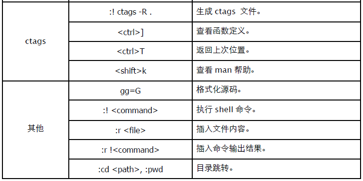

# 第四部分: 工具

# 1. GCC

## 1.1 预处理

输出预处理结果到文件。

```
$ gcc -E main.c -o main.i
```

保留文件头注释。

```
$ gcc -C -E main.c -o main.i
```

参数 -Dname 定义宏 (源文件中不能定义该宏)，-Uname 取消 GCC 设置中定义的宏。

```
$ tail -n 10 main.c

int main(int argc, char* argv[])
{
	#if __MY__
	printf("a");
	#else
	printf("b");
	#endif
	return EXIT_SUCCESS;
}

$ gcc -E main.c -D__MY__ | tail -n 10

int main(int argc, char* argv[])
{
	printf("a");
	return 0;
}
```

-Idirectory 设置头文件(.h)的搜索路径。

```
$ gcc -g -I./lib -I/usr/local/include/cbase main.c mylib.c
```

查看依赖文件。

```
$ gcc -M -I./lib main.c
$ gcc -MM -I./lib main.c # 忽略标准库
```

## 1.2 汇编

我们可以将 C 源代码编译成汇编语言 (.s)。

```
$ gcc -S main.c
$ head -n 20 main.s
	.file "main.c"
	.section .rodata
.LC0:
	.string "Hello, World!"
	.text
.globl main
	.type main, @function
main:
	pushl %ebp
	movl %esp, %ebp
	andl $-16, %esp
	subl $16, %esp
	movl $.LC0, (%esp)
	call test
	movl $0, %eax
	leave
	ret
	.size main, .-main
	.ident "GCC: (Ubuntu 4.4.1-4ubuntu9) 4.4.1"
	.section .note.GNU-stack,"",@progbits
```

使用 -fverbose-asm 参数可以获取变量注释。如果需要指定汇编格式，可以使用 "-masm=intel"参数。

## 1.3 链接

参数 -c 仅生成目标文件 (.o)，然后需要调用链接器 (link) 将多个目标文件链接成单一可执行文件。

```
$ gcc -g -c main.c mylib.c
```

参数 -l 链接其他库，比如 -lpthread 链接 libpthread.so。或指定 -static 参数进行静态链接。我们还可以直接指定链接库 (.so, .a) 完整路径。

```
$ gcc -g -o test main.c ./libmy.so ./libtest.a

$ ldd ./test
	linux-gate.so.1 => (0xb7860000)
	./libmy.so (0xb785b000)
	libc.so.6 => /lib/tls/i686/cmov/libc.so.6 (0xb7710000)
	/lib/ld-linux.so.2 (0xb7861000)
```

另外一种做法就是用 -L 指定库搜索路径。

```
$ gcc -g -o test -L/usr/local/lib -lgdsl main.c

$ ldd ./test
	linux-gate.so.1 => (0xb77b6000)
	libgdsl.so.1 => /usr/local/lib/libgdsl.so.1 (0xb779b000)
	libc.so.6 => /lib/tls/i686/cmov/libc.so.6 (0xb7656000)
	/lib/ld-linux.so.2 (0xb77b7000)
```

## 1.4 动态库

使用 "-fPIC -shared" 参数生成动态库。

```
$ gcc -fPIC -c -O2 mylib.c

$ gcc -shared -o libmy.so mylib.o

$ nm libmy.so
... ...
00000348 T _init
00002010 b completed.6990
00002014 b dtor_idx.6992
... ...
0000047c T test
```

静态库则需要借助 ar 工具将多个目标文件 (.o) 打包。

```
c$ gcc -c mylib.c

$ ar rs libmy.a mylib.o
ar: creating libmy.a
```

## 1.5 优化

参数 -O0 关闭优化 (默认)；-O1 (或 -O) 让可执行文件更小，速度更快；-O2 采用几乎所有的优化手段。

```
$ gcc -O2 -o test main.c mylib.c
```

## 1.6 调试
参数 -g 在对象文件 (.o) 和执行文件中生成符号表和源代码行号信息，以便使用 gdb 等工具进行调试。

```
$ gcc -g -o test main.c mylib.c

$ readelf -S test
There are 38 section headers, starting at offset 0x18a8:

Section Headers:
	[Nr] Name Type Addr Off Size ES Flg Lk Inf Al
	... ...
	[27] .debug_aranges PROGBITS 00000000 001060 000060 00 0 0 8
	[28] .debug_pubnames PROGBITS 00000000 0010c0 00005b 00 0 0 1
	[29] .debug_info PROGBITS 00000000 00111b 000272 00 0 0 1
	[30] .debug_abbrev PROGBITS 00000000 00138d 00014b 00 0 0 1
	[31] .debug_line PROGBITS 00000000 0014d8 0000f1 00 0 0 1
	[32] .debug_frame PROGBITS 00000000 0015cc 000058 00 0 0 4
	[33] .debug_str PROGBITS 00000000 001624 0000d5 01 MS 0 0 1
	[34] .debug_loc PROGBITS 00000000 0016f9 000058 00 0 0 1
	... ...
```

参数 -pg 会在程序中添加性能分析 (profiling) 函数，用于统计程序中最耗费时间的函数。程序执行后，统计信息保存在 gmon.out 文件中，可以用 gprof 命令查看结果。

```
$ gcc -g -pg main.c mylib.c
```

# 2. GDB
作为内置和最常用的调试器，GDB 显然有着无可辩驳的地位。熟练使用 GDB，就好像所有 Linux 下的开发人员建议你用 VIM 一样，是个很 "奇怪" 的情节。

测试用源代码。

```
#include <stdio.h>
int test(int a, int b)
{
	int c = a + b;
	return c;
}

int main(int argc, char* argv[])
{
	int a = 0x1000;
	int b = 0x2000;
	int c = test(a, b);
	printf("%d\n", c);

	printf("Hello, World!\n");
	return 0;
}
```

编译命令 (注意使用 -g 参数生成调试符号)：

```
$ gcc -g -o hello hello.c
```

开始调试：

```
$ gdb hello

GNU gdb 6.8-debian
Copyright (C) 2008 Free Software Foundation, Inc.
This GDB was configured as "i486-linux-gnu"...

(gdb)
```

## 2.1 源码
在调试过程中查看源代码是必须的。list (缩写 l) 支持多种方式查看源码。

```
(gdb) l # 显示源代码

2
3 int test(int a, int b)
4 {
5 		int c = a + b;
6 		return c;
7 }
8
9 int main(int argc, char* argv[])
10 {
11 		int a = 0x1000;

(gdb) l # 继续显示

12 		int b = 0x2000;
13 		int c = test(a, b);
14 		printf("%d\n", c);
15
16 		printf("Hello, World!\n");
17 		return 0;
18 }

(gdb) l 3, 10 # 显示特定范围的源代码

3 int test(int a, int b)
4 {
5 		int c = a + b;
6 		return c;
7 }
8
9 int main(int argc, char* argv[])
10 {

(gdb) l main # 显示特定函数源代码
5 		int c = a + b;
6 		return c;
7 }
8
9 int main(int argc, char* argv[])
10 {
11 		int a = 0x1000;
12 		int b = 0x2000;
13 		int c = test(a, b);
14 		printf("%d\n", c);
```

可以用如下命令修改源代码显示行数。

```
(gdb) set listsize 50
```

## 2.2 断点

可以使用函数名或者源代码行号设置断点。

```
(gdb) b main # 设置函数断点
Breakpoint 1 at 0x804841b: file hello.c, line 11.

(gdb) b 13 # 设置源代码行断点
Breakpoint 2 at 0x8048429: file hello.c, line 13.

(gdb) b # 将下一行设置为断点 (循环、递归等调试很有用)
Breakpoint 5 at 0x8048422: file hello.c, line 12.

(gdb) tbreak main # 设置临时断点 (中断后失效)
Breakpoint 1 at 0x804841b: file hello.c, line 11.

(gdb) info breakpoints # 查看所有断点

Num Type Disp Enb Address What
2 breakpoint keep y 0x0804841b in main at hello.c:11
3 breakpoint keep y 0x080483fa in test at hello.c:5

(gdb) d 3 # delete: 删除断点 (还可以用范围 "d 1-3"，无参数时删除全部断点)
(gdb) disable 2 # 禁用断点 (还可以用范围 "disable 1-3")
(gdb) enable 2 # 启用断点 (还可以用范围 "enable 1-3")
(gdb) ignore 2 1 # 忽略 2 号中断 1 次
```

当然少不了条件式中断。

```
(gdb) b test if a == 10
Breakpoint 4 at 0x80483fa: file hello.c, line 5.

(gdb) info breakpoints

Num Type Disp Enb Address What
4 	breakpoint keep y 0x080483fa in test at hello.c:5
	stop only if a == 10
```

可以用 condition 修改条件，注意表达式不包含 if。

```
(gdb) condition 4 a == 30

(gdb) info breakpoints

Num Type Disp Enb Address What
2 	breakpoint keep y 0x0804841b in main at hello.c:11
	ignore next 1 hits
4 	breakpoint keep y 0x080483fa in test at hello.c:5
	stop only if a == 30
```

## 2.3 执行

通常情况下，我们会先设置 main 入口断点。

```
(gdb) b main
Breakpoint 1 at 0x804841b: file hello.c, line 11.

(gdb) r # 开始执行 (Run)
Starting program: /home/yuhen/Learn.c/hello
Breakpoint 1, main () at hello.c:11
11 int a = 0x1000;

(gdb) n # 单步执行 (不跟踪到函数内部, Step Over)
12 int b = 0x2000;

(gdb) n
13 int c = test(a, b);

(gdb) s # 单步执行 (跟踪到函数内部, Step In)
test (a=4096, b=8192) at hello.c:5
5 int c = a + b;

(gdb) finish # 继续执行直到当前函数结束 (Step Out)

Run till exit from #0 test (a=4096, b=8192) at hello.c:5
0x0804843b in main () at hello.c:13
13 int c = test(a, b);
Value returned is $1 = 12288

(gdb) c # Continue: 继续执行，直到下一个断点。

Continuing.
12288
Hello, World!

Program exited normally.
```

## 2.4 堆栈

查看调用堆栈无疑是调试过程中非常重要的事情。

```
(gdb) where # 查看调用堆栈 (相同作用的命令还有 info s 和 bt)

#0 test (a=4096, b=8192) at hello.c:5
#1 0x0804843b in main () at hello.c:13

(gdb) frame # 查看当前堆栈帧，还可显示当前代码

#0 test (a=4096, b=8192) at hello.c:5
5 int c = a + b;

(gdb) info frame # 获取当前堆栈帧更详细的信息

Stack level 0, frame at 0xbfad3290:
	eip = 0x80483fa in test (hello.c:5); saved eip 0x804843b
	called by frame at 0xbfad32c0
	source language c.
	Arglist at 0xbfad3288, args: a=4096, b=8192
	Locals at 0xbfad3288, Previous frame's sp is 0xbfad3290
	Saved registers:
	ebp at 0xbfad3288, eip at 0xbfad328c
```

可以用 frame 修改当前堆栈帧，然后查看其详细信息。

```
(gdb) frame 1
#1 0x0804843b in main () at hello.c:13
13 int c = test(a, b);

(gdb) info frame

Stack level 1, frame at 0xbfad32c0:
	eip = 0x804843b in main (hello.c:13); saved eip 0xb7e59775
	caller of frame at 0xbfad3290
	source language c.
	Arglist at 0xbfad32b8, args:
	Locals at 0xbfad32b8, Previous frame's sp at 0xbfad32b4
	Saved registers:
		ebp at 0xbfad32b8, eip at 0xbfad32bc
```

## 2.5 变量和参数

```
(gdb) info locals # 显示局部变量
c = 0

(gdb) info args # 显示函数参数(自变量)
a = 4096
b = 8192
```

我们同样可以切换 frame，然后查看不同堆栈帧的信息。

```
(gdb) p a # print 命令可显示局部变量和参数值
$2 = 4096

(gdb) p/x a # 十六进制输出
$10 = 0x1000

(gdb) p a + b # 还可以进行表达式计算
$5 = 12288
```

x 命令内存输出格式:
- d: 十进制
- u: 十进制无符号
- x: 十六进制
- o: 八进制
- t: 二进制
- c: 字符
- 
set variable 可用来修改变量值。

```
(gdb) set variable a=100

(gdb) info args
a = 100
b = 8192
```

## 2.6 内存及寄存器

x 命令可以显示指定地址的内存数据。

```
格式: x/nfu [address]
```

- n: 显示内存单位 (组或者行)。
- f: 格式 (除了 print 格式外，还有 字符串 s 和 汇编 i)。
- u: 内存单位 (b: 1字节; h: 2字节; w: 4字节; g: 8字节)。

```
(gdb) x/8w 0x0804843b # 按四字节(w)显示 8 组内存数据

0x804843b <main+49>: 0x8bf04589 0x4489f045 0x04c70424 0x04853024
0x804844b <main+65>: 0xfecbe808 0x04c7ffff 0x04853424 0xfecfe808

(gdb) x/8i 0x0804843b # 显示 8 行汇编指令

0x804843b <main+49>: mov DWORD PTR [ebp-0x10],eax
0x804843e <main+52>: mov eax,DWORD PTR [ebp-0x10]
0x8048441 <main+55>: mov DWORD PTR [esp+0x4],eax
0x8048445 <main+59>: mov DWORD PTR [esp],0x8048530
0x804844c <main+66>: call 0x804831c <printf@plt>
0x8048451 <main+71>: mov DWORD PTR [esp],0x8048534
0x8048458 <main+78>: call 0x804832c <puts@plt>
0x804845d <main+83>: mov eax,0x0

(gdb) x/s 0x08048530 # 显示字符串

0x8048530: "%d\n"
```

除了通过 "info frame" 查看寄存器值外，还可以用如下指令。

```
(gdb) info registers # 显示所有寄存器数据

eax 0x1000 4096
ecx 0xbfad32d0 -1079168304
edx 0x1 1
ebx 0xb7fa1ff4 -1208344588
esp 0xbfad3278 0xbfad3278
ebp 0xbfad3288 0xbfad3288
esi 0x8048480 134513792
edi 0x8048340 134513472
eip 0x80483fa 0x80483fa <test+6>
eflags 0x286 [ PF SF IF ]
cs 0x73 115
ss 0x7b 123
ds 0x7b 123
es 0x7b 123
fs 0x0 0
gs 0x33 51

(gdb) p $eax # 显示单个寄存器数据
$11 = 4096
```

## 2.7 反汇编

我对 AT&T 汇编不是很熟悉，还是设置成 intel 格式的好。

```
(gdb) set disassembly-flavor intel # 设置反汇编格式
(gdb) disass main # 反汇编函数

Dump of assembler code for function main:
0x0804840a <main+0>: lea ecx,[esp+0x4]
0x0804840e <main+4>: and esp,0xfffffff0
0x08048411 <main+7>: push DWORD PTR [ecx-0x4]
0x08048414 <main+10>: push ebp
0x08048415 <main+11>: mov ebp,esp
0x08048417 <main+13>: push ecx
0x08048418 <main+14>: sub esp,0x24
0x0804841b <main+17>: mov DWORD PTR [ebp-0x8],0x1000
0x08048422 <main+24>: mov DWORD PTR [ebp-0xc],0x2000
0x08048429 <main+31>: mov eax,DWORD PTR [ebp-0xc]
0x0804842c <main+34>: mov DWORD PTR [esp+0x4],eax
0x08048430 <main+38>: mov eax,DWORD PTR [ebp-0x8]
0x08048433 <main+41>: mov DWORD PTR [esp],eax
0x08048436 <main+44>: call 0x80483f4 <test>
0x0804843b <main+49>: mov DWORD PTR [ebp-0x10],eax
0x0804843e <main+52>: mov eax,DWORD PTR [ebp-0x10]
0x08048441 <main+55>: mov DWORD PTR [esp+0x4],eax
0x08048445 <main+59>: mov DWORD PTR [esp],0x8048530
0x0804844c <main+66>: call 0x804831c <printf@plt>
0x08048451 <main+71>: mov DWORD PTR [esp],0x8048534
0x08048458 <main+78>: call 0x804832c <puts@plt>
0x0804845d <main+83>: mov eax,0x0
0x08048462 <main+88>: add esp,0x24
0x08048465 <main+91>: pop ecx
0x08048466 <main+92>: pop ebp
0x08048467 <main+93>: lea esp,[ecx-0x4]
0x0804846a <main+96>: ret
End of assembler dump.
```

可以用 "b *address" 设置汇编断点，然后用 si 和 ni 进行汇编级单步执行，这对于分析指针和寻址非常有用。

## 2.8 进程

查看进程相关信息，尤其是 maps 内存数据是非常有用的。

```
(gdb) help info proc stat

Show /proc process information about any running process.
Specify any process id, or use the program being debugged by default.
Specify any of the following keywords for detailed info:
	mappings -- list of mapped memory regions.
	stat -- list a bunch of random process info.
	status -- list a different bunch of random process info.
	all -- list all available /proc info.

(gdb) info proc mappings !# 相当于 cat /proc/{pid}/maps

process 22561
cmdline = '/home/yuhen/Learn.c/hello'
cwd = '/home/yuhen/Learn.c'
exe = '/home/yuhen/Learn.c/hello'
Mapped address spaces:

	Start Addr End Addr Size Offset objfile
	0x8048000 0x8049000 0x1000 0 /home/yuhen/Learn.c/hello
	0x8049000 0x804a000 0x1000 0 /home/yuhen/Learn.c/hello
	0x804a000 0x804b000 0x1000 0x1000 /home/yuhen/Learn.c/hello
	0x8a33000 0x8a54000 0x21000 0x8a33000 [heap]
	0xb7565000 0xb7f67000 0xa02000 0xb7565000
	0xb7f67000 0xb80c3000 0x15c000 0 /lib/tls/i686/cmov/libc-2.9.so
	0xb80c3000 0xb80c4000 0x1000 0x15c000 /lib/tls/i686/cmov/libc-2.9.so
	0xb80c4000 0xb80c6000 0x2000 0x15c000 /lib/tls/i686/cmov/libc-2.9.so
	0xb80c6000 0xb80c7000 0x1000 0x15e000 /lib/tls/i686/cmov/libc-2.9.so
	0xb80c7000 0xb80ca000 0x3000 0xb80c7000
	0xb80d7000 0xb80d9000 0x2000 0xb80d7000
	0xb80d9000 0xb80da000 0x1000 0xb80d9000 [vdso]
	0xb80da000 0xb80f6000 0x1c000 0 /lib/ld-2.9.so
	0xb80f6000 0xb80f7000 0x1000 0x1b000 /lib/ld-2.9.so
	0xb80f7000 0xb80f8000 0x1000 0x1c000 /lib/ld-2.9.so
	0xbfee2000 0xbfef7000 0x15000 0xbffeb000 [stack]
```

## 2.9 线程

可以在 pthread_create 处设置断点，当线程创建时会生成提示信息。

```
(gdb) c

Continuing.
[New Thread 0xb7e78b70 (LWP 2933)]

(gdb) info threads # 查看所有线程列表

* 2 Thread 0xb7e78b70 (LWP 2933) test (arg=0x804b008) at main.c:24
1 Thread 0xb7e796c0 (LWP 2932) 0xb7fe2430 in __kernel_vsyscall ()

(gdb) where # 显示当前线程调用堆栈

#0 test (arg=0x804b008) at main.c:24
#1 0xb7fc580e in start_thread (arg=0xb7e78b70) at pthread_create.c:300
#2 0xb7f478de in clone () at ../sysdeps/unix/sysv/linux/i386/clone.S:130

(gdb) thread 1 # 切换线程

[Switching to thread 1 (Thread 0xb7e796c0 (LWP 2932))]#0 0xb7fe2430 in __kernel_vsyscall ()

(gdb) where # 查看切换后线程调用堆栈

#0 0xb7fe2430 in __kernel_vsyscall ()
#1 0xb7fc694d in pthread_join (threadid=3085405040, thread_return=0xbffff744) at pthread_join.c:89
#2 0x08048828 in main (argc=1, argv=0xbffff804) at main.c:36
```

## 2.10 其他

调试子进程。

```
(gdb) set follow-fork-mode child
```

临时进入 Shell 执行命令，Exit 返回。

```
(gdb) shell
```

调试时直接调用函数。

```
(gdb) call test("abc")
```

使用 "--tui" 参数，可以在终端窗口上部显示一个源代码查看窗。

```
$ gdb --tui hello
```

查看命令帮助。

```
(gdb) help b
```

最后就是退出命令。

```
(gdb) q
```

和 Linux Base Shell 习惯一样，对于记不住的命令，可以在输入前几个字母后按 Tab 补全。

## 2.11 Core Dump

在 Windows 下我们已经习惯了用 Windbg 之类的工具调试 dump 文件，从而分析并排除程序运行时错误。在 Linux 下我们同样可以完成类似的工作 —— Core Dump。

我们先看看相关的设置。

```
$ ulimit -a

core file size (blocks, -c) 0
data seg size (kbytes, -d) unlimited
scheduling priority (-e) 20
file size (blocks, -f) unlimited
pending signals (-i) 16382
max locked memory (kbytes, -l) 64
max memory size (kbytes, -m) unlimited
open files (-n) 1024
pipe size (512 bytes, -p) 8
POSIX message queues (bytes, -q) 819200
real-time priority (-r) 0
stack size (kbytes, -s) 8192
cpu time (seconds, -t) unlimited
max user processes (-u) unlimited
virtual memory (kbytes, -v) unlimited
file locks (-x) unlimited
```

"core file size (blocks, -c) 0" 意味着在程序崩溃时不会生成 core dump 文件，我们需要修改一下设置。如果你和我一样懒得修改配置文件，那么就输入下面这样命令吧。

```
$ sudo sh -c "ulimit -c unlimited; ./test" # test 是可执行文件名。
```

等等…… 我们还是先准备个测试目标。

```
#include <stdio.h>
#include <stdlib.h>
void test()
{
	char* s = "abc";
	*s = 'x';
}

int main(int argc, char** argv)
{
	test();
	return (EXIT_SUCCESS);
}
```

很显然，我们在 test 里面写了一个不该写的东东，这无疑会很严重。生成可执行文件后，执行上面的命令。

```
$ sudo sh -c "ulimit -c unlimited; ./test"

Segmentation fault (core dumped)

$ ls -l

total 96
-rw------- 1 root root 167936 2010-01-06 13:30 core
-rwxr-xr-x 1 yuhen yuhen 9166 2010-01-06 13:16 test
```

这个 core 文件就是被系统 dump 出来的，我们分析目标就是它了。

```
$ sudo gdb test core

GNU gdb (GDB) 7.0-ubuntu
Copyright (C) 2009 Free Software Foundation, Inc.

Reading symbols from .../dist/Debug/test...done.

warning: Can't read pathname for load map: Input/output error.
Reading symbols from /lib/tls/i686/cmov/libpthread.so.0... ...done.
(no debugging symbols found)...done.
Loaded symbols for /lib/tls/i686/cmov/libpthread.so.0
Reading symbols from /lib/tls/i686/cmov/libc.so.6... ...done.
(no debugging symbols found)...done.
Loaded symbols for /lib/tls/i686/cmov/libc.so.6
Reading symbols from /lib/ld-linux.so.2... ...done.
(no debugging symbols found)...done.
Loaded symbols for /lib/ld-linux.so.2

Core was generated by `./test'.
Program terminated with signal 11, Segmentation fault.
#0 0x080483f4 in test () at main.c:16

warning: Source file is more recent than executable.
16 *s = 'x';
```

最后这几行提示已经告诉我们错误的原因和代码位置，接下来如何调试就是 gdb 的技巧了，可以先输入 where 看看调用堆栈。

```
(gdb) where

#0 0x080483f4 in test () at main.c:16
#1 0x08048401 in main (argc=1, argv=0xbfd53e44) at main.c:22

(gdb) p s
$1 = 0x80484d0 "abc"

(gdb) info files

Symbols from ".../dist/Debug/test".
Local core dump file:

Local exec file:
	`.../dist/Debug/test', file type elf32-i386.
	Entry point: 0x8048330
	0x08048134 - 0x08048147 is .interp
	... ...
	0x08048330 - 0x080484ac is .text
	0x080484ac - 0x080484c8 is .fini
	0x080484c8 - 0x080484d4 is .rodata
```

很显然 abc 属于 .rodata，严禁调戏。

附：如果你调试的是 Release (-O2) 版本，而且删除(strip)了符号表，那还是老老实实数汇编代码吧。可见用 Debug 版本试运行是很重要滴！！！

# 3. VIM

Unix-like 环境下最常用的编辑器，应该掌握最基本的快捷键操作。

在 OSX 下可以用 macvim 代替，毕竟图形化界面要更方便一点。

全局配置文件：/etc/vim/vimrc
用户配置文件：~/.vimrc

```
" 显示行号
set nu

" 高亮当前行
set cursorline

" 用空格代替Tab
set expandtab

" 自动缩进
set autoindent
set smartindent
set smarttab
set cindent

" 缩进宽度
set tabstop=4
set shiftwidth=4

" 语法高亮
syntax on

" 禁止在 Makefile 中将 Tab 转换成空格
autocmd FileType make set noexpandtab
```




# 4. Make

一个完整的 Makefile 通常由 "显式规则"、"隐式规则"、"变量定义"、"指示符"、"注释" 五部分组成。

- 显式规则: 描述了在何种情况下如何更新一个或多个目标文件。
- 隐式规则: make 默认创建目标文件的规则。(可重写)
- 变量定义: 类似 shell 变量或 C 宏，用一个简短名称代表一段文本。
- 指示符: 包括包含(include)、条件执行、宏定义(多行变量)等内容。
- 注释: 字符 "#" 后的内容被当作注释。

(1) 在工作目录按 "GNUmakefile、makefile、Makefile (推荐)" 顺序查找执行，或 -f 指定。
(2) 如果不在 make 命令行显式指定目标规则名，则默认使用第一个有效规则。
(3) Makefile 中 $、# 有特殊含义，可以进行转义 "\#"、"$$"。
(4) 可以使用 \ 换行 (注释行也可以使用)，但其后不能有空格，新行同样必须以 Tab 开头和缩进。

注意: 本文中提到的目标文件通常是 ".o"，类似的还有源文件 (.c)、头文件 (.h) 等。

## 4.1 规则

规则组成方式:

```
target...: prerequisites...
	command
	...
```

- target: 目标。
- prerequisites: 依赖列表。文件名列表 (空格分隔，通常是 ".o, .c, .h"，可使用通配符)。
- command: 命令行。shell 命令或程序，且必须以 TAB 开头 (最容易犯的错误)。

没有命令行的规则只能指示依赖关系，没有依赖项的规则指示 "如何" 构建目标，而非 "何时" 构建。

目标的依赖列表可以通过 GCC -MM 参数获得。

规则处理方式:
- 目标文件不存在，使用其规则 (显式或隐式规则) 创建。
- 目标文件存在，但如果任何一个依赖文件比目标文件修改时间 "新"，则重新创建目标文件。
- 目标文件存在，且比所有依赖文件 "新"，则什么都不做。

### 4.1.1 隐式规则

当我们不编写显式规则时，隐式规则就会生效。当然我们可以修改隐式规则的命令。

```
%.o: %.c
	$(CC) $(CFLAGS) -o $@ -c $<
```

未定义规则或者不包含命令的规则都会使用隐式规则。

```
# 隐式规则
%.o: %.c
	@echo $<
	@echo $^
	$(CC) $(CFLAGS) -o $@ -c $<

all: test.o main.o
	$(CC) $(CFLAGS) $(LDFLAGS) -o $(OUT) $^

main.o: test.o test.h
```

输出:

```
$ make

./lib/test.c
./lib/test.c
gcc -Wall -g -std=c99 -I./lib -I./src -o test.o -c ./lib/test.c

./src/main.c
./src/main.c test.o ./lib/test.h
gcc -Wall -g -std=c99 -I./lib -I./src -o main.o -c ./src/main.c

gcc -Wall -g -std=c99 -I./lib -I./src -lpthread -o test test.o main.o
```

test.o 规则不存在，使用隐式规则。main.o 没有命令，使用隐式规则的同时，还会合并依赖列表。

可以有多个隐式规则，比如：

```
%.o: %.c
	...
%o: %c %h
	...
```

### 4.1.2 模式规则

在隐式规则前添加特定的目标，就形成了模式规则。

```
test.o main.o: %.o: %.c
	$(CC) $(CFLAGS) -o $@ -c $<
```

### 4.1.3 搜索路径

在实际项目中我们通常将源码文件分散在多个目录中，将这些路径写入 Makefile 会很麻烦，此时可以考虑用 VPATH 变量指定搜索路径。

```
all: lib/test.o src/main.o
	$(CC) $(CFLAGS) $(LDFLAGS) -o $(OUT) $^
```

改写成 VPATH 方式后，要调整项目目录就简单多了。

```
# 依赖目标搜索路径
VPATH = ./src:./lib

# 隐式规则
%.o:%.c
	-@echo "source file: $<"
	$(CC) $(CFLAGS) -o $@ -c $<

all:test.o main.o
	$(CC) $(CFLAGS) $(LDFLAGS) -o $(OUT) $^
```

执行:

```
$ make

source file: ./lib/test.c
gcc -Wall -g -std=c99 -I./lib -I./src -o test.o -c ./lib/test.c

source file: ./src/main.c
gcc -Wall -g -std=c99 -I./lib -I./src -o main.o -c ./src/main.c

gcc -Wall -g -std=c99 -I./lib -I./src -lpthread -o test test.o main.o
```

还可使用 make 关键字 vpath。比 VPATH 变量更灵活，甚至可以单独为某个文件定义路径。

```
vpath %.c ./src:./lib # 定义匹配模式(%匹配任意个字符)和搜索路径。
vpath %.c # 取消该模式
vpath # 取消所有模式
```

相同的匹配模式可以定义多次，make 会按照定义顺序搜索这多个定义的路径。

```
vpath %.c ./src
vpath %.c ./lib
vpath %.h ./lib
```

VPATH 和 vpath 定义的搜索路径仅对 makefile 规则有效，对 gcc/g++ 命令行无效，比如不能用它定义命令行头文件搜索路径参数。

### 4.1.4 伪目标

当我们为了执行命令而非创建目标文件时，就会使用伪目标了，比如 clean。伪目标总是被执行。

```
clean:
	-rm *.o
.PHONY: clean
```

使用 "-" 前缀可以忽略命令错误，".PHONY" 的作用是避免和当前目录下的文件名冲突 (可能引发隐式规则)。

## 4.2 命令

每条命令都在一个独立 shell 环境中执行，如希望在同一 shell 执行，可以用 ";" 将命令写在一行。

```
test:
	cd test; cp test test.bak
```

提示: 可以用 "\" 换行，如此更美观一些。

默认情况下，多行命令会顺序执行。但如果命令出错，默认会终止后续执行。可以添加 "-" 前缀来忽略命令错误。另外还可以添加 "@" 来避免显示命令行本身。

```
all: test.o main.o
	@echo "build ..."
	@$(CC) $(CFLAGS) $(LDFLAGS) -o $(OUT) $^
```

执行其他规则:

```
all: test.o main.o
	$(MAKE) info
	@$(CC) $(CFLAGS) $(LDFLAGS) -o $(OUT) $^

info:
	@echo "build..."
```

## 4.3 变量

Makefile 支持类似 shell 的变量功能，相当于 C 宏，本质上就是文本替换。
变量名区分大小写。变量名建议使用字母、数字和下划线组成。引用方式 $(var) 或 ${var}。引用未定义变量时，输出空。

### 4.3.1 变量定义

首先注意的是 "=" 和 ":=" 的区别。
- = : 递归展开变量，仅在目标展开时才会替换，也就是说它可以引用在后面定义的变量。
- := : 直接展开变量，在定义时就直接展开，它无法后置引用。

```
A = "a: $(C)"
B := "b: $(C)"
C = "haha..."

all:
	@echo $A
	@echo $B
```

输出:

```
$ make

a: haha...
b:
```

由于 B 定义时 C 尚未定义，所以直接展开的结果就是空。修改一下，再看。

```
C = "none..."
A = "a: $(C)"
B := "b: $(C)"
C = "haha..."

all:
	@echo $A
	@echo $B
```

输出:

```
$ make

a: haha...
b: none...
```

可见 A 和 B 的展开时机的区别。

除了使用 "="、":=" 外，还可以用 "define ... endef" 定义多行变量 (宏，递归展开，只需在调用时添加 @ 即可)。

```
define help
	echo ""
	echo " make release : Build release version."
	echo " make clean : Clean templ files."
	echo ""
endef

debug:
	@echo "Build debug version..."
	@$(help)
	@$(MAKE) $(OUT) DEBUG=1

release:
	@echo "Build release version..."
	@$(help)
	@$(MAKE) clean $(OUT)
```

### 4.3.2 操作符

"?=" 表示变量为空或未定义时才进行赋值操作。

```
A ?= "a"

A ?= "A"
B = "B"

all:
	@echo $A
	@echo $B
```

输出:

```
$ make

a
B
```

"+=" 追加变量值。注意变量展开时机。

```
A = "$B"
A += "..."
B = "haha"

all:
	@echo $A
```

输出:

```
$ make
haha ...
```

### 4.3.3 替换引用

使用 "$(VAR:A=B)" 可以将变量 VAR 中所有以 A 结尾的单词替换成以 B 结尾。

```
A = "a.o b.o c.o"

all:
	@echo $(A:o=c)
```

输出:

```
$ make
a.c b.c c.o
```

### 4.3.4 命令行变量
命令行变量会替换 Makefile 中定义的变量值，除非使用 override。

```
A = "aaa"
override B = "bbb"
C += "ccc"
override D += "ddd"

all:
	@echo $A
	@echo $B
	@echo $C
	@echo $D
```

执行:

```
$ make A="111" B="222" C="333" D="444"

111
bbb
333
444 ddd
```

我们注意到追加方式在使用 override 后才和命令行变量合并。

### 4.3.5 目标变量

仅在某个特定目标中生效，相当于局部变量。

```
test1: A = "abc"

test1:
	@echo "test1" $A

test2:
	@echo "test2" $A
```

输出:

```
$ make test1 test2

test1 abc
test2
```

还可以定义模式变量。

```
test%: A = "abc"

test1:
	@echo "test1" $A

test2:
	@echo "test2" $A
```

输出:

```
$ make test1 test2

test1 abc
test2 abc
```

### 4.3.6 自动化变量

- $? : 比目标新的依赖项。
- $@ : 目标名称。
- $< : 第一个依赖项名称 (搜索后路径)。
- $^ : 所有依赖项 (搜索后路径，排除重复项)。

### 4.3.7 通配符

在变量定义中使用通配符则需要借助 wildcard。

```
FILES = $(wildcard *.o)

all:
	@echo $(FILES)
```

### 4.3.8 环境变量

和 shell 一样，可以使用 "export VAR" 将变量设定为环境变量，以便让命令和递归调用的 make 命令能接收到参数。

例如: 使用 GCC C_INCLUDE_PATH 环境变量来代替 -I 参数。

```
C_INCLUDE_PATH := ./lib:/usr/include:/usr/local/include
export C_INCLUDE_PATH
```

## 4.4 条件

没有条件判断是不行滴。

```
CFLAGS = -Wall -std=c99 $(INC_PATHS)
ifdef DEBUG
	CFLAGS += -g
else
	CFLAGS += -O3
endif
```

类似的还有: ifeq、ifneq、ifndef
格式: ifeq (ARG1, ARG2) 或 ifeq "ARG1" "ARG2"

```
# DEBUG == 1
ifeq "$(DEBUG)" "1"
	...
else
	...
endif

# DEBUG 不为空
ifneq ($(DEBUG), )
	...
else
	...
endif
```

实际上，我们可以用 if 函数来代替。相当于编程语言中的三元表达式 "?:"。

```
CFLAGS = -Wall $(if $(DEBUG), -g, -O3) -std=c99 $(INC_PATHS)
```

## 4.5 函数

*nix 下的 "配置" 都有点 "脚本语言" 的感觉。

make 支持函数的使用，调用方法 "$(function args)" 或 "${function args}"。多个参数之间用"," (多余的空格可能会成为参数的一部分)。

例如: 将 "Hello, World!" 替换成 "Hello, GNU Make!"。

```
A = Hello, World!
all:
	@echo $(subst World, GUN Make, $(A))
```

注意: 字符串没有用引号包含起来，如果字符串中有引号字符，使用 "\" 转义。

### 4.5.1 foreach

这个 foreach 很好，执行结果输出 "[1] [2] [3]"。

```
A = 1 2 3
all:
	@echo $(foreach x,$(A),[$(x)])
```

### 4.5.2 call

我们还可以自定义一个函数，其实就是用一个变量来代替复杂的表达式，比如对上面例子的改写。

```
A = x y z
func = $(foreach x, $(1), [$(x)])
all:
	@echo $(call func, $(A))
	@echo $(call func, 1 2 3)
```

传递的参数分别是 "$(1), $(2) ..."。

用 define 可以定义一个更复杂一点的多行函数。

```
A = x y z
define func
	echo "$(2): $(1) -> $(foreach x, $(1), [$(x)])"
endef

all:
	@$(call func, $(A), char)
	@$(call func, 1 2 3, num)
```

输出:

```
$ make

char: x y z -> [x] [y] [z]
num: 1 2 3 -> [1] [2] [3]
```

### 4.5.3 eval

eval 函数的作用是动态生成 Makefile 内容。

```
define func
	$(1) = $(1)...
endef

$(eval $(call func, A))
$(eval $(call func, B))

all:
	@echo $(A) $(B)
```

上面例子的执行结果实际上是 "动态" 定义了两个变量而已。当然，借用 foreach 可以更紧凑一些。

```
$(foreach x, A B, $(eval $(call func, $(x))))
```
### 4.5.4 shell

执行 shell 命令，这个非常实用。

```
A = $(shell uname)
all:
	@echo $(A)
```

更多的函数列表和详细信息请参考相关文档。

## 4.6 包含

include 指令会读取其他的 Makefile 文件内容，并在当前位置展开。通常使用 ".mk" 作为扩展名，支持文件名通配符，支持相对和绝对路径。

## 4.7 执行

Makefile 常用目标名:

- all: 默认目标。
- clean: 清理项目文件的伪目标。
- install: 安装(拷贝)编译成功的项目文件。
- tar: 创建源码压缩包。
- dist: 创建待发布的源码压缩包。
- tags: 创建 VIM 使用的 CTAGS 文件。
- 
make 常用命令参数:

- -n: 显示待执行的命令，但不执行。
- -t: 更新目标文件时间戳，也就是说就算依赖项被修改，也不更新目标文件。
- -k: 出错时，继续执行。
- -B: 不检查依赖列表，强制更新目标。
- -C: 执行 make 前，进入特定目录。让我们可以在非 Makefile 目录下执行 make 命令。
- -e: 使用系统环境变量覆盖同名变量。
- -i: 忽略命令错误。相当于 "-" 前缀。
- -I: 指定 include 包含文件搜索目录。
- -p: 显示所有 Makefile 和 make 的相关参数信息。
- -s: 不显示执行的命令行。相当于 "@" 前缀。

顺序执行多个目标:

```
$ make clean debug
```

# 5. Scons

Scons 采用 Python 编写，用来替换 GNU Make 的自动化编译构建工具。相比 Makefile 和类似的老古董，scons 更智能，更简单。

## 5.1 脚本

在项目目录下创建名为 SConstruct (或 Sconstruct、 sconstruct) 的文件，作用类似 Makefile。实质上就是 py 源文件。

简单样本:

```
Program("test", ["main.c"])
```

常用命令：

```
$ scons!! ! ! ! ! # 构建，输出详细信息。
scons: Reading SConscript files ...
scons: done reading SConscript files.
scons: Building targets ...
gcc -o main.o -c main.c
gcc -o test main.o
scons: done building targets.

$ scons -c! ! ! ! ! # 清理，类似 make clean。
scons: Reading SConscript files ...
scons: done reading SConscript files.
scons: Cleaning targets ...
Removed main.o
Removed test
scons: done cleaning targets.

$ scons -Q! ! ! ! ! # 构建，简化信息输出。
gcc -o main.o -c main.c
gcc -o test main.o

$ scons -i! ! ! ! ! # 忽略错误，继续执行。
$ scons -n! ! ! ! ! # 输出要执行的命令，但并不真的执行。
$ scons -s! ! ! ! ! # 安静执行，不输出任何非错误信息。
$ scons -j 2! ! ! ! ! # 并行构建。
```

如需调试，建议插入 "import pdb; pdb.set_trace()"，命令行参数 "--debug=pdb" 并不好用。可用 SConscript(path/filename) 包含其他设置文件 (或列表)，按惯例命名为 SConscript。

## 5.2 环境

影响 scons 执行的环境 (Environment ) 因素包括：
- External：外部环境。执行 scons 时的操作系统环境变量，可以用 os.environ 访问。
- Construction: 构建环境，用来控制实际的编译行为。
- Execution: 执行环境，用于设置相关工具所需设置。比如 PATH 可执行搜索路径。

简单程序，可直接使用默认构建环境实例。

```
env = DefaultEnvironment(CCFLAGS = "-g")! ! # 返回默认构建环境实例，并设置参数。
Program("test", ["main.c"])! ! ! ! # 相当于 env.Program()
```

输出:

```
gcc -o main.o -c -g main.c
gcc -o test main.o
```

如需多个构建环境，可用 Environment 函数创建。同一环境可编译多个目标，比如用相同设置编译静态库和目标执行程序。

```
env = Environment(CCFLAGS = "-O3")
env.Library("my", ["test.c"], srcdir = "lib")
env.Program("test", ["main.c"], LIBS = ["my"], LIBPATH = ["."])
```

输出:

```
gcc -o lib/test.o -c -O3 lib/test.c
ar rc libmy.a lib/test.o
ranlib libmy.a

gcc -o main.o -c -O3 main.c
gcc -o test main.o -L. -lmy
```

常用环境参数:
- CC: 编译器，默认 "gcc"。
- CCFLAGS: 编译参数。
- CPPDEFINES: 宏定义。
- CPPPATH：头文件搜索路径。
- LIBPATH：库文件搜索路径。
- LIBS: 需要链接的库名称。
- 
除直接提供键值参数外，还可用名为 parse_flags 的特殊参数一次性提供，它会被 ParseFlags 方法自动分解。

```
env = Environment(parse_flags = "-Ilib -L.")
print env["CPPPATH"], env["LIBPATH"]
```

输出:

```
['lib'] ['.']
```

调用 Dictionary 方法返回环境参数字典，或直接用 Dump 方法返回 Pretty-Print 字符串。

```
print env.Dictionary(); ! print env.Dictionary("LIBS", "CPPPATH")
print env.Dump(); ! ! print env.Dump("LIBS")
```

用 "ENV" 键访问执行环境字典。系统不会自动拷贝外部环境变量，需自行设置。

```
import os
env = DefaultEnvironment(ENV = os.environ)
print env["ENV"]["PATH"]
```

## 5.3 方法

### 5.3.1 编译

同一构建环境，可用相关方法编译多个目标。无需关心这些方法调用顺序，系统会自动处理依赖关系，安排构建顺序。
- Program: 创建可执行程序 (ELF、.exe)。
- Library, StaticLibrary: 创建静态库 (.a, .lib)。
- SharedLibrary: 创建动态库 (.so, .dylib, .dll)。
- Object: 创建目标文件 (.o)。
- 
如果没有构建环境实例，那么这些函数将使用默认环境实例。

用首个位置参数指定目标文件名 (不包括扩展名)，或用 target、source 指定命名参数。source 是单个源文件名 (包含扩展名) 或列表。

```
Program("test1", "main.c")
Program("test2", ["main.c", "lib/test.c"])! ! # 列表
Program("test3", Split("main.c lib/test.c"))!! # 分解成列表
Program("test4", "main.c lib/test.c".split())! # 分解成列表
```

Glob 用通配符匹配多个文件，还可用 srcdir 指定源码目录简化文件名列表。为方法单独提供环境参数仅影响该方法，不会修改环境对象。

```
Library("my", "test.c", srcdir = "lib")
Program("test2", Glob("*.c"), LIBS = ["my"], LIBPATH = ["."], CPPPATH = "lib")
```

输出:

```
gcc -o lib/test.o -c lib/test.c
ar rc libmy.a lib/test.o
ranlib libmy.a

gcc -o main.o -c -Ilib main.c
gcc -o test2 main.o -L. -lmy
```

创建共享库。

```
SharedLibrary("my", "test.c", srcdir = "lib")
Program("test", Glob("*.c"), LIBS = ["my"], LIBPATH = ["."], CPPPATH = "lib")
```

输出:

```
gcc -o lib/test.os -c -fPIC lib/test.c
gcc -o libmy.dylib -dynamiclib lib/test.os

gcc -o main.o -c -Ilib main.c
gcc -o test main.o -L. -lmy
```

编译方法返回列表，第一元素是目标文件全名。

```
print env.Library("my", "test.c", srcdir = "lib")
```

输出:

```
['libmy.a']
```

### 5.3.2 参数

Append: 追加参数数据。

```
env = Environment(X = "a")
env.Append(X = "b")! ! ! # "a" + "b"。
env.Append(X = ["c"]) !! # 如果原参数或新值是列表，那么 [] + []。
print env["X"]
```

输出:

```
['ab', 'c']
```

AppendUnique: 判断要追加的数据是否已经存在。delete_existing 参数删除原数据，然后添加到列表尾部。原参数值必须是列表。

```
env = Environment(X = ["a", "b", "c"])
env.AppendUnique(X = "d")
env.AppendUnique(1, X = "b")
print env["X"]
```

输出:

```
['a', 'c', 'd', 'b']
```

Prepend, PrependUnique: 将值添加到头部。

```
env = Environment(X = ["a", "b", "c"])
env.Prepend(X = "d")
print env["X"]
```

输出:

```
['d', 'a', 'b', 'c']
```

AppendENVPath, PrependENVPath: 向执行环境追加路径，去重。

```
env = Environment()
print env["ENV"]["PATH"]

env.AppendENVPath("PATH", "./lib")
env.AppendENVPath("PATH", "./lib")
print env["ENV"]["PATH"]
```

输出:

```
/opt/bin:/usr/bin:/bin:/usr/sbin:/sbin:/usr/local/bin
/opt/bin:/usr/bin:/bin:/usr/sbin:/sbin:/usr/local/bin:./lib
```

Replace: 替换参数。如目标不存在，新增。

```
env = Environment(CCFLAGS = ["-g"])
env.Replace(CCFLAGS = "-O3")
print env["CCFLAGS"]
```

输出:

```
-O3
```

SetDefault: 和 Python dict.setdefault 作用相同，仅在目标键不存在时添加。

```
env = Environment(CCFLAGS = "-g")
env.SetDefault(CCFLAGS = "-O3")
env.SetDefault(LIBS = ["m", "pthread"])
print env["CCFLAGS"], env["LIBS"]
```

输出:

```
-g ['m', 'pthread']
```

MergeFlags: 合并参数字典，去重。

```
env = Environment(CCFLAGS = ["option"], CPPATH = ["/usr/local/include"])
env.MergeFlags({"CCFLAGS" : "-O3" })
env.MergeFlags("-I/usr/opt/include -O3 -I/usr/local/include")
print env['CCFLAGS'], env["CPPPATH"]
```

输出:

```
['option', '-O3'] ['/usr/opt/include', '/usr/local/include']
```

ParseFlags: 分解参数。

```
env = Environment()
d = env.ParseFlags("-I/opt/include -L/opt/lib -lfoo")
env.MergeFlags(d)
print d
print env["CPPPATH"], env["LIBS"], env["LIBPATH"]
```

输出:

```
{'LIBPATH': ['/opt/lib'], 'LIBS': ['foo'], ..., 'CPPPATH': ['/opt/include']}
['/opt/include'] ['foo'] ['/opt/lib']
```

### 5.3.3 其他

Clone: 环境对象深度复制，可指定覆盖参数。

```
env = Environment(CCFLAGS = ["-g"], LIBS = ["m", "pthread"])
env2 = env.Clone(CCFLAGS = "-O3")
print env2["CCFLAGS"], env2["LIBS"]
```

输出:

```
-O3 ['m', 'pthread']
```

NoClean: 指示 "scons -c" 不要清理这些文件。

```
my = Library("my", "test.c", srcdir = "lib")
test = Program("test", "main.c")

NoClean(test, my) ! ! ! ! ! # 也可直接使用文件名，注意是 libmy.a。
```

subst: 展开所有环境参数。

```
print env["CCCOM"]
print env.subst("$CCCOM")
```

输出:

```
'$CC -o $TARGET -c $CFLAGS $CCFLAGS $_CCCOMCOM $SOURCES'
'gcc -o -c -O3'
```

各方法详细信息可参考 "man scons" 或 在线手册。

## 5.4 依赖

当依赖文件发生变更时，需重新编译目标程序。可使用 Decider 决定变更探测方式，可选项包括：
- MD5: 默认设置，根据文件内容进行判断。
- timestamp-newer: 如果源文件比目标文件新，则表示发生变更。
- timestamp-match: 检查源文件修改时间和上次编译时是否相同。
- MD5-timestamp: 记录内容变化，但只有源文件修改时间变化时变更。
- 
用 touch 更新某个源文件修改时间，即便文件内容没有变化，timestamp-newer 也会让 scons 重新编译该目标文件。

```
env.Decider("timestamp-newer")
env.Program("test", "main.c")
```

某些时候，scons 无法探测到依赖关系，那么可以用 Depends 显式指定依赖。

```
env.Decider("timestamp-newer")

test = env.Program("test", "main.c")
env.Depends(test, ["lib/test.h"])
```

Ignore 忽略依赖关系，Require 指定编译顺序。下例中，指示在编译 my 前必须先构建 test，即便它们之间没有任何依赖关系。

```
my = env.Library("my", "test.c", srcdir = "lib")
test = env.Program("test", "main.c")
env.Requires(my, test)
```

AlwaysBuild 指示目标总是被编译。不管依赖项是否变更，这个目标总是会被重新构建。

```
my = env.Library("my", "test.c", srcdir = "lib")
env.AlwaysBuild(my)
```

## 5.5 命令行

scons 提供了三种不同的命令行参数：
- Options: 以一个或两个 "-" 开始的参数，通常是系统参数，可扩展。
- Variables: 以键值对方式出现。
- Targets: 需要编译的目标。

### 5.5.1 Variables

所有键值都保存在 ARGUMENTS 字典中，可用 Help 函数添加帮助信息。

```
vars = Variables(None, ARGUMENTS)
vars.Add('RELEASE', 'Set to 1 to build for release', 0)

env = Environment(variables = vars)
Help(vars.GenerateHelpText(env))

if not GetOption("help"):
	print ARGUMENTS
	print ARGUMENTS.get("RELEASE", "0")
```

输出:

```
$ scons -Q -h

RELEASE: Set to 1 to build for release
	default: 0
	actual: 0

Use scons -H for help about command-line options.

$ scons -Q RELEASE=1
{'RELEASE': '1'}
1

$ scons -Q
{}
0
```

另有 BoolVariable、EnumVariable、ListVariable、PathVariable 等函数对参数做进一步处理。

### 5.5.2 Targets

Program、Library 等编译目标文件名，可通过 COMMAND_LINE_TARGETS 列表获取。

```
print COMMAND_LINE_TARGETS

Library("my", "lib/test.c")

env = Environment()
env.Program("test", "main.c")
```

输出:

```
$ scons -Q test
['test']
gcc -o main.o -c main.c
gcc -o test main.o

$ scons -Q libmy.a
['libmy.a']
gcc -o lib/test.o -c lib/test.c
ar rc libmy.a lib/test.o
ranlib libmy.a

$ scons -Q -c test libmy.a
['test', 'libmy.a']
Removed main.o
Removed test
Removed lib/test.o
Removed libmy.a
```

除非用 Default 函数指定默认目标，否则 scons 会构建所有目标。多次调用 Default 的结果会被合并，保存在 DEFAULT_TARGETS 列表中。

```
my = Library("my", "lib/test.c")
test = Program("test", "main.c")
Default(my)! ! ! ! ! # 可指定多个目标，比如 Default(my, test)。
```

输出:

```
$ scons -Q
gcc -o lib/test.o -c lib/test.c
ar rc libmy.a lib/test.o
ranlib libmy.a
```

就算指定了默认目标，我们依然可以用 "scons -Q ." 来构建所有目标，清理亦同。

附: scons 还有 Install、InstallAs、Alias、Package 等方法用来处理安装和打包，详细信息可参考官方手册。

[SCons User Guide](http://www.scons.org/doc/production/HTML/scons-user/index.html)
[Man page of SCons](http://www.scons.org/doc/production/HTML/scons-man.html)

# 6. Git

## 6.1 系统设置

通常情况下，我们只需简单设置用户信息和着色即可。

```
$ git config --global user.name "Q.yuhen"
$ git config --global user.email qyuhen@abc.com
$ git config --global color.ui true
```

可以使用 "--list" 查看当前设置。

```
$ git config --list
```

## 6.2 初始化

创建项目目录，然后执行 git init 初始化。这会在项目目录创建 .git 目录，即为元数据信息所在。

```
$ git init
```

通常我们还需要创建一个忽略配置文件 ".gitignore"，并不是什么都需要加到代码仓库中的。

```
$ cat > .gitignore << end

> *.[oa]
> *.so
> *~
> !a.so
> test
> tmp/
> end
```

如果作为 Server 存在，那么可以忽略工作目录，以纯代码仓库形式存在。

```
$ git --bare init
```

在客户端，我们可以调用 clone 命令克隆整个项目。支持 SSH / HTTP/ GIT 等协议。

```
$ git clone ssh://user@server:3387/git/myproj
$ git clone git://github.com/schacon/grit.git mygrit
```

## 6.3 基本操作

Git 分为 "工作目录"、"暂存区"、"代码仓库" 三个部分。

### 6.3.1 添加

文件通过 "git add <file>" 被添加到暂存区，如此暂存区将拥有一份文件快照。

```
$ git add .
$ git add file1 file2
$ git add *.c
```

"git add" 除了添加新文件到暂存区进行跟踪外，还可以刷新已被跟踪文件的暂存区快照。需要注意的是，被提交到代码仓库的是暂存区的快照，而不是工作目录中的文件。

### 6.3.2 提交

"git commit -m <message>" 命令将暂存区的快照提交到代码仓库。

```
$ git commit -m "message"
```

在执行 commit 提交时，我们通常会直接使用 "-a" 参数。该参数的含义是：刷新暂存区快照，提交时同时移除被删除的文件。但该参数并不会添加未被跟踪的新文件，依然需要执行 "git add <file>"操作。

```
$ git commit -am "message"
```

### 6.3.3 状态

可以使用 "git status" 查看暂存区状态，通常包括 "当前工作分支 (Branch)"、"被修改的已跟踪文件(Changed but not updated)"，以及 "未跟踪的新文件 (Untracked files)" 三部分信息。

```
$ git status

# On branch master

# Changed but not updated:
# (use "git add <file>..." to update what will be committed)
# (use "git checkout -- <file>..." to discard changes in working directory)
#
# modified: readme
#

# Untracked files:
# (use "git add <file>..." to include in what will be committed)
#
# install
no changes added to commit (use "git add" and/or "git commit -a")
```

### 6.3.4 比较

要比较三个区域的文件差别，需要使用 "git diff" 命令。

使用 "git diff [file]" 查看工作目录和暂存区的差异。
使用 "git diff --staged [file]" 或 "git diff --cached [file]" 查看暂存区和代码仓库的差异。

```
$ git diff readme

diff --git a/readme b/readme
index e69de29..df8285e 100644
--- a/readme
+++ b/readme
@@ -0,0 +1,2 @@
+1111111111111111111
+
```

查看当前所有未提交的差异，包括工作目录和暂存区。

```
$ git diff HEAD
```

### 6.3.5 撤销

作为代码管理工作，我们随时可以 "反悔"。

使用 "git reset HEAD <filename>" 命令可以取消暂存区的文件快照(即恢复成最后一个提交版本)，这不会影响工作目录的文件修改。

使用 "git checkout -- <filename>" 从仓库恢复工作目录文件，暂存区不受影响。

```
$ git chekcout -- readme
```

在 Git 中 "HEAD" 表示仓库中最后一个提交版本，"HEAD^" 是倒数第二个版本，"HEAD~2" 则是更老的版本。

我们可以直接 "签出" 代码仓库中的某个文件版本到工作目录，该操作同时会取消暂存区快照。

```
$ git checkout HEAD^ readme
```

如果想将整个项目回溯到以前的某个版本，可以使用 "git reset"。可以选择的参数包括默认的 "--mixed" 和 "--hard"，前者不会取消工作目录的修改，而后者则放弃全部的修改。该操作会丢失其后的日志。

```
$ git reset --hard HEAD^
```

### 6.3.6 日志

每次提交都会为整个项目创建一个版本，我们可以通过日志来查看相关信息。

参数 "git log -p" 可以查看详细信息，包括修改的内容。
参数 "git log -2" 查看最后两条日志。
参数 "git log --stat" 可以查看统计摘要。

```
$ git log --stat -2 -p

commit c11364da1bde38f55000bc6dea9c1dda426c00f9
Author: Q.yuhen <qyuhen@hotmail.com>
Date: Sun Jul 18 15:53:55 2010 +0800

b
---
0 files changed, 0 insertions(+), 0 deletions(-)

diff --git a/install b/install
new file mode 100644
index 0000000..e69de29

commit 784b289acc8dccd1d2d9742d17f586ccaa56a3f0
Author: Q.yuhen <qyuhen@hotmail.com>
Date: Sun Jul 18 15:33:24 2010 +0800

a
---
0 files changed, 0 insertions(+), 0 deletions(-)

diff --git a/readme b/readme
new file mode 100644
index 0000000..e69de29
```

### 6.3.7 重做

马有失蹄，使用 "git commit --amend" 可以重做最后一次提交。

```
$ git commit --amend -am "b2"

[master 6abac48] b2
	0 files changed, 0 insertions(+), 0 deletions(-)
	create mode 100644 abc
	create mode 100644 install

$ git log

commit 6abac48c014598890c6c4f47b4138f6be020e403
Author: Q.yuhen <qyuhen@hotmail.com>
Date: Sun Jul 18 15:53:55 2010 +0800
	
	b2

commit 784b289acc8dccd1d2d9742d17f586ccaa56a3f0

Author: Q.yuhen <qyuhen@hotmail.com>
Date: Sun Jul 18 15:33:24 2010 +0800
	a
```

### 6.3.8 查看

使用 "git show" 可以查看日志中文件的变更信息，默认显示最后一个版本 (HEAD)。

```
$ git show readme
$ git show HEAD^ readme
```

### 6.3.9 标签

可以使用标签 (tag) 对最后提交的版本做标记，如此可以方便记忆和操作，这通常也是一个里程碑的标志。

```
$ git tag v0.9

$ git tag
v0.9

$ git show v0.9
commit 3fcdd49fc0f0a45cd283a86bc743b4e5a1dfdf5d
Author: Q.yuhen <qyuhen@hotmail.com>
Date: Sun Jul 18 14:53:55 2010 +0800
...
```

可以直接用标签号代替日志版本号进行操作。

```
$ git log v0.9

commit 3fcdd49fc0f0a45cd283a86bc743b4e5a1dfdf5d
Author: Q.yuhen <qyuhen@hotmail.com>
Date: Sun Jul 18 14:53:55 2010 +0800

	a
```

### 6.3.10 补丁

在不方便共享代码仓库，或者修改一个没有权限的代码时，可以考虑通过补丁文件的方式来分享代码修改。

输出补丁：

```
$ git diff > patch.txt
$ git diff HEAD HEAD~ > patch.txt
```

合并补丁：

```
$ git apply < patch.txt
```

## 6.4 工作分支

用 Git 一定得习惯用分支进行工作。

使用 "git branch <name>" 创建分支，还可以创建不以当前版本为起点的分支 "git branch
<name> HEAD^"。

使用 "git checkout <name>" 切换分支。

```
$ git branch yuhen

$ git checkout yuhen
Switched to branch 'yuhen'

$ git branch
	master
* yuhen
```

使用 "git chekcout -b <name>" 一次完成分支创建和切换操作。

```
$ git checkout -b yuhen
Switched to a new branch 'yuhen'

$ git branch
	master
* yuhen
```

在分支中完成提交，然后切换回主分支进行合并 (git merge) 和 删除 (git branch -d <name>) 操作。

```
$ git checkout master
Switched to branch 'master'

$ git merge yuhen
Updating 6abac48..7943312
Fast-forward
	0 files changed, 0 insertions(+), 0 deletions(-)
	create mode 100644 abc.txt

$ git branch -d yuhen
Deleted branch yuhen (was 7943312).

$ git branch
* master
```

附注: 如果当前工作目录有未提交的内容，直接切换到其他分支会将变更一同带入。

## 6.5 服务器

(1) 首先克隆服务器代码仓库。

```
$ git clone git@192.168.1.202:/git.server/project1 # SSH
```

完成克隆后，可以用 origin 来代替服务器地址。使用 "git remote" 命令查看相关信息。

```
$ git remote
origin

$ git remote show origin
* remote origin
	Fetch URL: ...
	Push URL: ...
	HEAD branch: master
	Remote branch:
		master tracked
	Local branch configured for 'git pull':
		master merges with remote master
	Local ref configured for 'git push':
		master pushes to master (up to date)
```

还可以创建新的 remote 设置。

```
$ git remote add project1 git@192.168.1.202:/git.server/project1

$ git remote
origin
project1

$ git remote rm project1
```

(2) 在将代码提交 (push) 到服务器之前，首先要确认相关更新已经合并到主分支。还应该先从服务器刷新 (pull) 最新代码，以确保自己的提交不会和别人最新提交的代码冲突。

```
$ git pull origin master
$ git push origin master
```

(3) 要提交标签到服务器，需要额外操作 (先执行 git push 提交，然后再执行该指令)。

```
$ git push origin --tags
```

## 6.6 管理

检查损坏情况。

```
$ git fsck
```

清理无用数据。

```
$ git gc
```

# 7. Debug

在初学汇编时，MS-DOS debug.com 命令是个最佳的实验工具。

## 7.1 命令

常用命令：
- 输入指令: a [address]
- 反汇编: u [range]
- 执行: g [=address] [breakpoint]
- 执行: p [=address] [number]
- 单步: t
- 查看寄存器: r
- 修改寄存器: r <reg>
- 内存显示: d [range]
- 内存比较: c <range> <address>
- 内存修改: e <address> <list>
- 内存填充: f <range> <list>
- 
参数格式：

- range: 表示一段内存范围，可以是 "<起始> <结束>"，或 "<起始>L<长度>"。
- list: 表示一个或多个内存字节值，用英文逗号分隔。

### 7.1.1 汇编

输入汇编指令，转换成机器码存入指定位置。

```
a [address]
```

address 可以是偏移量，或者完整的段地址 (CS:SA)。

```
-a 100
1396:0100 mov bx, fefe
1396:0103 mov ax, bx
1396:0105

-u 100 103
1396:0100 BBFEFE MOV BX,FEFE
1396:0103 89D8 MOV AX,BX
```

除了输入汇编指令，我们还可以使用 db 和 dw 这两个伪指令。

```
-a
1396:0105 db 1,2,3,4
1396:0109 dw 5,6,7,8
1396:0111 db "Hello, World!"
1396:011E

-d 100
1396:0100 BB FE FE 89 D8 01 02 03-04 05 00 06 00 07 00 08 ................
1396:0110 00 48 65 6C 6C 6F 2C 20-57 6F 72 6C 64 21 33 44 .Hello, World!3D
1396:0120 55 00 00 00 00 00 00 00-00 00 00 00 00 00 00 00 U...............
1396:0130 11 22 33 00 00 00 00 00-00 00 00 00 00 00 00 00 ."3.............
1396:0140 00 00 00 00 00 00 00 00-00 00 00 00 00 00 00 00 ................
1396:0150 00 00 00 00 00 00 00 00-00 00 00 00 00 00 00 00 ................
1396:0160 33 44 55 33 00 00 00 00-00 00 00 00 00 00 00 00 3DU3............
1396:0170 00 00 00 00 00 00 00 00-00 00 00 00 00 00 00 00 ................
```

对应的，我们可以用 U 命令进行反汇编。

```
u [range]
```

如果省略 range，则从上次结束位置继续反汇编。

```
-u 100 105
1396:0100 BBFEFE MOV BX,FEFE
1396:0103 89D8 MOV AX,BX
1396:0105 0102 ADD [BP+SI],AX

-u
1396:0107 0304 ADD AX,[SI]
1396:0109 050006 ADD AX,0600
1396:010C 0007 ADD [BX],AL
1396:010E 0008 ADD [BX+SI],CL
1396:0110 004865 ADD [BX+SI+65],CL
1396:0113 6C DB 6C
1396:0114 6C DB 6C
1396:0115 6F DB 6F
1396:0116 2C20 SUB AL,20
1396:0118 57 PUSH DI
1396:0119 6F DB 6F
1396:011A 726C JB 0188
1396:011C 64 DB 64
1396:011D 2101 AND [BX+DI],AX
1396:011F 0203 ADD AL,[BP+DI]
1396:0121 0000 ADD [BX+SI],AL
1396:0123 0000 ADD [BX+SI],AL
1396:0125 0000 ADD [BX+SI],AL
```

### 7.1.2 比较

比较两段内存区域的差异。

```
c <range> <address>
```

- range: 表示第一段内存区域。
- address: 是第二段内存的起始地址。

```
-d 100
1396:0100 BB FE FE 89 D8 01 02 03-04 05 00 06 00 07 00 08 ................
1396:0110 00 48 65 6C 6C 6F 2C 20-57 6F 72 6C 64 21 33 44 .Hello, World!3D
1396:0120 55 00 00 00 00 00 00 00-00 00 00 00 00 00 00 00 U...............
1396:0130 11 22 33 00 00 00 00 00-00 00 00 00 00 00 00 00 ."3.............

-c 100l3 160
1396:0100 BB 33 1396:0160
1396:0101 FE 44 1396:0161
1396:0102 FE 55 1396:0162

-c 100 102 160
1396:0100 BB 33 1396:0160
1396:0101 FE 44 1396:0161
1396:0102 FE 55 1396:0162
```

### 7.1.3 显示

显示内存信息。

```
d [range]
```

可以不指定 range，从上次显示尾部继续显示后续内容。也可以不指定长度或结束地址。

```
-d 100
1396:0100 BB FE FE 89 D8 01 02 03-04 05 00 06 00 07 00 08 ................
1396:0110 00 48 65 6C 6C 6F 2C 20-57 6F 72 6C 64 21 33 44 .Hello, World!3D
1396:0120 55 00 00 00 00 00 00 00-00 00 00 00 00 00 00 00 U...............
1396:0130 11 22 33 00 00 00 00 00-00 00 00 00 00 00 00 00 ."3.............

-d
1396:0180 00 00 00 00 00 00 00 00-00 00 00 00 00 00 00 00 ................
1396:0190 00 00 00 00 00 00 00 00-00 00 00 00 00 00 00 00 ................
1396:01A0 00 00 00 00 00 00 00 00-00 00 00 00 00 00 00 00 ................
1396:01B0 00 00 00 00 00 00 00 00-00 00 00 00 00 00 00 00 ................

-d 100l5
1396:0100 BB FE FE 89 D8 .....

-d 100 11f
1396:0100 BB FE FE 89 D8 01 02 03-04 05 00 06 00 07 00 08 ................
1396:0110 00 48 65 6C 6C 6F 2C 20-57 6F 72 6C 64 21 33 44 .Hello, World!3D
```

### 7.1.4 修改

修改内存数据。

```
e <address> [list]
```

使用逗号分隔多个值。

```
-d 100
1396:0100 00 00 00 00 00 00 00 00-00 00 00 00 00 00 00 00 ................
1396:0110 00 00 00 00 00 00 00 00-00 00 00 00 00 00 00 00 ................
1396:0120 00 00 00 00 00 00 00 00-00 00 00 00 00 00 00 00 ................

-e 100 1,2,3,4,5,6

-d 100
1396:0100 01 02 03 04 05 06 00 00-00 00 00 00 00 00 00 00 ................
1396:0110 00 00 00 00 00 00 00 00-00 00 00 00 00 00 00 00 ................
1396:0120 00 00 00 00 00 00 00 00-00 00 00 00 00 00 00 00 ................
也可以按字节输入修改值。调试器会给出当前值，在符号 "." 后输入新值，空格键继续下一字节，回车结束。
```

```
-e 100
1396:0100 01.aa 02.bb 03.cc

-d 100
1396:0100 AA BB CC 04 05 06 00 00-00 00 00 00 00 00 00 00 ................
1396:0110 00 00 00 00 00 00 00 00-00 00 00 00 00 00 00 00 ................
1396:0120 00 00 00 00 00 00 00 00-00 00 00 00 00 00 00 00 ................
```

### 7.1.5 填充

使用特定数据填充内存。

```
f <range> <list>
```

可以是多个字节。

```
-f 100l6 ff
-d 100
1396:0100 FF FF FF FF FF FF 00 00-00 00 00 00 00 00 00 00 ................
1396:0110 00 00 00 00 00 00 00 00-00 00 00 00 00 00 00 00 ................
1396:0120 00 00 00 00 00 00 00 00-00 00 00 00 00 00 00 00 ................
-f 100 120 1,2,3,4,5
-d 100
1396:0100 01 02 03 04 05 01 02 03-04 05 01 02 03 04 05 01 ................
1396:0110 02 03 04 05 01 02 03 04-05 01 02 03 04 05 01 02 ................
1396:0120 03 00 00 00 00 00 00 00-00 00 00 00 00 00 00 00 ................
```

我们通常用该命令清空某个内存，以便观察操作结果。

```
f 100l50 00
```

### 7.1.6 运行

运行汇编指令。

```
g [=address] [breakpoint]
```

注意不能省略地址前的 "="。如果不输入开始地址，则使用 CS:IP。

```
-a 100
1396:0100 mov bx, 1000
1396:0103 mov ax, bx
1396:0105 add ax, 2000
1396:0108

-g =100 108

AX=3000 BX=1000 CX=0000 DX=0000 SP=FFE6 BP=0000 SI=0000 DI=0000
DS=1396 ES=1396 SS=1396 CS=1396 IP=0108 NV UP EI PL NZ NA PE NC
1396:0108 0405 ADD AL,05
```

命令 P 比 G 更方便一些，可以直接指定要执行的指令数。

```
p [=address] [number]
```

number 默认是 1。

```
-p =100 3

AX=0000 BX=1000 CX=0000 DX=0000 SP=FFE6 BP=0000 SI=0000 DI=0000
DS=1396 ES=1396 SS=1396 CS=1396 IP=0103 NV UP EI PL NZ NA PE NC
1396:0103 89D8 MOV AX,BX

AX=1000 BX=1000 CX=0000 DX=0000 SP=FFE6 BP=0000 SI=0000 DI=0000
DS=1396 ES=1396 SS=1396 CS=1396 IP=0105 NV UP EI PL NZ NA PE NC
1396:0105 050020 ADD AX,2000

AX=3000 BX=1000 CX=0000 DX=0000 SP=FFE6 BP=0000 SI=0000 DI=0000
DS=1396 ES=1396 SS=1396 CS=1396 IP=0108 NV UP EI PL NZ NA PE NC
1396:0108 0405 ADD AL,05
```

剩下一个命令是 T，它单步执行汇编指令。

```
-r ip ; 修改寄存器 IP，调整开始执行位置
IP 4444
:100

-t
AX=1000 BX=1000 CX=0000 DX=0000 SP=FFE4 BP=0000 SI=0000 DI=0000
DS=1396 ES=1396 SS=1396 CS=1396 IP=0103 NV UP EI PL NZ NA PE NC
1396:0103 89D8 MOV AX,BX

-t
AX=1000 BX=1000 CX=0000 DX=0000 SP=FFE4 BP=0000 SI=0000 DI=0000
DS=1396 ES=1396 SS=1396 CS=1396 IP=0105 NV UP EI PL NZ NA PE NC
1396:0105 050020 ADD AX,2000

-t
AX=3000 BX=1000 CX=0000 DX=0000 SP=FFE4 BP=0000 SI=0000 DI=0000
DS=1396 ES=1396 SS=1396 CS=1396 IP=0108 NV UP EI PL NZ NA PE NC
1396:0108 0405 ADD AL,05
```

### 7.1.7 计算

计算两个值的 "和" 与 "差"。

```
h <value1> <value2>
```

第一个结果是 "和"，第二个是 "差"。

```
-h 2000 1000
3000 1000
```

### 7.1.8 复制

复制内存块。

```
m <range> <address>
```

range 是源内存地址范围，address 是目标起始地址。

```
-d 100
1396:0100 BB 00 10 89 D8 05 00 20-04 05 01 02 03 04 05 01 ....... ........
1396:0110 02 03 04 05 01 02 03 04-05 01 02 03 04 05 01 02 ................

-m 100l6 110

-d 100
1396:0100 BB 00 10 89 D8 05 00 20-04 05 01 02 03 04 05 01 ....... ........
1396:0110 BB 00 10 89 D8 05 03 04-05 01 02 03 04 05 01 02 ................
```

### 7.1.9 寄存器

显示或修改寄存器内容。

```
r [register]
```

演示:

```
-r
AX=3000 BX=1000 CX=0000 DX=0000 SP=FFE4 BP=0000 SI=0000 DI=0000
DS=1396 ES=1396 SS=1396 CS=1396 IP=0108 NV UP EI PL NZ NA PE NC
1396:0108 0405 ADD AL,05

-r ip
IP 0108
:100
```

### 7.1.10 退出

退出调试器。

```
q
```

## 7.2 8086 寻址模式

### 7.2.1 立即寻址方式

直接将操作数存放在指令中。该操作数是为常数，通常用来初始化寄存器。

```
-a
1396:0100 mov ax, 1234
1396:0103

-t
AX=1234 BX=0000 CX=0000 DX=0000 SP=FFEE BP=0000 SI=0000 DI=0000
DS=1396 ES=1396 SS=1396 CS=1396 IP=0103 NV UP EI PL NZ NA PO NC
1396:0103 0000 ADD [BX+SI],AL DS:0000=CD
```

### 7.2.2 寄存器寻址方式

操作数存放于寄存器中，通过寄存器名完成操作。

```
-a 100
1396:0100 mov ax, 5555
1396:0103 mov bx, ax
1396:0105

-p =100 2

AX=5555 BX=0000 CX=0000 DX=0000 SP=FFEE BP=0000 SI=0000 DI=0000
DS=1396 ES=1396 SS=1396 CS=1396 IP=0103 NV UP EI PL NZ NA PO NC
1396:0103 89C3 MOV BX,AX

AX=5555 BX=5555 CX=0000 DX=0000 SP=FFEE BP=0000 SI=0000 DI=0000
DS=1396 ES=1396 SS=1396 CS=1396 IP=0105 NV UP EI PL NZ NA PO NC
1396:0105 0000 ADD [BX+SI],AL DS:5555=00
```

### 7.2.3 直接寻址方式

直接在指令中用常数操作数指定偏移地址。

```
-a 100
139B:0100 mov ax, [0010] ; 从 DS:0010 处读取数据
139B:0103

-p =100 1

AX=0DFF BX=0000 CX=0000 DX=0000 SP=FFEE BP=0000 SI=0000 DI=0000
DS=139B ES=139B SS=139B CS=139B IP=0103 NV UP EI PL NZ NA PO NC
139B:0103 BE0200 MOV SI,0002

-d 0010l6
139B:0010 FF 0D 17 03 FF 0D ......
```

### 7.2.4 寄存器间接寻址方式

将偏移地址存放在寄存器中，通过寄存器间接读取目标数据。

```
-a 100
1396:0100 mov bx, 0010
1396:0103 mov ax, [bx] ; 相当于 "mov ax, [0010]"
1396:0105

-p =100 2

AX=0000 BX=0010 CX=0000 DX=0000 SP=FFEE BP=0000 SI=0000 DI=0000
DS=1000 ES=1396 SS=1396 CS=1396 IP=0103 NV UP EI PL NZ NA PO NC
1396:0103 8B07 MOV AX,[BX] DS:0010=E85B

AX=E85B BX=0010 CX=0000 DX=0000 SP=FFEE BP=0000 SI=0000 DI=0000
DS=1000 ES=1396 SS=1396 CS=1396 IP=0105 NV UP EI PL NZ NA PO NC
1396:0105 0000 ADD [BX+SI],AL DS:0010=5B

-d 0010l6
1000:0010 5B E8 59 00 E8 D8 ......
```

### 7.2.5 寄存器相对寻址方式

偏移地址 = 寄存器内容 + 偏移常数。

"COUNT[BX]" 或 "[BX + COUNT]"。

```
-a 100
139B:0100 mov bx, 0010
139B:0103 mov ax, 2[bx] ; 相当于 "mov ax, [0010 + 2]"
139B:0106

-p =100 2

AX=0000 BX=0010 CX=0000 DX=0000 SP=FFEE BP=0000 SI=0000 DI=0000
DS=139B ES=139B SS=139B CS=139B IP=0103 NV UP EI PL NZ NA PO NC
139B:0103 8B4702 MOV AX,[BX+02] DS:0012=0317

AX=0317 BX=0010 CX=0000 DX=0000 SP=FFEE BP=0000 SI=0000 DI=0000
DS=139B ES=139B SS=139B CS=139B IP=0106 NV UP EI PL NZ NA PO NC
139B:0106 0000 ADD [BX+SI],AL DS:0010=FF

-d 0010l6
139B:0010 FF 0D 17 03 FF 0D ......
```

### 7.2.6 基址变址寻址方式

偏移地址 = 基址寄存器内容 + 变址寄存器内容。

```
"[BX][DI]" 也可写成 "[BX + DI]"
-a 100
139B:0100 mov bx, 0010
139B:0103 mov di, 2
139B:0106 mov ax, [bx][di] ; 相当于 "mov ax, [0010 + 2]"
139B:0108

-p =100 3

AX=0317 BX=0010 CX=0000 DX=0000 SP=FFEE BP=0000 SI=0000 DI=0000
DS=139B ES=139B SS=139B CS=139B IP=0103 NV UP EI PL NZ NA PO NC
139B:0103 BF0200 MOV DI,0002

AX=0317 BX=0010 CX=0000 DX=0000 SP=FFEE BP=0000 SI=0000 DI=0002
DS=139B ES=139B SS=139B CS=139B IP=0106 NV UP EI PL NZ NA PO NC
139B:0106 8B01 MOV AX,[BX+DI] DS:0012=0317

AX=0317 BX=0010 CX=0000 DX=0000 SP=FFEE BP=0000 SI=0000 DI=0002
DS=139B ES=139B SS=139B CS=139B IP=0108 NV UP EI PL NZ NA PO NC
139B:0108 0000 ADD [BX+SI],AL DS:0010=FF

-d 0010l4
139B:0010 FF 0D 17 03 ....
```

### 7.2.7 相对基址变址寻址方式

偏移地址 = 基址寄存器内容 + 变址寄存器内容 + 偏移常数。

"MASK[BX][SI]" 或 "MASK[BX + SI]" 或 "[MASK + BX + SI]"

```
-a 100
139B:0100 mov bx, 0010
139B:0103 mov si, 2
139B:0106 mov ax, 2[bx][si] ; 相当于 "mov ax, [0010 + 2 + 2]"
139B:0109

-p =100 3

AX=0317 BX=0010 CX=0000 DX=0000 SP=FFEE BP=0000 SI=0000 DI=0002
DS=139B ES=139B SS=139B CS=139B IP=0103 NV UP EI PL NZ NA PO NC
139B:0103 BE0200 MOV SI,0002

AX=0317 BX=0010 CX=0000 DX=0000 SP=FFEE BP=0000 SI=0002 DI=0002
DS=139B ES=139B SS=139B CS=139B IP=0106 NV UP EI PL NZ NA PO NC
139B:0106 8B4002 MOV AX,[BX+SI+02] DS:0014=0DFF

AX=0DFF BX=0010 CX=0000 DX=0000 SP=FFEE BP=0000 SI=0002 DI=0002
DS=139B ES=139B SS=139B CS=139B IP=0109 NV UP EI PL NZ NA PO NC
139B:0109 0000 ADD [BX+SI],AL DS:0012=17

-d 0010l6
139B:0010 FF 0D 17 03 FF 0D ......
```

比例变址寻址方式: COUNT[ESI * 4] == [ ESI * 4 + COUNT]
基址比例变址寻址方式: [EAX][EDX * 8] == [EDX * 8 + EAX]
相对基址比例变址寻址方式: MASK[EBP][EDI * 4] == [EDI * 4 + EBP + MASK]

# 8. Binutils

## 8.1 addr2line

将程序地址(VA)转换为源代码文件名和行号。
参数:
- f: 显示函数名。
- s: 仅显示文件名，不包括路径。
- p: 以 Pretty-Print 方式显示。
- e: 文件名。

```
$ addr2line -pfe test 8028783
```

## 8.2 ar

用来创建、修改、提取静态库文件。

参数:
- s: 创建或更新静态库索引，相当于 ranlib。
- r: 替换库文件中的老旧目标文件。
- c: 删除已有文件，创建新静态库。
- t: 显示包内容。
- x: 展开包成员。

生成静态库。

```
$ ar rs libfunc.a func.o
```

查看静态库组成。

```
$ ar t libfunc.a
```

展开静态库。

```
$ ar x libfunc.a
```

## 8.3 gcc

GNU 编译器。

参数：
- c: 生成目标文件，但不做链接。
- g: 生成必要的调试信息。
- I: 添加 include 头文件搜索路径。(字母 i 大写)
- L: 添加 library 搜索路径。
- l: 链接库文件。比如 -lm 表示链接 libm.so 。
- static: 静态链接。
- fPIC: 生成位置无关代码，通常是共享库。
- O: 优化代码，分为 0, 1, 2, 3 四个等级。
- M, MM: 查看依赖文件。
- Wall: 显示所以可能的警告信息。

编译程序。

```
$ gcc -g -Wall -std=c99 -I./include -I/usr/include/gc -o test -lgc main.o func.o
```

生成动态库。

```
$ gcc -c func.c
$ gcc -fPIC -shared -o libfunc.so func.o
```

## 8.4 ldd

通过模拟运行，查看可执行文件动态库加载。通常用于查看动态库加载失败信息。

参数:
- v: 显示详细信息。

```
$ ldd test
```

## 8.5 nm

查看目标文件符号表中定义的符号。

参数:
- l: 显示文件名和行号。
- n: 按地址排序。

```
$ nm func.o
```

## 8.6 objcopy

用于把一种目标文件中的内容复制到另一种类型的目标文件中。

## 8.7 objdump

显示目标文件信息，通常用于反汇编。

参数：
- a: 显示静态库信息，类似 ls -l。
- g: 显示调试信息。
- x: 显示头部信息。
- d: 反汇编。
- l: 反汇编时输出文件名和行号。
- M: 反汇编参数，比如指定 intel 或 att 指令格式。
- S: 反汇编时输出 C 源码。

```
$ objdump -dS -M intel test
```

## 8.8 readelf

用于显示 ELF 文件详细信息。

参数:
- a: 全部信息。
- h: ELF 头。
- l: Program 段。
- S: Section 头。
- x: 以二进制显示段内容。
- p: 以字符串显示段内容。
- 
显示 section table 信息。

```
$ readelf -S test
```

显示 section 二进制内容，可以是 -S 输出的段序号或段名称。

```
$ readelf -x 13 test
$ readelf -x .text test
```

显示 section 字符串内容。

```
$ readelf -p .strtab test
```

## 8.9 size

列出目标文件段和总体大小。

参数:
- A: 更详细信息。

```
$ size test
```

## 8.10 strings

显示目标文件中的所有可打印字符串。

```
$ strings test
```

## 8.11 strip

删除目标文件符号。

参数:
- s: 删除全部符号。
- d: 仅删除调试符号。

```
$ strip test
```

# 9. Manpages

虽然比不上 MSDN 豪华，但也是日常开发离不了的东西。

```
$ sudo apt-get install manpages-dev
```

然后就可以用如下命令查看标准库函数手册了

```
$ man 3 <function>
```

如:

```
man 3 printf
```

还可以用 -k 参数搜索所有相关的信息

```
$ man -k printf

printf (1) - format and print data
printf (3) - formatted output conversion
vsnprintf (3) - formatted output conversion
vsprintf (3) - formatted output conversion
vswprintf (3) - formatted wide-character output conversion
vwprintf (3) - formatted wide-character output conversion
wprintf (3) - formatted wide-character output conversion
```

查看函数所在手册文件

```
$ man -wa printf

/usr/share/man/man1/printf.1.gz
/usr/share/man/man3/printf.3.gz
ManPages Section:

1 - commands
2 - system calls
3 - library calls
4 - special files
5 - file formats and convertions
6 - games for linux
7 - macro packages and conventions
8 - system management commands
9 - others
```